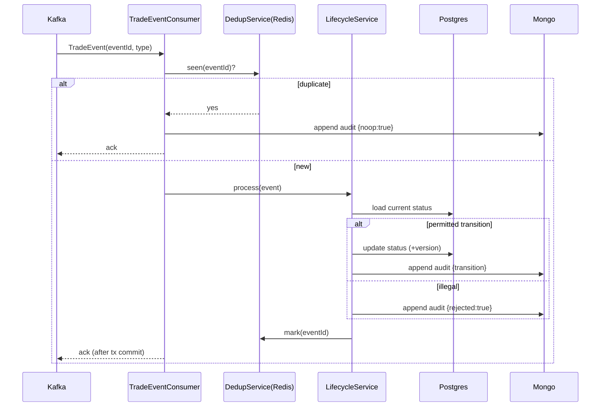

# Design Document — Trade Lifecycle (Bounded Context)

> **Stage 2 of 3** (`requirements.md → design.md → tasks.md`). This document realizes `requirements.md` for the Trade Lifecycle bounded context. Unlike requirements (which are technology-agnostic), **design is where Technology Roles resolve to concrete products** — per `01-initial-setup/01-technology-stack` — and where the inherited golden-path NFRs (`architecture-golden-path/01-service-nfrs`) get concrete implementations. Every design decision below traces to a requirement (see §12).

## 1. Overview

The `trade-lifecycle-service` consumes trade domain events, advances a deterministic state machine, rejects illegal transitions, and preserves an immutable audit history — exposing read APIs for current state and timeline. It owns state only (no risk, rules, or money).

**Role → concrete binding** (resolved from the technology-stack registry — the *only* place these products are otherwise named):

| Technology Role | Concrete product | Use in this service |
|---|---|---|
| `SERVICE_LANGUAGE` / `SERVICE_FRAMEWORK` | Java 21 / Spring Boot 3.4.x | the service runtime |
| `RELATIONAL_STORE` | PostgreSQL | current lifecycle state (`trade_current_state`) |
| `DOCUMENT_STORE` | MongoDB | append-only audit history (`trade_lifecycle_audit`) |
| `EVENT_STREAM` | Apache Kafka | consume `fxops.trade.events` |
| `CACHE` | Redis | processed-`eventId` dedup set |
| `SERIALIZATION` | Jackson (ISO-8601, JSON numbers) | event/DTO (de)serialization |
| `INTEGRATION_TEST_HARNESS` | Testcontainers | Postgres+Mongo+Kafka integration tests |

## 2. Module and package structure

Maven module `Middleware/trade-lifecycle-service`, package root `com.fxtradeops.tradelifecycle`:

```
config/          SecurityConfig (GP-Rq-9 placeholder), KafkaConfig, MongoConfig, ObservabilityConfig
domain/          TradeStatus (shared kernel), StateMachine, LifecycleTransition
consumer/        TradeEventConsumer (Kafka @KafkaListener)
application/     LifecycleService (transition orchestration), DedupService
persistence/
  relational/    TradeCurrentStateEntity, TradeCurrentStateRepository (JPA)
  document/      AuditEntryDocument, AuditRepository (Spring Data Mongo)
  cache/         ProcessedEventStore (Redis)
api/             LifecycleQueryController, dto/ (StateView, TimelineEntryView, ExpectedLifecycleView)
web/             CorrelationIdFilter, GlobalExceptionHandler   (both realize golden-path NFRs)
health/          ReadinessHealthIndicator
```

Domain types (`TradeRecord`, `TradeEvent`, `TradeStatus`, `TradeEventType`) come from the `shared-domain-contracts` shared-kernel dependency — not redefined here.

## 3. Domain model and state machine (Req 1)

The state machine is a static, immutable transition table — the domain invariant expressed as data, not scattered `if`s:

```java
// permitted transitions; any (from,to) not present is an IllegalTransition
static final Map<TradeStatus, Set<TradeStatus>> PERMITTED = Map.of(
  CAPTURED,        Set.of(VALIDATED, CANCELLED, AMENDED, FAILED),
  VALIDATED,       Set.of(ENRICHED, CANCELLED, AMENDED, FAILED),
  ENRICHED,        Set.of(RISK_CALCULATED, CANCELLED, AMENDED, FAILED),
  RISK_CALCULATED, Set.of(BOOKED, CANCELLED, AMENDED, FAILED),
  BOOKED,          Set.of(ALLOCATED, CANCELLED, AMENDED, FAILED),
  ALLOCATED,       Set.of(CONFIRMED, CANCELLED, FAILED),
  CONFIRMED,       Set.of(SETTLED, CANCELLED, FAILED));
// SETTLED, CANCELLED, FAILED -> terminal (empty set)
```

```mermaid
stateDiagram-v2
  [*] --> CAPTURED
  CAPTURED --> VALIDATED --> ENRICHED --> RISK_CALCULATED --> BOOKED --> ALLOCATED --> CONFIRMED --> SETTLED
  CAPTURED --> CANCELLED
  BOOKED --> AMENDED
  RISK_CALCULATED --> FAILED
  SETTLED --> [*]
```

`TradeEventType → TradeStatus` induction map is a second static table (Req 1.6). `StateMachine.canTransition(from, to)` and `StateMachine.targetFor(eventType)` are pure functions (unit-testable in isolation).

## 4. Persistence design

**`RELATIONAL_STORE` — `trade_current_state`** (PostgreSQL, Req 2/5):

| column | type | notes |
|---|---|---|
| `trade_id` | `varchar` PK | business key `FX-######` |
| `status` | `varchar` | current `TradeStatus` |
| `correlation_id` | `varchar` | last correlation id |
| `updated_at` | `timestamptz` | processing instant |
| `version` | `bigint` | `@Version` — optimistic lock (GP-Rq-6) |

**`DOCUMENT_STORE` — `trade_lifecycle_audit`** (MongoDB, Req 4). Append-only document per processed event:
```json
{ "tradeId":"FX-000001","correlationId":"...","eventId":"...","eventType":"TRADE_VALIDATED",
  "fromStatus":"CAPTURED","toStatus":"VALIDATED","rejected":false,"noop":false,"orphan":false,
  "sourceService":"trade-validation-service","occurredAt":"...","recordedAt":"..." }
```
Indexes: `{tradeId:1}` and `{tradeId:1, occurredAt:1}` (Req 4.4). Writes are insert-only; no update/delete (Req 4.3).

**`CACHE` — dedup** (Redis, Req 6 / GP-Rq-5): `SET processed:eventId` with TTL; membership check before processing. (Fallback: a `processed_events` Postgres table if Redis is unavailable — readiness downgrades but correctness is preserved.)

## 5. Event consumption design (Req 2, GP-Rq-7)

- `@KafkaListener(topics="fxops.trade.events")`, manual ack, container concurrency = partition count.
- Per record: resolve correlation id → dedup check → load aggregate → `StateMachine` decision → persist state + audit **in one transaction** → **ack offset only after commit** (GP-Rq-7.3).
- Atomicity across Postgres (state) + Mongo (audit): since these are two stores, use a single logical unit with the audit write as the "outbox-equivalent" record of truth; on Mongo-write failure the Postgres tx rolls back and the offset is not acked (at-least-once redelivery, made safe by dedup).

## 6. API design (Req 5) — read-only, `/api/v1` (GP-Rq-1)

| Endpoint | Returns | Not-found |
|---|---|---|
| `GET /api/v1/trades/{tradeId}/state` | `StateView{status, updatedAt, version}` | 404 |
| `GET /api/v1/trades/{tradeId}/timeline` | ordered `TimelineEntryView[]` (incl. rejected/noop/orphan) | 404 |
| `GET /api/v1/trades/{tradeId}/expected-lifecycle` | `ExpectedLifecycleView{status, reached\|pending}[]` | 404 |

## 7. Application of inherited golden-path NFRs (concrete)

| Golden-path | Concrete implementation here |
|---|---|
| GP-Rq-2 correlation id | `CorrelationIdFilter` (HTTP) + header/MDC copy in `TradeEventConsumer`; `%X{correlationId}` in log pattern |
| GP-Rq-3 error envelope | `GlobalExceptionHandler` (`@RestControllerAdvice`) → 400/404/409/500 bodies |
| GP-Rq-4 readiness | `ReadinessHealthIndicator` checks Postgres + Mongo + Kafka consumer assignment |
| GP-Rq-5 idempotency | `DedupService` over Redis (§4) |
| GP-Rq-6 optimistic lock | `@Version` on `TradeCurrentStateEntity` |
| GP-Rq-7 atomicity | §5 transactional consume + ack-after-commit |
| GP-Rq-8 observability | Micrometer + OTel auto-config; business metric `lifecycle_transitions_total{from,to,rejected}` |
| GP-Rq-9 security | `SecurityConfig` permit-all + the standard TODO marker |
| GP-Rq-12 testing | §11 |

## 8. Key sequence flow (happy path + branches)



## 9. Error handling strategy

- Validation/unknown-trade at API → 404/400 via `GlobalExceptionHandler` (GP-Rq-3).
- Illegal transition is **not** an error — it is a recorded domain outcome (Req 3), never throws to the consumer; the consumer continues (Req 3.3).
- Infrastructure failure (store down) → exception → tx rollback → no ack → Kafka redelivery; dedup makes redelivery safe.

## 10. Testing strategy (Req 7 + GP-Rq-12)

- **Unit** (`UNIT_TEST_FRAMEWORK`): `StateMachine` transition table (all permitted + representative illegal); induction map.
- **Web-layer** (`WEB_LAYER_TEST`): 3 query endpoints incl. 404 and anomaly-visible timeline.
- **Integration** (`INTEGRATION_TEST_HARNESS`: Postgres+Mongo+Kafka): full `TRADE_CAPTURED→…→TRADE_SETTLED` → final `SETTLED` + ordered timeline; duplicate `eventId` → `noop`; orphan event → no aggregate.
- Synthetic `FX-` data only (GP-Rq-14).

## 11. Design decisions (ADR-lite)

- **Transition table as data** (not a rules engine): the lifecycle is small, fixed, and must be trivially auditable; a data table is clearer and unit-testable. (Risk rules *do* use Drools — different context.)
- **Audit in `DOCUMENT_STORE`, state in `RELATIONAL_STORE`**: audit is append-only, schemaless-friendly, high-volume → document store; current state is a small, strongly-consistent, optimistically-locked row → relational.
- **Dedup in `CACHE` with relational fallback**: fast common path, correctness preserved if cache is down.

## 12. Requirement → design traceability

| Requirement | Satisfied by |
|---|---|
| Req 1 State machine | §3 |
| Req 2 Event-driven advancement | §5, §8 |
| Req 3 Illegal transition | §3, §8, §9 |
| Req 4 Audit history | §4 (Mongo) |
| Req 5 Query APIs | §6 |
| Req 6 Idempotent consumption | §4 (Redis), §5 |
| Req 7 Domain acceptance scenarios | §10 |
| Inherited GP-Rq-* | §7 |
