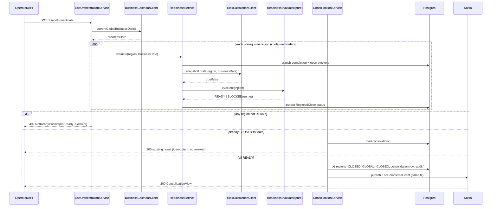

# Design Document — End-of-Day Processing (Bounded Context)

> **Stage 2 of 3** (`requirements.md → design.md → tasks.md`). This document realizes `requirements.md` for the End-of-Day Processing bounded context. Unlike requirements (which are technology-agnostic), **design is where Technology Roles resolve to concrete products** — per `01-initial-setup/01-technology-stack` — and where the inherited golden-path NFRs (`architecture-golden-path/01-service-nfrs`) get concrete implementations. Every design decision below traces to a requirement (see §13).

## 1. Overview

The `eod-processing-service` is the **close-orchestration authority** for the daily global FX close. It aligns every regional close to one `Global Business Date` anchored on the base country (obtained from the **Business Calendar** peer service), tracks per-branch completion, evaluates each region's readiness deterministically, records late-trades/blockers, applies approval-gated exceptions and reruns, and consolidates the global end-of-day result only when every prerequisite region is `READY` — publishing an EOD-completion event atomically with the state change. It computes no risk and derives no calendar logic; it consumes those contexts' outputs and coordinates deterministic readiness state around them (inherited GP-Rq-13). No model participates.

**Role → concrete binding** (resolved from the technology-stack registry — the *only* place these products are otherwise named):

| Technology Role | Concrete product | Use in this service |
|---|---|---|
| `SERVICE_LANGUAGE` / `SERVICE_FRAMEWORK` | Java 21 / Spring Boot 3.4.x | the service runtime |
| `SERVICE_BUILD_TOOL` | Maven 3.9.x | module build under `Middleware/` parent |
| `RELATIONAL_STORE` | PostgreSQL 16.x | regional close, branch completion, blockers, consolidation state, EOD audit log |
| `EVENT_STREAM` | Apache Kafka 3.x via Spring Kafka | consume readiness-input signals; publish EOD-completion (transactional producer) |
| `SERIALIZATION` | Jackson (ISO-8601 temporals, JSON numbers) | REST + Kafka (de)serialization |
| `INTEGRATION_TEST_HARNESS` | Testcontainers | Postgres + Kafka integration tests |
| `UNIT_TEST_FRAMEWORK` | JUnit 5 (Jupiter) | readiness/consolidation unit tests |
| `WEB_LAYER_TEST` | Spring MockMvc | API success + error-path tests |

**Peer services** (called over REST, resolved via `RESILIENCE`/timeout config, never their stores): **Business Calendar** service (current `Global Business Date`, booking-date classification of late trades) and **Risk Calculation** service (existence of a region's EOD risk snapshot). Neither is a data store of this service; both are reachability dependencies for readiness (GP-Rq-4).

## 2. Module and package structure

Maven module `Middleware/eod-processing-service`, package root `com.fxtradeops.eod`:

```
config/          SecurityConfig (GP-Rq-9 placeholder), KafkaConsumerConfig, KafkaProducerConfig (transactional), RestClientConfig (peer timeouts, GP-Rq-10), ObservabilityConfig
domain/          RegionCode (shared kernel), RegionalCloseStatus, ReadinessEvaluator, ReadinessResult, Blocker, BlockerType, ReadinessStatusMap, RegionOrdering
application/      EodOrchestrationService, BranchCompletionService, ReadinessService, BlockerService, ExceptionService, ConsolidationService, DedupService
consumer/        ReadinessSignalConsumer (Kafka @KafkaListener — risk-snapshot + booking-date signals)
integration/     BusinessCalendarClient (REST), RiskCalculationClient (REST)
persistence/
  RegionalCloseEntity, RegionalCloseRepository (JPA)
  BranchCompletionEntity, BranchCompletionRepository
  BlockerEntity, BlockerRepository
  ConsolidationEntity, ConsolidationRepository
  EodAuditEntity, EodAuditRepository        (append-only)
  ProcessedEventEntity, ProcessedEventRepository   (dedup marker, GP-Rq-5)
api/             EodCommandController, EodQueryController, dto/ (ReadinessMapView, BlockerView, BranchStatusView, ExceptionRequest, ConsolidationView, NotReadyConflict)
event/           EodCompletedEvent (published), publish via transactional producer
web/             CorrelationIdFilter, GlobalExceptionHandler   (both realize golden-path NFRs)
health/          ReadinessHealthIndicator
```

Domain types (`RegionCode`, event envelopes, `EodCompletedEvent`) come from the `shared-domain-contracts` shared-kernel dependency — not redefined here.

## 3. Global Business Day alignment (Req 1)

The service never derives calendar logic. `EodOrchestrationService` resolves the current `Global Business Date` by calling `BusinessCalendarClient.currentGlobalBusinessDate()` (base-country anchored) and stamps that `businessDate` onto **every** `RegionalCloseEntity`, `ConsolidationEntity`, and `EodAuditEntity` row (Req 1.2). Regions are processed in a configured close order — default `APAC → EMEA → AMERICAS` — held in `RegionOrdering`, an externalized ordered list bound from `application.yml` (`eod.region-order`), so the order is deployment-configurable (Req 1.3 / GP-Rq-11). When trade/event data straddles a daylight-saving or date-line boundary, assignment to a `Global Business Date` defers entirely to the Business Calendar service's booking-date classification (Req 1.4) — this service stores only the classification result it is handed.

## 4. Regional close and branch completion (Req 2)

`RegionalCloseStatus` is a fixed enum — `{IN_PROGRESS, BLOCKED, READY, CLOSED}` — with a small, data-defined legal-transition table (a rules engine would be overkill for four states):

```java
// permitted regional-close transitions; any (from,to) not present is rejected
static final Map<RegionalCloseStatus, Set<RegionalCloseStatus>> PERMITTED = Map.of(
  IN_PROGRESS, Set.of(READY, BLOCKED),
  BLOCKED,     Set.of(READY, BLOCKED, IN_PROGRESS),  // rerun may re-block or clear
  READY,       Set.of(CLOSED, BLOCKED),              // late blocker can revoke READY
  CLOSED,      Set.of());                            // terminal for the business date
```

`BranchCompletionService` maintains one `BranchCompletionEntity` per `(businessDate, region, branch)` (Req 2.1). `markComplete(region, branch)` is idempotent (GP-Rq-5 / Req 2.5): re-marking an already-complete branch is a no-op (upsert keyed on the natural triple, guarded by unique constraint). A region cannot reach `READY` while any of its branches is incomplete (Req 2.4), enforced inside `ReadinessEvaluator`, not at the API edge.

## 5. Deterministic regional readiness evaluation (Req 3)

`ReadinessEvaluator.evaluate(...)` is a **pure function** — no I/O, no clock beyond the passed-in inputs — so it is trivially unit-testable and deterministic (GP-Rq-13). It takes the collected inputs and returns a `ReadinessResult{status, List<Blocker> unmet}`:

```java
public ReadinessResult evaluate(ReadinessInputs in) {
    List<Blocker> unmet = new ArrayList<>();
    if (!in.allBranchesComplete())        unmet.add(Blocker.of(INCOMPLETE_BRANCH, in.incompleteBranches()));
    if (in.unprocessedTradeCount() > in.tolerance()
            && !in.toleranceExceptionApproved())
                                          unmet.add(Blocker.of(UNPROCESSED_TRADES, in.unprocessedTradeCount()));
    if (!in.riskSnapshotExists())         unmet.add(Blocker.of(MISSING_RISK_SNAPSHOT, in.region()));
    unmet.addAll(in.openBlockers());      // late-trade + operator-recorded blockers still unresolved
    return unmet.isEmpty()
        ? ReadinessResult.ready()
        : ReadinessResult.blocked(unmet);
}
```

The four inputs (Req 3.1) are collected by `ReadinessService` before the pure call: branch completeness from the `RELATIONAL_STORE`; unprocessed-trade count (with a configured tolerance that an approved `Exception` can waive); EOD risk-snapshot existence via `RiskCalculationClient.snapshotExists(region, businessDate)`; and the set of unresolved `Blocker`s. All-satisfied → `READY` (Req 3.2); otherwise `BLOCKED` with the specific unmet conditions recorded on the `RegionalClose` and returned (Req 3.3).

**Readiness Status Map** (Req 3.4): `EodQueryController` projects each region's `RegionalCloseStatus` plus the `GLOBAL` consolidation status, e.g. `{APAC: READY, EMEA: BLOCKED, AMERICAS: IN_PROGRESS, GLOBAL: NOT_READY}`. A per-region blocker read (Req 3.5) returns the current `Blocker` list.

## 6. Late-trade and blocker handling (Req 4)

`BlockerService` tracks `Late Trade`s as candidate `Blocker`s (`BlockerType.LATE_TRADE`) for the affected region. A late trade is one whose booking date — **as classified by the Business Calendar service**, never decided here — falls after the region's close began (Req 4.1). This service does **not** judge a late trade's materiality (Req 4.2): it records and exposes it, deferring materiality to the Risk Calculation context, the rules policy, and later agents. While any `Blocker` is recorded, the region stays `BLOCKED` until the blocker is resolved or an authorized `Exception` clears it (Req 4.3, §7). `recordException(region, blockerId, approvalReference)` clears a **named** blocker (Req 4.4).

## 7. Rerun and approval-gated exception (Req 5)

- **Rerun** (`ReadinessService.rerun(region)`): re-collects inputs for the current `Global Business Date`, re-invokes the pure `ReadinessEvaluator`, persists and returns the updated status (Req 5.1). A rerun after a blocker is resolved is how a region progresses `BLOCKED → READY` without touching the global date.
- **Exception approval gate** (`ExceptionService`): applying an `Exception` **requires a non-blank `approvalReference`**; a blank/absent reference is a `400` validation error via `GlobalExceptionHandler` (Req 5.2 / GP-Rq-3). The service **never auto-approves** — a blocker is cleared only when the caller supplies an explicit `approvalReference` (Req 5.4); the human-approval gate itself is enforced upstream in a later agent phase.
- **Append-only audit** (`EodAuditEntity`): every `Rerun` and every applied `Exception` is written as an insert-only audit row capturing `region`, `businessDate`, `approvalReference` (where applicable), `action`, and `recordedAt` (Req 5.3). No update/delete.

## 8. Persistence design

All schemas managed via Flyway on the `RELATIONAL_STORE` (PostgreSQL). Every mutable table carries a `version` column for optimistic locking (GP-Rq-6).

**`regional_close`** — one row per `(business_date, region)`:

| column | type | notes |
|---|---|---|
| `business_date` | `date` NOT NULL | part of natural key |
| `region_code` | `varchar(8)` NOT NULL | `APAC`/`EMEA`/`AMERICAS`/`GLOBAL` |
| `status` | `varchar(12)` | `RegionalCloseStatus` |
| `unmet_conditions` | `text` | JSON array of blocker summaries |
| `updated_at` | `timestamptz` | |
| `version` | `bigint` | `@Version` (GP-Rq-6) |
| `UNIQUE(business_date, region_code)` | | |

**`branch_completion`** — one row per `(business_date, region, branch)`:

| column | type | notes |
|---|---|---|
| `business_date` | `date` NOT NULL | |
| `region_code` | `varchar(8)` NOT NULL | |
| `branch_id` | `varchar(50)` NOT NULL | fictional branch id |
| `complete` | `boolean` NOT NULL | |
| `completed_at` | `timestamptz` | |
| `version` | `bigint` | |
| `UNIQUE(business_date, region_code, branch_id)` | | idempotent marking (Req 2.5) |

**`blocker`** — recorded blockers incl. late trades:

| column | type | notes |
|---|---|---|
| `blocker_id` | `varchar(36)` PK | UUID |
| `business_date` | `date` NOT NULL | |
| `region_code` | `varchar(8)` NOT NULL | |
| `blocker_type` | `varchar(24)` | `INCOMPLETE_BRANCH`/`UNPROCESSED_TRADES`/`MISSING_RISK_SNAPSHOT`/`LATE_TRADE` |
| `reference` | `varchar(50)` | e.g. `FX-000123` for a late trade |
| `resolved` | `boolean` NOT NULL | |
| `approval_reference` | `varchar(100)` | set when cleared by an `Exception` |
| `detected_at` | `timestamptz` | |
| `resolved_at` | `timestamptz` | |
| `version` | `bigint` | |

**`consolidation`** — one row per `Global Business Date` (idempotency anchor, Req 6.4):

| column | type | notes |
|---|---|---|
| `business_date` | `date` PK | one consolidation per global date |
| `status` | `varchar(12)` | `NOT_READY`/`CLOSED` |
| `contributing_regions` | `text` | JSON snapshot of regional closes consolidated |
| `applied_exceptions` | `text` | JSON array of `approvalReference`s |
| `consolidated_at` | `timestamptz` | |
| `version` | `bigint` | |

**`eod_audit`** — append-only (insert only, no update/delete), Req 5.3 / 6.5:

| column | type | notes |
|---|---|---|
| `audit_id` | `varchar(36)` PK | UUID |
| `business_date` | `date` NOT NULL | |
| `region_code` | `varchar(8)` | null for global-scope actions |
| `action` | `varchar(24)` | `RERUN`/`EXCEPTION_APPLIED`/`CONSOLIDATED` |
| `approval_reference` | `varchar(100)` | where applicable |
| `detail` | `text` | JSON |
| `recorded_at` | `timestamptz` | |

**`processed_event`** — dedup markers for consumed readiness signals (GP-Rq-5.3, relational role):

| column | type | notes |
|---|---|---|
| `event_id` | `varchar(36)` PK | consumed `eventId` |
| `processed_at` | `timestamptz` | retention-swept |

## 9. Event consumption and API design

### 9.1 Consumed readiness signals (Req 3 inputs, GP-Rq-7)

`ReadinessSignalConsumer` — `@KafkaListener` on the shared-kernel readiness-input topics, manual ack, container concurrency = partition count. It consumes **risk-snapshot-completion** signals (from Risk Calculation) and **booking-date-classification** signals (from Business Calendar), used purely as readiness inputs. Per record: adopt `correlationId` → dedup check on `eventId` against `processed_event` → record the input (e.g. mark a region's risk snapshot present, or register a late trade as a candidate blocker) → **ack offset only after the tx (including the dedup marker) commits** (GP-Rq-7.3). At-least-once redelivery is made safe by the dedup guard.

### 9.2 Produced event (Req 6.3, GP-Rq-7)

`EodCompletedEvent` (a `shared-domain-contracts` type carrying `eventId`, `correlationId`, `sourceService=eod-processing-service`, `occurredAt`, `businessDate`) is published via a **transactional Kafka producer** in the same transaction as the consolidation state change — no orphan state, no event without state (GP-Rq-7.1/7.2).

### 9.3 REST API — `/api/v1` (GP-Rq-1)

| Endpoint | Purpose | Semantics |
|---|---|---|
| `POST /api/v1/eod/branches/{region}/{branchId}/complete` | mark branch complete | idempotent; `200` (Req 2.2/2.5) |
| `GET /api/v1/eod/branches/{region}` | branch completion read | `BranchStatusView[]` (Req 2.3) |
| `POST /api/v1/eod/regions/{region}/rerun` | rerun readiness | returns updated status (Req 5.1) |
| `POST /api/v1/eod/regions/{region}/exceptions` | apply approved exception | body `ExceptionRequest{blockerId, approvalReference}`; `400` if blank ref (Req 5.2) |
| `GET /api/v1/eod/readiness` | Readiness Status Map | all regions + `GLOBAL` (Req 3.4) |
| `GET /api/v1/eod/regions/{region}/blockers` | current blockers | `BlockerView[]` (Req 3.5) |
| `POST /api/v1/eod/consolidate` | trigger global consolidation | `200` result / `409` not-ready / idempotent replay (Req 6) |
| `GET /api/v1/eod/consolidation` | consolidation status | `ConsolidationView` for current date |

All `GET`s are side-effect free (GP-Rq-1.4). `POST /consolidate` and `/complete` are idempotent per §10 / §4.

## 10. Global consolidation guard (Req 6)

`ConsolidationService.consolidate(businessDate)`:

1. Load `consolidation` row for the date. **If already `CLOSED`** → return the existing result **without re-executing** (idempotent, Req 6.4 / GP-Rq-5). This is the `409`-guarded idempotency anchor: the `business_date` PK plus a status check make a repeat a safe read.
2. Otherwise evaluate every prerequisite region (`RegionOrdering`). **If any is not `READY`** → reject with **`409 Conflict`** whose `NotReadyConflict` body lists the not-ready regions and their blockers (Req 6.2 / GP-Rq-3).
3. When all prerequisite regions are `READY`, in **one transaction**: set each region's `RegionalClose` to `CLOSED`, set `GLOBAL` consolidation to `CLOSED`, write the `consolidation` row (contributing snapshots + applied exceptions), append an `eod_audit` `CONSOLIDATED` row, and publish `EodCompletedEvent` via the transactional producer — all committing atomically (Req 6.3/6.5 / GP-Rq-7).

## 11. Application of golden-path NFRs (concrete)

| Golden-path | Concrete implementation here |
|---|---|
| GP-Rq-1 API conventions | all endpoints under `/api/v1`; `200`/`400`/`404`/`409`/`503` per §9.3; reads side-effect free |
| GP-Rq-2 correlation id | `CorrelationIdFilter` (HTTP) + `correlationId` copy to MDC in `ReadinessSignalConsumer`; `%X{correlationId}` in log pattern; set on published `EodCompletedEvent` |
| GP-Rq-3 error envelope | `GlobalExceptionHandler` (`@RestControllerAdvice`) → `400` (blank `approvalReference`), `404` (unknown region/date), `409` (not-ready consolidation + optimistic-lock), `500` |
| GP-Rq-4 readiness | `ReadinessHealthIndicator` checks Postgres + Kafka consumer assignment + Business Calendar + Risk Calculation reachability |
| GP-Rq-5 idempotency | `DedupService` over `processed_event`; branch-complete idempotent by natural key; consolidation idempotent by `business_date` |
| GP-Rq-6 optimistic lock | `@Version` on `regional_close`, `branch_completion`, `blocker`, `consolidation` entities |
| GP-Rq-7 atomicity | §9.1 consume + ack-after-commit; §10 transactional consolidation + producer publish in one tx |
| GP-Rq-8 observability | Micrometer + OTel auto-config; business metrics `eod_region_readiness{region,status}`, `eod_consolidation_total{outcome}`, `eod_blockers_open{region}` |
| GP-Rq-9 security | `SecurityConfig` permit-all + the standard Phase-6 auth TODO marker |
| GP-Rq-10 resilience | `RestClientConfig` bounded timeouts + bounded backoff retry on Business Calendar / Risk Calculation calls; readiness downgrades rather than blocking |
| GP-Rq-11 configuration | `eod.region-order`, tolerance, peer endpoints, topics externalized in `application.yml`; profiles for local/AWS/Azure |
| GP-Rq-13 determinism | no LLM; `ReadinessEvaluator` and the consolidation guard are pure/deterministic; same inputs → same status |
| GP-Rq-12/14 testing + synthetic data | §12; only `FX-` ids and fictional branch/region names |

## 12. Key sequence flow (readiness → consolidation)



## 13. Error handling strategy

- Blank/absent `approvalReference` on an `Exception` → `400` validation envelope via `GlobalExceptionHandler` (Req 5.2 / GP-Rq-3.1).
- Unknown region or no close record for the current date → `404` (GP-Rq-3).
- Consolidation while any region is not `READY` → `409` with the `NotReadyConflict` list of regions + blockers (Req 6.2); optimistic-lock collision → `409` (GP-Rq-6.2).
- A `BLOCKED` region is **not** an error — it is a recorded deterministic domain outcome (Req 3.3), returned as data, never thrown.
- Peer service (Business Calendar / Risk Calculation) unreachable → bounded-timeout failure (GP-Rq-10); readiness for the affected input is treated as unsatisfied (region stays `BLOCKED`) and the `ReadinessHealthIndicator` reports the failing dependency — correctness preserved, never a false `READY`.
- Infrastructure failure (store/broker down) mid-consume → exception → tx rollback → offset not acked → Kafka redelivery, made safe by dedup.

## 14. Testing strategy (Req 7 + GP-Rq-12)

- **Unit** (`UNIT_TEST_FRAMEWORK`): `ReadinessEvaluator` — a region is `READY` only when all four Req 3 inputs are satisfied, `BLOCKED` (with the exact unmet conditions) otherwise; branch-completeness gate; tolerance-with-approved-exception path.
- **Web-layer** (`WEB_LAYER_TEST`): the API endpoints incl. `400` on blank `approvalReference`, `409` on not-ready consolidation, `404` on unknown region.
- **Integration** (`INTEGRATION_TEST_HARNESS`: Postgres + Kafka, peer clients stubbed): consolidation returns `409` while any region is not `READY` and succeeds only when every prerequisite region is `READY` → regions + `GLOBAL` become `CLOSED` and `EodCompletedEvent` is published; a **repeat** consolidation for an already-`CLOSED` `Global Business Date` returns the existing result without re-executing; applying an `Exception` without an `approvalReference` is rejected.
- Synthetic `FX-` ids and fictional branch/region names only (GP-Rq-14).

## 15. Design decisions (ADR-lite)

- **Readiness as a pure function, not a rules engine**: the four-input readiness gate is small, fixed, and must be trivially auditable and deterministic; a pure `ReadinessEvaluator` is clearer, unit-testable in isolation, and needs no Drools (materiality classification — which *is* rules/agent territory — is deferred to Risk Calculation, Req 4.2).
- **Consolidation idempotency anchored on `business_date` PK**: one `consolidation` row per `Global Business Date` makes a repeat consolidation a `409`-guarded safe read rather than a re-execution (Req 6.4) — the simplest correct idempotency key for a once-per-day operation.
- **All state + audit in `RELATIONAL_STORE`**: close state is small, strongly-consistent, optimistically-locked; the audit log is append-only but low-volume and must be transactionally consistent with the consolidation it records — so a document store buys nothing here; one relational store keeps consolidation + audit + event publish in a single transaction (GP-Rq-7).
- **Approval gate is data, enforced upstream**: this service only *records* an `approvalReference` and refuses to auto-approve (Req 5.4); the human-approval decision lives in a later agent phase, keeping this context deterministic (GP-Rq-13).
- **Peer contexts consumed, never their stores**: calendar and risk-snapshot facts are obtained via REST/events from the Business Calendar and Risk Calculation services — this context owns close orchestration only, honoring the bounded-context boundary.

## 16. Requirement → design traceability

| Requirement | Satisfied by |
|---|---|
| Req 1 Global business day alignment | §3 |
| Req 2 Branch completion tracking | §4, §8, §9.3 |
| Req 3 Deterministic readiness evaluation | §5, §9.1 |
| Req 4 Late-trade and blocker handling | §6 |
| Req 5 Rerun and exception approval gate | §7 |
| Req 6 Global consolidation guard | §10, §9.2, §12 |
| Req 7 Domain acceptance scenarios | §14 |
| Inherited GP-Rq-* | §11 |
