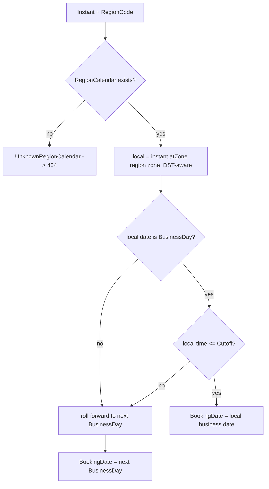
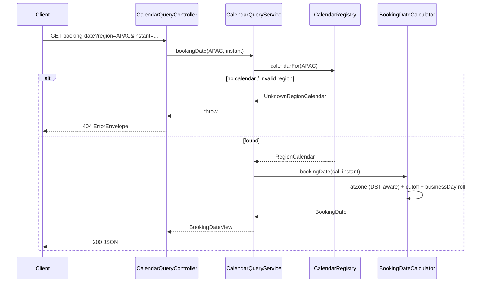

# Design Document — Business Calendar (Bounded Context)

> **Stage 2 of 3** (`requirements.md → design.md → tasks.md`). This document realizes `requirements.md` for the Business Calendar bounded context. Unlike requirements (which are technology-agnostic), **design is where Technology Roles resolve to concrete products** — per `01-initial-setup/01-technology-stack` — and where the inherited golden-path NFRs (`architecture-golden-path/01-service-nfrs`) get concrete implementations. Every design decision below traces to a requirement (see §14).

## 1. Overview

The `business-calendar-service` is the single, authoritative source of calendar truth for the platform. It answers, deterministically, which days are business days per region, when each region's processing cutoff occurs, which business date a trade or event belongs to, and how daylight-saving-time transitions shift those local-time boundaries — all anchored, for the 24-hour global processing day, to the base country (`America/New_York`). It is a **deterministic query service**: reference data (region calendars, holidays, cutoffs) is loaded from the `RELATIONAL_STORE` at startup and every answer is a pure `java.time` computation. It owns calendar authority only — no trade state, no risk, no rules engine, no money, no event stream.

**Role → concrete binding** (resolved from the technology-stack registry — the *only* place these products are otherwise named):

| Technology Role | Concrete product | Use in this service |
|---|---|---|
| `SERVICE_LANGUAGE` / `SERVICE_FRAMEWORK` | Java 21 / Spring Boot 3.4.x | the service runtime |
| `SERVICE_BUILD_TOOL` | Maven | module build (`Middleware/business-calendar-service`) |
| `RELATIONAL_STORE` | PostgreSQL | region calendar definitions, holidays, cutoffs (`region_calendar`, `holiday`, `cutoff`) |
| `SERIALIZATION` | Jackson (ISO-8601 temporals) | DTO (de)serialization of `LocalDate`/`ZonedDateTime`/`Instant` |
| `BEAN_VALIDATION` | Jakarta Bean Validation + Hibernate Validator | `RegionCode`, date, and instant request validation |
| `INTEGRATION_TEST_HARNESS` | Testcontainers (PostgreSQL) | reference-data load + query integration tests |
| `UNIT_TEST_FRAMEWORK` | JUnit 5 (Jupiter) | calendar-logic unit tests (incl. DST edge cases) |
| `PROPERTY_TEST` | jqwik | invariants of business-day arithmetic and determinism |

**Not used by this service** (deterministic query service): `EVENT_STREAM`/Kafka, `DOCUMENT_STORE`/MongoDB, `CACHE`/Redis, `RULES_ENGINE`/Drools. There is no event consumption and no `GLOBAL`-independent mutable state at runtime.

## 2. Module and package structure

Maven module `Middleware/business-calendar-service`, package root `com.fxtradeops.calendar`:

```
config/          SecurityConfig (GP-Rq-9 placeholder), JacksonConfig, ObservabilityConfig, CalendarBootstrapConfig
domain/          RegionCalendar, Holiday, Cutoff, BusinessDayReason (enum), BookingDate, GlobalBusinessDate,
                 GapResolution/OverlapResolution (DST policy), CalendarRegistry (in-memory authoritative view)
domain/calc/     BusinessDayCalculator, DstResolver, BookingDateCalculator, GlobalBusinessDateCalculator  (pure functions)
application/     CalendarQueryService (orchestrates registry + calculators)
persistence/
  relational/    RegionCalendarEntity, HolidayEntity, CutoffEntity + Spring Data JPA repositories
api/             CalendarQueryController, dto/ (BusinessDayView, AddBusinessDaysView, BusinessDaysBetweenView,
                 BookingDateView, PostCutoffView, GlobalBusinessDateView, HolidayView)
web/             CorrelationIdFilter, GlobalExceptionHandler   (both realize golden-path NFRs)
health/          ReadinessHealthIndicator (Postgres reachable + calendar definitions loaded)
```

Domain types (`RegionCode` enum: `APAC`, `EMEA`, `AMERICAS`, `GLOBAL`) come from the `shared-domain-contracts` shared-kernel dependency — not redefined here.

## 3. Regional calendar model (Req 1, 2)

A `RegionCalendar` is the consistency boundary for all calendar answers about one region. It is immutable at runtime, built once from the `RELATIONAL_STORE` and held in the `CalendarRegistry`:

```java
record RegionCalendar(
    RegionCode region,
    ZoneId zone,                 // IANA zone, e.g. ZoneId.of("Asia/Singapore")
    Set<DayOfWeek> weekend,      // default {SATURDAY, SUNDAY}; overridable per region (Req 1.4)
    Set<LocalDate> holidays,     // region-scoped fictional/standard holidays (Req 2.1–2.3)
    Cutoff cutoff) {}            // local time-of-day cutoff (Req 5.1)
```

Region → IANA zone bindings (Req 1.1/1.2 — standard IANA zones, fictional holidays only):

| RegionCode | IANA zone | Role |
|---|---|---|
| `APAC` | `Asia/Singapore` | operational region |
| `EMEA` | `Europe/London` | operational region (observes DST) |
| `AMERICAS` | `America/New_York` | operational region (observes DST) |
| `GLOBAL` | `America/New_York` | base-country anchor for `GlobalBusinessDate` (Req 1.2) |

Holidays are **region-scoped**: a `LocalDate` present in `APAC.holidays` never affects `EMEA` business-day evaluation (Req 2.3). The `CalendarRegistry` exposes `calendarFor(RegionCode)` and raises an `UnknownRegionCalendarException` when a region has no configured calendar (Req 4.4) or a request names a value that is not a valid `RegionCode` (Req 2.5) — both mapped to golden-path error responses (§12).

## 4. DST-aware time handling (Req 3)

All local-time boundaries are resolved with `java.time.ZonedDateTime`/`ZoneId`, so the UTC offset applied is the one **in effect at the specific instant** under the named IANA zone — never a fixed stored offset (Req 3.1/3.2/3.5). Cutoffs are stored as a `LocalTime` + `ZoneId`, never as a fixed UTC offset (Req 3.5).

`DstResolver` centralizes the two documented, deterministic edge-case rules (Req 3.3/3.4):

| DST condition | `java.time` behavior | Documented rule applied |
|---|---|---|
| **Spring-forward gap** (local time does not exist) | `ZonedDateTime.of(gapLocalDateTime, zone)` shifts forward by the gap | **Push forward to the first valid instant after the gap** (later offset). Explicit via `ZoneRules.getTransition(...).getDuration()`; documented as "gap ⇒ resolve to post-transition instant". |
| **Fall-back overlap** (local time occurs twice) | `ZonedDateTime` picks the **earlier** offset by default | **Resolve to the earlier offset occurrence** via `.withEarlierOffsetAtOverlap()`; documented as "overlap ⇒ resolve to earlier (pre-transition) occurrence". |

Both rules are applied uniformly to cutoff evaluation and booking-date classification, so a trade whose local instant lands on a change day is bucketed identically on every evaluation with the same reference-data version (Req 3, GP-Rq-13).

## 5. Business-day classification and arithmetic (Req 4)

`BusinessDayCalculator` operates over a `RegionCalendar` as pure functions (unit- and property-testable in isolation):

- `classify(region, date) -> BusinessDayReason` — returns `WEEKEND`, `HOLIDAY`, or `BUSINESS_DAY` (weekend checked in the region's zone semantics; holiday checked against the region-scoped set) (Req 4.1).
- `addBusinessDays(region, date, n) -> LocalDate` — steps day-by-day skipping weekends/holidays; `n < 0` steps backward; `n = 0` returns `date` unchanged (Req 4.2).
- `businessDaysBetween(region, from, to) -> long` — counts business days in the **half-open interval `[from, to)`** for that region (Req 4.3).

`isBusinessDay(region, date)` is the boolean derived from `classify(...) == BUSINESS_DAY`. An unknown region calendar is reported as an unknown-resource result naming the missing region (Req 4.4, GP-Rq-1/GP-Rq-3).

## 6. Regional cutoff and booking-date classification (Req 5)

`BookingDateCalculator` converts an `Instant` to the region's local time and applies the cutoff + business-day rules to derive the `BookingDate`:

1. `local = instant.atZone(regionZone)` (DST-aware, §4).
2. If `local.toLocalDate()` is a `BusinessDay` **and** `local.toLocalTime() <= cutoff`, the `BookingDate` is that business date (Req 5.3).
3. Otherwise (after cutoff, **or** the local date is a weekend/holiday), the `BookingDate` rolls forward to the **next** `BusinessDay` via `addBusinessDays(region, baseDate, 1)` starting from the appropriate base date (Req 5.4).

Capabilities exposed:

- `bookingDate(region, instant) -> BookingDate` (Req 5.2).
- `isPostCutoff(region, instant) -> boolean` — whether the instant is after the current business date's cutoff for the region (Req 5.5).
- `globalBusinessDate(instant) -> GlobalBusinessDate` — the same computation anchored to the base-country zone (`GLOBAL` → `America/New_York`), used for global consolidation (Req 5.6; Req 1.2).



## 7. Persistence design (Req 1.3)

Reference data lives in the `RELATIONAL_STORE` (PostgreSQL) and is **read-only at runtime** — loaded at startup into the `CalendarRegistry` by `CalendarBootstrapConfig` (readiness stays `DOWN` until the load completes, §12/GP-Rq-4).

**`region_calendar`**:

| column | type | notes |
|---|---|---|
| `region` | `varchar` PK | `RegionCode` |
| `iana_zone` | `varchar` | e.g. `Asia/Singapore` |
| `weekend_days` | `varchar` | comma list of `DayOfWeek`; default `SATURDAY,SUNDAY` (Req 1.4) |
| `version` | `bigint` | `@Version` — optimistic lock (GP-Rq-6) for admin edits |

**`holiday`** (region-scoped, Req 2.1/2.3):

| column | type | notes |
|---|---|---|
| `id` | `bigint` PK | surrogate |
| `region` | `varchar` FK → `region_calendar` | scoping region |
| `holiday_date` | `date` | fictional/standard holiday |
| `name` | `varchar` | fictional holiday name |

Unique `(region, holiday_date)`; index `(region, holiday_date)` for year queries (Req 2.4).

**`cutoff`** (Req 5.1, DST-safe per §4):

| column | type | notes |
|---|---|---|
| `region` | `varchar` PK FK → `region_calendar` | one cutoff per region |
| `cutoff_local_time` | `time` | local time-of-day, **not** a UTC offset (Req 3.5) |

## 8. Query API design (Req 2.4, 4, 5) — read-only, `/api/v1` (GP-Rq-1)

Every endpoint is side-effect free (GP-Rq-1.4). `RegionCode` and temporal params are validated (`BEAN_VALIDATION`); an invalid region → 400, an unknown-but-valid region calendar → 404.

| Endpoint | Returns | Errors |
|---|---|---|
| `GET /api/v1/calendars/{region}/business-day?date=` | `BusinessDayView{region, date, businessDay, reason}` | 400 invalid region / 404 no calendar |
| `GET /api/v1/calendars/{region}/add-business-days?date=&n=` | `AddBusinessDaysView{region, from, n, result}` | 400 / 404 |
| `GET /api/v1/calendars/{region}/business-days-between?from=&to=` | `BusinessDaysBetweenView{region, from, to, count}` | 400 / 404 |
| `GET /api/v1/calendars/{region}/holidays?year=` | `HolidayView[]{date, name}` | 400 / 404 |
| `GET /api/v1/calendars/{region}/booking-date?instant=` | `BookingDateView{region, instant, bookingDate}` | 400 / 404 |
| `GET /api/v1/calendars/{region}/post-cutoff?instant=` | `PostCutoffView{region, instant, postCutoff}` | 400 / 404 |
| `GET /api/v1/calendars/global/business-date?instant=` | `GlobalBusinessDateView{instant, globalBusinessDate, anchorZone}` | 400 |

## 9. Application of golden-path NFRs (concrete)

| Golden-path | Concrete realization here |
|---|---|
| GP-Rq-1 API conventions | `/api/v1/calendars/**`, JSON via Jackson (ISO-8601), read-only endpoints; status codes 200/400/404/500 |
| GP-Rq-2 correlation id | `CorrelationIdFilter` adopts/generates `X-Correlation-Id`, copies to MDC, echoes on response; `%X{correlationId}` in log pattern |
| GP-Rq-3 error envelope | `GlobalExceptionHandler` (`@RestControllerAdvice`) → 400 (invalid `RegionCode`/params), 404 (unknown region calendar), 500 bodies with `status`/`timestamp`/`errors`, no stack traces |
| GP-Rq-4 readiness | `ReadinessHealthIndicator` reports `UP` only when PostgreSQL is reachable **and** the `CalendarRegistry` has loaded all region calendars (declared dependency: `RELATIONAL_STORE`) |
| GP-Rq-6 optimistic lock | `@Version` on `RegionCalendarEntity` (admin reference-data edits) |
| GP-Rq-8 observability | Micrometer + OTel auto-config; business metrics `calendar_booking_date_total{region}`, `calendar_business_day_total{region,reason}` |
| GP-Rq-9 security | `SecurityConfig` permit-all + the standard Phase-6 auth TODO marker |
| GP-Rq-11 config | IANA zones/cutoffs externalized in `RELATIONAL_STORE`; profiles resolve datasource per environment; no hard-coded endpoints |
| GP-Rq-12 testing | §13 |
| GP-Rq-13 determinism | pure `java.time` computation, no LLM/inference; identical inputs + reference-data version ⇒ identical answers |
| GP-Rq-14 synthetic data | fictional holidays, standard IANA zones, `FX-` identifiers only in examples/fixtures |

*GP-Rq-5 (idempotency), GP-Rq-7 (event atomicity), GP-Rq-10 (downstream resilience) are not applicable: this service exposes only side-effect-free reads, consumes no events, and makes no downstream calls.*

## 10. Key query flow (booking-date, happy path + branches)



## 11. Reference-data bootstrap flow

- `CalendarBootstrapConfig` runs on `ApplicationReadyEvent`: reads `region_calendar` + `holiday` + `cutoff`, validates each IANA zone via `ZoneId.of(...)`, and builds the immutable `CalendarRegistry`.
- Until the load succeeds, `ReadinessHealthIndicator` reports `DOWN` (GP-Rq-4). A malformed zone or missing cutoff fails startup fast rather than serving wrong answers.

## 12. Error handling strategy

- Invalid `RegionCode` value or malformed date/instant param → `400` via `GlobalExceptionHandler` (GP-Rq-3.1).
- Valid `RegionCode` but no configured `RegionCalendar` → `404` unknown-resource envelope naming the missing region (Req 4.4, GP-Rq-3).
- A spring-forward gap / fall-back overlap is **not** an error — it is resolved by the documented deterministic rule (§4), never thrown.
- Reference-data load failure at startup → context fails to become ready (readiness `DOWN`), so no wrong answers are served.

## 13. Testing strategy (Req 6 + GP-Rq-12)

- **Unit** (`UNIT_TEST_FRAMEWORK`): `BusinessDayCalculator` (weekend/holiday/business-day across ≥2 regions with different IANA zones, Req 6.1); `addBusinessDays` (forward, backward, zero, across holidays); `businessDaysBetween` half-open semantics; `BookingDateCalculator` before/after cutoff and holiday for ≥2 regions (Req 6.2).
- **DST edge-case tests** (`UNIT_TEST_FRAMEWORK`): `DstResolver` and booking classification across a **spring-forward gap** and a **fall-back overlap** for `Europe/London` (or `America/New_York`), asserting resolution per the documented rule (§4, Req 6.3).
- **Property tests** (`PROPERTY_TEST` = jqwik): invariants — `addBusinessDays(region, d, n)` result is always a business day; `addBusinessDays(addBusinessDays(d, n), -n)` round-trips over business days; `businessDaysBetween(from, to) >= 0` for `from <= to`; **determinism** — identical inputs + reference-data version yield identical business-day/cutoff/booking answers (Req 6.4, GP-Rq-13).
- **Web-layer** (`WEB_LAYER_TEST` = MockMvc): each endpoint success + 400 (invalid region) + 404 (unknown calendar) paths (GP-Rq-12.1).
- **Integration** (`INTEGRATION_TEST_HARNESS` = Testcontainers PostgreSQL): load reference data from Postgres → registry populated → booking-date/business-day queries return expected results end-to-end.
- All fixtures use fictional holidays, standard IANA zones, and synthetic `FX-` ids (Req 6.5, GP-Rq-14).

## 14. Design decisions (ADR-lite)

- **`java.time` for all DST handling, not fixed offsets**: `ZonedDateTime`/`ZoneId` resolve the offset actually in effect at each instant, so cutoffs and booking dates never drift across DST boundaries (Req 3). Storing a `LocalTime` + zone (never a UTC offset) is the enabling schema choice.
- **Immutable in-memory `CalendarRegistry`, loaded once**: reference data changes rarely and every answer must be deterministic and fast; loading once at startup makes each query a pure function of stable data — no per-request DB round-trip, trivially unit/property-testable, and readiness-gated (GP-Rq-4/GP-Rq-13).
- **No Kafka/Mongo/Redis/Drools**: this is a deterministic read-only query authority — no events to consume, no audit history, no idempotency surface, no rule authoring. Pulling in those roles would add dependencies the domain does not need.
- **Documented spring-forward/fall-back rules** (gap ⇒ push forward; overlap ⇒ earlier offset): a single documented choice makes change-day bucketing reproducible and auditable rather than JVM-default-dependent.

## 15. Requirement → design traceability

| Requirement | Satisfied by |
|---|---|
| Req 1 Regional calendar definition | §3, §7 |
| Req 2 Regional holiday rules | §3, §7, §8 |
| Req 3 DST-aware time handling | §4 |
| Req 4 Business-day classification & arithmetic | §5, §8 |
| Req 5 Cutoff & booking-date classification | §6, §8 |
| Req 6 Domain acceptance scenarios | §13 |
| Inherited GP-Rq-* | §9, §11, §12 |
