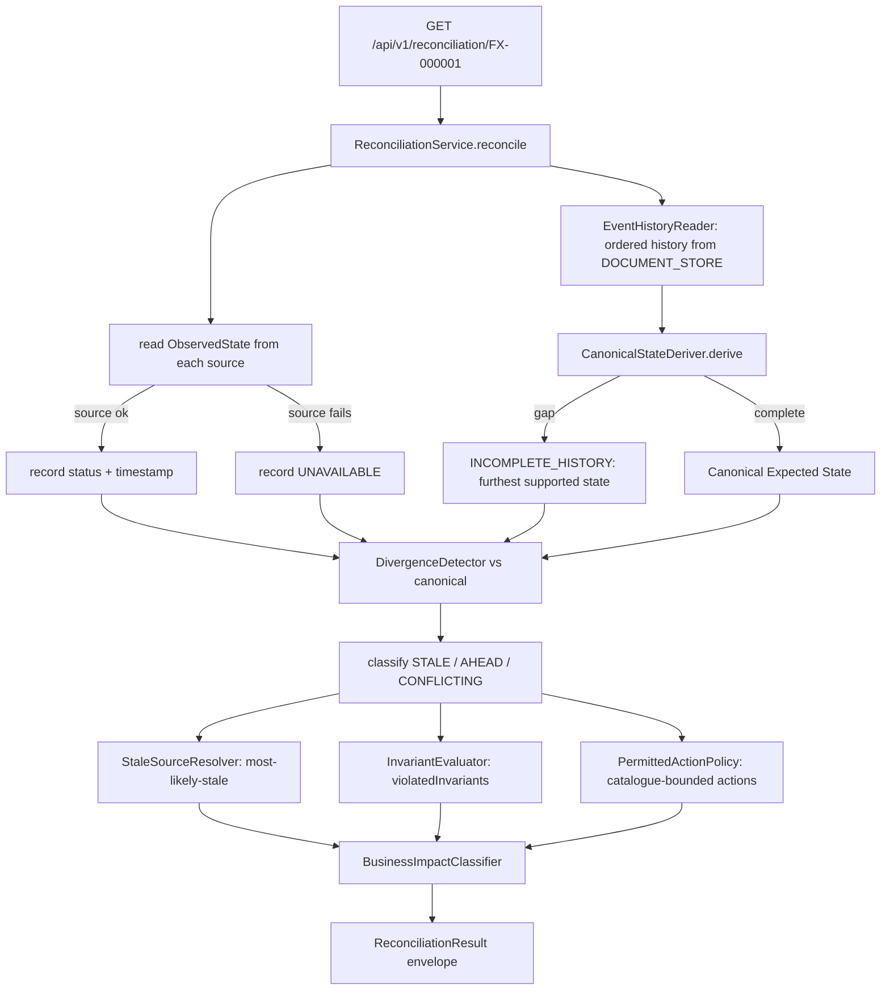

# Design Document — State Reconciliation (Bounded Context)

> **Stage 2 of 3** (`requirements.md → design.md → tasks.md`). This document realizes `requirements.md` for the State Reconciliation bounded context. Unlike requirements (which are technology-agnostic), **design is where Technology Roles resolve to concrete products** — per `01-initial-setup/01-technology-stack` — and where the inherited golden-path NFRs (`architecture-golden-path/01-service-nfrs`) get concrete implementations, including the **degraded-readiness override of GP-Rq-4** (Req 7). Every design decision below traces to a requirement (see §14).

## 1. Overview

The `state-reconciliation-service` is the platform's **deterministic canonical-state authority and cross-source divergence detector**. For a given trade it (a) reads the `Observed State` each system of record reports, (b) derives the one `Canonical Expected State` **deterministically** from the trade's ordered event history and the lifecycle state machine — never by majority vote and never by a model, (c) detects and classifies every divergence, (d) evaluates cross-source invariants, (e) computes permitted corrective actions from a **fixed enumerated catalogue**, and (f) returns a `ReconciliationResult` envelope with a deterministic `businessImpact`. It **decides**; a later agent context interprets and coordinates. It is **read-only across every source** and **never executes** a corrective action.

**Role → concrete binding** (resolved from the technology-stack registry — the *only* place these products are otherwise named):

| Technology Role | Concrete product | Use in this service |
|---|---|---|
| `SERVICE_LANGUAGE` / `SERVICE_FRAMEWORK` | Java 21 / Spring Boot 3.4.x | the service runtime |
| `SERVICE_BUILD_TOOL` | Maven | module build |
| `RELATIONAL_STORE` | PostgreSQL | **read-only** — current trade row (`trade_current_state`) |
| `DOCUMENT_STORE` | MongoDB | **read-only** — trade document / latest audit status, and ordered event history |
| `CACHE` | Redis | **read-only** — cached runtime state |
| `EVENT_STREAM` | Apache Kafka | **read-only** — latest domain event for the trade |
| `ANALYTICS_PLATFORM` | Databricks | **read-only, optional** — additional observed state when configured |
| `SERIALIZATION` | Jackson (ISO-8601, JSON numbers) | DTO (de)serialization |
| `INTEGRATION_TEST_HARNESS` | Testcontainers | Postgres+Mongo+Redis+Kafka integration tests |
| `UNIT_TEST_FRAMEWORK` | JUnit 5 (Jupiter) | domain unit tests |

Domain types (`TradeStatus`, `TradeEventType`, `TradeEvent`) come from the `shared-domain-contracts` shared-kernel dependency — not redefined here.

## 2. Module and package structure

Maven module `Middleware/state-reconciliation-service`, package root `com.fxtradeops.reconciliation`:

```
config/          SecurityConfig (GP-Rq-9 placeholder), DataSourceConfig, MongoConfig,
                 RedisConfig, KafkaConfig, ObservabilityConfig
domain/
  canonical/     CanonicalStateDeriver, LifecycleTransitions (shared/duplicated rules), DerivationResult
  divergence/    DivergenceDetector, DivergenceClassifier, StaleSourceResolver
  invariant/     Invariant, InvariantCatalogue, InvariantEvaluator
  action/        PermittedAction (enum catalogue), PermittedActionPolicy
  impact/        BusinessImpact (ordinal enum), BusinessImpactClassifier
  model/         ObservedState, SourceId, ReconciliationResult, Divergence, ViolatedInvariant
source/          ObservedStateSource (interface)
  relational/    RelationalStateSource      (read-only Postgres)
  document/      DocumentStateSource         (read-only Mongo — state + event history)
  cache/         CacheStateSource            (read-only Redis)
  stream/        EventStreamStateSource      (read-only Kafka — latest event)
  analytics/     AnalyticsStateSource        (read-only Databricks, optional/@ConditionalOnProperty)
application/     ReconciliationService (orchestration), EventHistoryReader, SweepService
api/             ReconciliationQueryController, dto/ (ReconciliationResultView, ObservedStateView,
                 DivergenceView, SweepRequest)
web/             CorrelationIdFilter, GlobalExceptionHandler   (both realize golden-path NFRs)
health/          DegradedReadinessHealthIndicator                (Req 7 — narrows GP-Rq-4)
```

## 3. Observed-state retrieval design (Req 1)

Each source implements one read-only port; a source failure degrades to `UNAVAILABLE` and never fails the whole reconciliation (Req 1.3).

```java
public interface ObservedStateSource {
  SourceId sourceId();                       // RELATIONAL / DOCUMENT / CACHE / EVENT_STREAM / ANALYTICS
  ObservedState read(String tradeId);        // never throws to caller; UNAVAILABLE on failure
}

public record ObservedState(SourceId source, TradeStatus status,   // status == null ⇒ UNAVAILABLE
                            Instant sourceTimestamp, boolean available) {}
```

| Source | Concrete read (read-only) | Observed `TradeStatus` from | Timestamp |
|---|---|---|---|
| `RELATIONAL_STORE` (PostgreSQL) | `SELECT status, updated_at FROM trade_current_state WHERE trade_id=?` | `status` column | `updated_at` |
| `DOCUMENT_STORE` (MongoDB) | latest `trade_lifecycle_audit` doc by `{tradeId}` | `toStatus` | `occurredAt` |
| `CACHE` (Redis) | `GET state:{tradeId}` | cached status value | entry write time (if stored) |
| `EVENT_STREAM` (Kafka) | latest event for `tradeId` (§7) → induced status | `targetFor(eventType)` | event `occurredAt` |
| `ANALYTICS_PLATFORM` (Databricks) | optional query, `@ConditionalOnProperty` | reported status | snapshot time |

- Every source method is wrapped so an infrastructure exception is caught, logged (with correlation id), and mapped to an `UNAVAILABLE` `ObservedState` (Req 1.3, §12). The `available=false` marker is carried into the result `states` map (Req 5.2).
- **Read-only guarantee** (Req 1.4): the Postgres source uses a read-only transaction (`@Transactional(readOnly=true)`), the Mongo/Redis/Kafka sources issue only read/`GET`/consume operations, and no source has any write path. No `@Version` bump, no offset commit that mutates domain state.

## 4. Canonical expected-state derivation design (Req 2)

The canonical state is derived **deterministically** by folding the trade's ordered event history through the **same lifecycle transition rules** the Trade Lifecycle context enforces. These rules are **shared/duplicated deterministically** as a static, immutable table (identical semantics to `trade-lifecycle-service` §3) so the two contexts can never diverge on legality:

```java
// domain/canonical/LifecycleTransitions — deterministic mirror of the lifecycle state machine
static final Map<TradeStatus, Set<TradeStatus>> PERMITTED = Map.of(
  CAPTURED,        Set.of(VALIDATED, CANCELLED, AMENDED, FAILED),
  VALIDATED,       Set.of(ENRICHED, CANCELLED, AMENDED, FAILED),
  ENRICHED,        Set.of(RISK_CALCULATED, CANCELLED, AMENDED, FAILED),
  RISK_CALCULATED, Set.of(BOOKED, CANCELLED, AMENDED, FAILED),
  BOOKED,          Set.of(ALLOCATED, CANCELLED, AMENDED, FAILED),
  ALLOCATED,       Set.of(CONFIRMED, CANCELLED, FAILED),
  CONFIRMED,       Set.of(SETTLED, CANCELLED, FAILED));
// SETTLED, CANCELLED, FAILED -> terminal
```

Derivation (a pure function — unit-testable in isolation, **no majority vote, no LLM**):

```java
// domain/canonical/CanonicalStateDeriver
public DerivationResult derive(List<TradeEvent> orderedHistory) {
  TradeStatus state = null;                       // start empty
  for (TradeEvent e : orderedHistory) {           // events already ordered by occurredAt, seq tie-break
    TradeStatus target = targetFor(e.type());     // induction map (same as lifecycle)
    if (state == null && target == CAPTURED) { state = CAPTURED; continue; }
    if (state != null && PERMITTED.get(state).contains(target)) { state = target; continue; }
    // event not applicable on the canonical path from current state:
    return DerivationResult.incomplete(state);    // INCOMPLETE_HISTORY (Req 2.3)
  }
  return DerivationResult.complete(state);
}
```

- **INCOMPLETE_HISTORY** (Req 2.3): when the ordered history is missing a required event (a gap that makes the next observed event unreachable on the canonical path), derivation stops at the **furthest canonical state supported by the observed events** and the result is marked `INCOMPLETE_HISTORY`. A `null` result (no `CAPTURED`) is likewise `INCOMPLETE_HISTORY`.
- **Determinism** (Req 2.4 / GP-Rq-13): the fold is a total, side-effect-free function of the ordered event list; identical underlying data ⇒ identical `Canonical Expected State`. Event ordering is a stable sort on `(occurredAt, sequence)` so ties are resolved deterministically.
- The canonical decision uses **only** the event history + transition table. Observed states from the other sources are **never** inputs to the derivation (explicitly not a majority vote — Req 2.2).

## 5. Divergence detection and classification design (Req 3)

Each `Observed State` is compared against the `Canonical Expected State`; any mismatch is a `Divergence`, classified deterministically by the source's position relative to the canonical path:

```java
// domain/divergence/DivergenceClassifier
DivergenceClass classify(TradeStatus observed, TradeStatus canonical) {
  int io = pathIndex(observed), ic = pathIndex(canonical);
  if (io < 0 || !onCanonicalPath(observed, canonical)) return CONFLICTING; // unreachable on path
  return (io < ic) ? STALE : AHEAD;                                        // behind vs ahead
}
```

| Classification | Meaning | Rule |
|---|---|---|
| `STALE` | source behind canonical | observed is an earlier state on the canonical path |
| `AHEAD` | source ahead of canonical | observed is a later state on the canonical path |
| `CONFLICTING` | source off the canonical path | observed status not reachable on the path to canonical (e.g. `CACHE=PENDING` when path is `…→CANCELLED`) |

- **Most-Likely-Stale Source** (Req 3.3): among divergent sources, chosen **deterministically** — the source with the earliest `sourceTimestamp` whose observed state is furthest behind the canonical path; ties broken by a fixed source precedence (`EVENT_STREAM` > `RELATIONAL` > `DOCUMENT` > `CACHE` > `ANALYTICS`). No heuristic model.
- **CONSISTENT** (Req 3.4): when every available source equals the canonical state, zero divergences and overall status `CONSISTENT`. `UNAVAILABLE` sources are excluded from the agreement check but recorded in `states`.

## 6. Invariant evaluation and permitted actions design (Req 4)

**Invariants** (Req 4.1) are configured cross-source business rules, each a deterministic predicate over `(observedStates, canonical)` returning a stable code + description when broken:

```java
// domain/invariant/InvariantCatalogue — stable codes; extensible via config, never model-authored
INV_SETTLED_NOT_PENDING_IN_CACHE   // a SETTLED trade must not appear PENDING in the CACHE
INV_CANCELLED_NOT_ADVANCING        // a CANCELLED canonical must not show a post-cancel status anywhere
INV_NO_SOURCE_AHEAD_OF_CANONICAL   // no source may be AHEAD of a terminal canonical state
INV_HISTORY_COMPLETE               // derivation must not be INCOMPLETE_HISTORY for a terminal trade
```

**Permitted actions** (Req 4.2–4.5) are drawn from a **fixed, enumerated catalogue** — never free-form, never model-expanded, and never executed here:

```java
// domain/action/PermittedAction — the ENTIRE catalogue; policy may only select from these
enum PermittedAction { REFRESH_CACHE, REPLAY_EVENT, RESYNC_DOCUMENT_STORE,
                       RESYNC_RELATIONAL_STORE, OPEN_RECONCILIATION_CASE, NO_ACTION }
```

```java
// domain/action/PermittedActionPolicy — deterministic mapping, divergence → permitted actions
EnumSet<PermittedAction> permit(Set<Divergence> divs, DerivationResult d) {
  var out = EnumSet.noneOf(PermittedAction.class);
  for (Divergence x : divs) {
    if (x.source()==CACHE     && x.classification()==STALE) out.add(REFRESH_CACHE);
    if (x.source()==EVENT_STREAM && x.classification()==STALE) out.add(REPLAY_EVENT);
    if (x.source()==DOCUMENT  && x.classification()==STALE) out.add(RESYNC_DOCUMENT_STORE);
    if (x.source()==RELATIONAL&& x.classification()==STALE) out.add(RESYNC_RELATIONAL_STORE);
    if (x.classification()==CONFLICTING)                    out.add(OPEN_RECONCILIATION_CASE);
  }
  if (out.isEmpty()) out.add(NO_ACTION);
  return out;                    // pure; deterministic; catalogue-bounded (Req 4.3/4.4)
}
```

- The context **SHALL NOT execute** any action (Req 4.5) — it only reports the permitted set; execution is coordinated under human approval in the later agent context.

## 7. Event-history and source-access design (Req 1, 2)

- **Event history** (`EventHistoryReader`): the ordered domain-event history is read from the `DOCUMENT_STORE` audit collection (append-only per lifecycle §4), ordered by `occurredAt` then `recordedAt`. This is the **input to canonical derivation** (§4). Read-only.
- **Latest event** (`EventStreamStateSource`): the single latest event for a `tradeId` on the `EVENT_STREAM` is an **observed source** (§3) — its induced status (`targetFor(eventType)`) is compared like any other source. Reading the latest event is a bounded, read-only lookup (compacted view / keyed read) and commits no offset that advances domain processing.
- **No source is written.** There is no persistence *of* reconciliation state required by the domain; the `ReconciliationResult` is computed on demand and returned (optionally cacheable read-through in Redis is out of scope and, if added, remains a derived read-model, never a source mutation).

## 8. API design (Req 5) — read-only, `/api/v1` (GP-Rq-1)

| Endpoint | Returns | Not-found |
|---|---|---|
| `GET /api/v1/reconciliation/{tradeId}` | `ReconciliationResultView` for one trade | 404 if trade unknown to every source |
| `POST /api/v1/reconciliation/sweep` | `ReconciliationResultView[]` — one per `tradeId` (batch/on-demand, `SweepRequest{tradeIds\|filter}`) | 200 with per-trade results |

`ReconciliationResult` envelope shape (Req 5.2/5.3 — PRD-compatible, extended with `businessImpact`):

```json
{ "tradeId": "FX-000001",
  "states": { "RELATIONAL":{"status":"BOOKED","timestamp":"...","available":true},
              "DOCUMENT":{"status":"RISK_CALCULATED","timestamp":"...","available":true},
              "CACHE":{"status":"PENDING","timestamp":"...","available":true},
              "EVENT_STREAM":{"status":"CANCELLED","timestamp":"...","available":true} },
  "expectedState": "CANCELLED",
  "derivation": "COMPLETE",
  "divergences": [ {"source":"RELATIONAL","observed":"BOOKED","classification":"CONFLICTING"} ],
  "mostLikelyStaleSource": "CACHE",
  "violatedInvariants": [ {"code":"INV_CANCELLED_NOT_ADVANCING","description":"..."} ],
  "permittedActions": [ "OPEN_RECONCILIATION_CASE" ],
  "businessImpact": "HIGH" }
```

All endpoints are side-effect free (GP-Rq-1.4). No endpoint mutates any source (Req 1.4).

## 9. Business-impact classification design (Req 6)

`businessImpact` is a **fixed ordinal scale** `NONE < LOW < MEDIUM < HIGH < CRITICAL`, assigned **deterministically** from the divergence nature and the canonical stage:

```java
// domain/impact/BusinessImpactClassifier — deterministic; no monetary computation here (Req 6.3)
BusinessImpact classify(DerivationResult d, Set<Divergence> divs) {
  if (divs.isEmpty()) return NONE;
  boolean settlementStage = isLateStage(d.state());        // CONFIRMED/SETTLED/CANCELLED near settlement
  boolean conflicting     = divs.stream().anyMatch(x -> x.classification()==CONFLICTING);
  if (settlementStage && conflicting) return CRITICAL;     // settlement-stage conflict outranks all
  if (conflicting)                    return HIGH;
  if (settlementStage)                return MEDIUM;
  return LOW;                                                // e.g. cache lag on an early-stage trade
}
```

Where impact would depend on monetary exposure, the result **references the risk/exposure context** rather than computing figures locally (Req 6.3).

## 10. Application of golden-path NFRs (concrete)

| Golden-path | Concrete implementation here |
|---|---|
| GP-Rq-1 API conventions | `/api/v1/reconciliation/**`, read-only, JSON per Jackson; 200/404/503 semantics |
| GP-Rq-2 correlation id | `CorrelationIdFilter` (HTTP) + MDC copy; `%X{correlationId}` in log pattern |
| GP-Rq-3 error envelope | `GlobalExceptionHandler` (`@RestControllerAdvice`) → 400/404/500 bodies, no stack trace |
| **GP-Rq-4 readiness (OVERRIDDEN — Req 7)** | `DegradedReadinessHealthIndicator`: **ready** with exactly one of {Postgres, Mongo, Redis, Kafka} down (that source reported `UNAVAILABLE`); **not-ready (503)** only when ≥2 are down — narrows the strict all-dependencies rule |
| GP-Rq-5 idempotency | reads are naturally idempotent (read-only, no state change, no dedup markers needed) |
| GP-Rq-6 optimistic lock | N/A — no writes to `RELATIONAL_STORE` (read-only across all sources, Req 1.4) |
| GP-Rq-7 atomicity | N/A — publishes no events, writes no state |
| GP-Rq-8 observability | Micrometer + OTel; business metrics `reconciliations_total{status}`, `divergences_total{source,classification}`, `source_unavailable_total{source}` |
| GP-Rq-9 security | `SecurityConfig` permit-all + the standard Phase-6 auth TODO marker |
| GP-Rq-11 configuration | source endpoints/profiles externalized; `ANALYTICS_PLATFORM` source `@ConditionalOnProperty` |
| GP-Rq-12 testing | §13 |
| GP-Rq-13 determinism | canonical derivation, classification, permitted-action policy, and impact are pure functions; no LLM, no majority vote |
| GP-Rq-14 synthetic data | `FX-` ids and fictional names only in all examples/tests |

## 11. Reconciliation flow



## 12. Error handling strategy

- **Source UNAVAILABLE** (Req 1.3): an infrastructure failure reading any single source is **not** a reconciliation error — it is caught in the source adapter, logged at WARN with the correlation id, mapped to an `UNAVAILABLE` `ObservedState`, and carried into `states`. Reconciliation proceeds on the partial picture.
- **Readiness vs request** (Req 7): source availability drives the **readiness probe** (degraded with one down, not-ready with ≥2 down), but an individual `GET`/sweep still returns `200` with `UNAVAILABLE` entries while the service is ready.
- Unknown trade (no source has any state and no history) → `404` via `GlobalExceptionHandler` (GP-Rq-3).
- Validation errors on sweep input → `400` envelope. Unhandled → `500` envelope, no stack trace in body (GP-Rq-3.3).

## 13. Testing strategy (Req 8 + GP-Rq-12)

- **Unit** (`UNIT_TEST_FRAMEWORK`): `CanonicalStateDeriver` (complete path, `INCOMPLETE_HISTORY` gap, determinism: same history ×2 = same state); `DivergenceClassifier` (STALE/AHEAD/CONFLICTING); `PermittedActionPolicy` (every emitted action ∈ catalogue); `BusinessImpactClassifier` ordinal cases.
- **Web-layer** (`WEB_LAYER_TEST`): `GET /{tradeId}` incl. 404; sweep endpoint; envelope shape matches Req 5 incl. an `UNAVAILABLE` source (Req 8.4).
- **Integration** (`INTEGRATION_TEST_HARNESS`: Postgres+Mongo+Redis+Kafka):
  - **Consistent case** (Req 8.1): all sources = canonical → `CONSISTENT`, zero divergences.
  - **Canonical divergence scenario** (Req 8.2): `RELATIONAL_STORE`=`BOOKED`, `DOCUMENT_STORE`=`RISK_CALCULATED`, `CACHE`=`PENDING`, latest `EVENT_STREAM` event=`TRADE_CANCELLED` → assert `expectedState`, per-source classification, expected `violatedInvariants`, and every returned action ∈ catalogue.
  - **Determinism** (Req 8.3): reconcile the same trade twice against identical data → identical `expectedState`.
  - **Degraded readiness** (Req 7): stop one container → readiness `degraded`/ready and that source `UNAVAILABLE`; stop a second → not-ready 503.
- Synthetic `FX-` data only (GP-Rq-14).

## 14. Design decisions (ADR-lite)

- **Canonical state from event history, not majority vote** (Req 2.2): the sources are exactly what may be wrong; deriving canonical from the ordered event log + the lifecycle transition table gives an authoritative reference independent of any store's staleness. A vote would let stale majorities win.
- **Lifecycle rules duplicated deterministically, not called live**: reconciliation must not depend on the lifecycle service being reachable, and both contexts must agree on legality forever. The transition table is a small, fixed, unit-tested mirror of the shared kernel — cheaper and safer than a runtime dependency.
- **Permitted actions as a fixed enum catalogue** (Req 4.3/4.4): a controlled, approved set makes every action an agent later proposes auditable and non-inventable; policy may only *select*, never *author*.
- **Read-only across all sources** (Req 1.4): the context decides, it does not fix — so it holds no write path, no `@Version`, no producer, and no offset-advancing consume. This is why GP-Rq-6/7 are N/A.
- **Degraded readiness overrides GP-Rq-4** (Req 7): partial-picture reconciliation is still valuable, so one down source degrades rather than removes the service from rotation; two or more falls back to golden-path not-ready.

## 15. Requirement → design traceability

| Requirement | Satisfied by |
|---|---|
| Req 1 Cross-source observed-state retrieval | §3, §7 |
| Req 2 Deterministic canonical derivation | §4, §7 |
| Req 3 Divergence detection + classification | §5 |
| Req 4 Invariants + permitted actions | §6 |
| Req 5 Reconciliation result contract | §8 |
| Req 6 Business-impact classification | §9 |
| Req 7 Degraded readiness (overrides GP-Rq-4) | §10, §12 |
| Req 8 Domain acceptance scenarios | §13 |
| Inherited GP-Rq-* | §10 |
