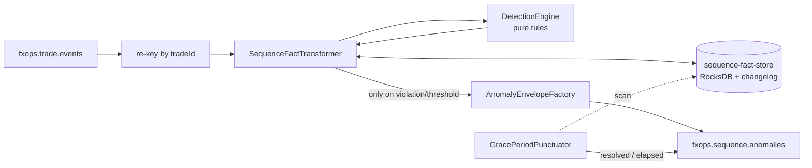
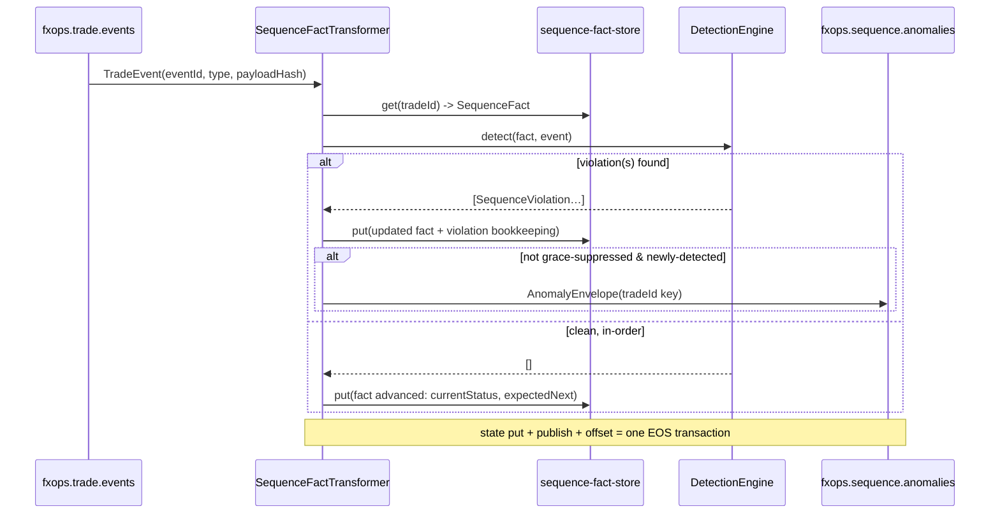

# Design Document — Event Sequence Processor (Bounded Context)

> **Stage 2 of 3** (`requirements.md → design.md → tasks.md`). This document realizes `requirements.md` for the Event Sequence Processor bounded context. Unlike requirements (which are technology-agnostic), **design is where Technology Roles resolve to concrete products** — per `01-initial-setup/01-technology-stack` — and where the inherited golden-path NFRs (`architecture-golden-path/01-service-nfrs`) get concrete implementations. Every design decision below traces to a requirement (see §13).

## 1. Overview

The `event-sequence-processor` is a **running Spring Boot service** that hosts a continuous Kafka Streams topology. It consumes `fxops.trade.events`, maintains a per-`tradeId` `SequenceFact` in a state store, and detects sequencing anomalies — missing, duplicate, conflicting-replay, out-of-order, orphan-child, and post-close events. On violation (or on a configured threshold) it emits a compact **anomaly envelope** to `fxops.sequence.anomalies`. It **never** advances lifecycle state, computes risk, exposes write APIs, or invokes a model — all detection is deterministic stream processing (inherited GP-Rq-13). Being a `Middleware/` service, it **inherits the full golden path**; §7 gives each inherited NFR a concrete realization.

The **agent/Kafka boundary** is load-bearing here: the high-volume raw event stream is processed entirely in-service by Kafka Streams; **only** compact anomaly envelopes cross to downstream agents/monitoring — the platform never routes a high-volume stream through an agent (technology-stack Req 5.2/5.5, GP-Rq-13).

**Role → concrete binding** (resolved from the technology-stack registry — the *only* place these products are otherwise named):

| Technology Role | Concrete product | Use in this service |
|---|---|---|
| `SERVICE_LANGUAGE` / `SERVICE_FRAMEWORK` | Java 21 / Spring Boot 3.4.x | the service runtime hosting the stream topology |
| `EVENT_STREAM` | Apache Kafka (KRaft) | consume `fxops.trade.events`; produce `fxops.sequence.anomalies` |
| `STREAM_PROCESSING` | Kafka Streams | the anomaly-detection topology (exactly-once) |
| state store (`STREAM_PROCESSING`) | Kafka Streams RocksDB state store | `SequenceFact` per `tradeId`, backed by changelog |
| `RELATIONAL_STORE` (optional read model) | PostgreSQL | optional materialized `sequence_fact` projection for the query API |
| `CACHE` | Redis | short-lived grace-period / punctuation bookkeeping (optional) |
| `SERIALIZATION` | Jackson (ISO-8601, JSON numbers) | envelope/DTO and state-store SerDes |
| `OBSERVABILITY_METRICS` | Micrometer + Prometheus | violation counters, state-store gauges |
| `INTEGRATION_TEST_HARNESS` | Testcontainers | Kafka integration tests (inject out-of-order/duplicate streams) |
| `UNIT_TEST_FRAMEWORK` / `WEB_LAYER_TEST` | JUnit 5 / MockMvc + `TopologyTestDriver` | detection-rule unit tests; query API web tests |

Domain types (`TradeEvent`, `TradeStatus`, `TradeEventType`, `EventEnvelope`) come from the `shared-domain-contracts` shared-kernel dependency — not redefined here.

## 2. Module and package structure

Maven module `Middleware/event-sequence-processor`, package root `com.fxtradeops.eventsequence`:

```
config/          SecurityConfig (GP-Rq-9 placeholder), KafkaStreamsConfig, ObservabilityConfig, SequenceProperties (@ConfigurationProperties)
domain/          SequenceFact, SequenceViolation, ViolationType (enum), ExpectedNextEvents
                 SequenceStateMachine (shared transition table — same source as trade-lifecycle)
topology/        SequenceTopology (StreamsBuilder wiring), SequenceFactTransformer (state-store processor)
detection/       DetectionEngine + rules: MissingEventRule, DuplicateEventRule, ConflictingReplayRule,
                 OutOfOrderRule, OrphanChildRule, PostCloseRule
anomaly/         AnomalyEnvelope, AnomalyEnvelopeFactory, AnomalyPublisher (sink into fxops.sequence.anomalies)
state/           SequenceFactStore (keyed by tradeId), SequenceFactSerde
punctuation/     GracePeriodPunctuator (wall-clock/stream-time scan for elapsed grace windows)
api/             SequenceQueryController, dto/ (SequenceFactView, ViolationView)   (read-only)
web/             CorrelationIdFilter, GlobalExceptionHandler   (both realize golden-path NFRs)
health/          StreamsReadinessHealthIndicator
```

## 3. Stream topology and `SequenceFact` maintenance (Req 1)

A single Kafka Streams topology keyed by `tradeId`. `fxops.trade.events` is consumed, re-keyed to `tradeId` (if not already partitioned by it), and each record flows through a stateful `SequenceFactTransformer` bound to the `sequence-fact-store`. The transformer is the only writer of the `SequenceFact`; detection rules are pure functions over `(currentFact, incomingEvent)`.

```java
// per-tradeId running state held in the STREAM_PROCESSING state store
record SequenceFact(
  String tradeId,
  TradeStatus currentStatus,                 // last in-order status reached
  List<ObservedEvent> observedEvents,        // {eventType, eventId, occurredAt, payloadHash, outOfOrder}
  Set<TradeEventType> expectedNextEvents,    // derived from SequenceStateMachine.canTransitionFrom(currentStatus)
  List<TradeEventType> missingEvents,        // detected-but-unseen prerequisites (dedup keyed by type)
  List<String> duplicateEventIds,            // eventIds already recorded
  List<SequenceViolation> sequenceViolations,// {type, detectedAt, detail} — emitted-once bookkeeping
  boolean complete,                          // terminal event observed
  Instant lastObservedAt) {}                 // basis for GracePeriod expiry
```

Processing steps per record (`SequenceFactTransformer.transform`):
1. Adopt/generate `correlationId` from the event envelope (GP-Rq-2) into MDC.
2. Load `SequenceFact` for `tradeId` from the state store (init if absent and event is initiating).
3. Run `DetectionEngine` (§4) → list of `SequenceViolation` (may be empty).
4. Mutate the `SequenceFact`: append `ObservedEvent`, recompute `expectedNextEvents` from `SequenceStateMachine`, advance `currentStatus` **only** for a valid in-order transition, record duplicates/missing/violations with emitted-once bookkeeping.
5. Put updated `SequenceFact` back to the store (change flushed to changelog, §5).
6. For each **new** violation, forward one `AnomalyEnvelope` (§4) to the sink — unless suppressed by `GracePeriod` (§4, Req 5.5).
7. On terminal event, mark `complete`; a retention punctuator later expires the entry (Req 1.4).

`ExpectedNextEvents` is derived from the **same** transition table as the Trade Lifecycle bounded context (Req 1.3) — `SequenceStateMachine.PERMITTED` mirrors `02-microservices/03-trade-lifecycle-service` §3 so the two contexts agree on "valid next event". The table lives in the shared kernel to prevent drift.



## 4. Detection logic and the anomaly envelope (Req 2, 3, 4, 5)

`DetectionEngine` runs an ordered set of **pure** rules against `(fact, event)`; each yields zero or more `SequenceViolation`s. Rules never mutate state or perform I/O.

| Rule | Condition | ViolationType | Notes |
|---|---|---|---|
| `OutOfOrderRule` | arriving event maps to a `TradeStatus` earlier than `fact.currentStatus` | `OUT_OF_ORDER_EVENT` | recorded in observation list, does **not** advance `currentStatus` (Req 4.3) |
| `DuplicateEventRule` | `eventId` already in `fact` **and** identical `payloadHash` | `DUPLICATE_EVENT` | stream continues (Req 3.3) |
| `ConflictingReplayRule` | `eventId` already in `fact` **but** differing `payloadHash` | `CONFLICTING_REPLAY` | both payloads carried in envelope (Req 3.4) |
| `MissingEventRule` | arriving type T2 requires prerequisite T1 (per state machine) not in `fact` | `MISSING_EVENT` | records T1 as missing; suppressed until `GracePeriod` elapses (Req 2, 5.5); at most one envelope per (tradeId, missing type) (Req 2.3) |
| `OrphanChildRule` | non-initiating event for a `tradeId` with no existing `SequenceFact` | `ORPHAN_CHILD_EVENT` | no lifecycle root observed |
| `PostCloseRule` | any event after a terminal event marked `complete` | `POST_CLOSE_EVENT` | flags activity on a closed trade |

**Grace-period resolution:** if a `MissingEvent`'s prerequisite arrives within the configured `GracePeriod` (externalized, GP-Rq-11, Req 6.4), `GracePeriodPunctuator`/the transformer clears it and emits a `MISSING_EVENT_RESOLVED` envelope (Req 2.4). Missing-event violations are **not** emitted until the grace window elapses (Req 5.5).

**Anomaly envelope** — compact, self-contained (Req 5.4), emitted **only** on violation/threshold. It carries the standard `EventEnvelope` metadata (per `03-events/02-domain-events-model` Req 1) plus violation-specific fields:

```json
{
  "eventId": "…", "correlationId": "…", "sourceService": "event-sequence-processor",
  "occurredAt": "2026-01-01T00:00:00Z", "tradeId": "FX-000042",
  "violationType": "MISSING_EVENT",
  "detectedAt": "2026-01-01T00:00:05Z",
  "observedEventType": "TRADE_BOOKED",
  "missingEventType": "TRADE_RISK_CALCULATED",
  "duplicateEventId": null, "eventType": null,
  "firstSeenAt": null, "duplicateSeenAt": null,
  "arrivingEventStatus": null, "currentFactStatus": "ENRICHED",
  "priorPayloadHash": null, "conflictingPayloadHash": null,
  "sequenceFactSnapshot": {
    "currentStatus": "ENRICHED",
    "observedEventTypes": ["TRADE_CAPTURED","TRADE_VALIDATED","TRADE_ENRICHED","TRADE_BOOKED"],
    "missingEvents": ["TRADE_RISK_CALCULATED"],
    "expectedNextEvents": ["TRADE_RISK_CALCULATED","TRADE_CANCELLED","TRADE_AMENDED","TRADE_FAILED"]
  }
}
```

Only the fields relevant to a violation type are populated (nulls elided at serialization). The envelope is published within one processing interval, never buffered (Req 5.3), with `tradeId` as the partition key (Req 5.1).

## 5. State store and changelog (Req 1.5, 6.1, 6.2)

- Store `sequence-fact-store`: a persistent RocksDB key-value store, `key = tradeId`, `value = SequenceFact` via `SequenceFactSerde` (Jackson).
- Backed by the compacted internal changelog topic `fxops.internal.sequence-processor.facts` (Req 1.5). On restart the store is **restored from the changelog** without re-reading `fxops.trade.events` (Req 6.2).
- `processing.guarantee=exactly_once_v2`: state update + anomaly publish + input-offset commit form one transaction, so a restart yields no duplicate envelopes and no missed violations (Req 6.1, and GP-Rq-7 `AtomicPublish` realized natively by the transactional producer).
- Retention: on terminal/`complete`, a punctuator expires the entry after the configured retention window (Req 1.4); changelog compaction reclaims the tombstoned key.

## 6. Query API design (read-only, `/api/v1`, GP-Rq-1)

A read-only API over the current `SequenceFact` (served via Kafka Streams **Interactive Queries** against the local/queryable store, or the optional Postgres projection). Side-effect free (GP-Rq-1.4).

| Endpoint | Returns | Not-found |
|---|---|---|
| `GET /api/v1/sequence/{tradeId}` | `SequenceFactView{currentStatus, observedEventTypes, expectedNextEvents, missingEvents, duplicateEventIds}` | 404 |
| `GET /api/v1/sequence/{tradeId}/violations` | ordered `ViolationView[]` (type, detectedAt, detail) | 404 |

If the key lives on another instance's partition, the controller resolves the owning host via `KafkaStreams.queryMetadataForKey` and returns `503`/redirect metadata until standby is ready (degraded readiness, GP-Rq-4).

## 7. Application of inherited golden-path NFRs (concrete)

| Golden-path | Concrete implementation here |
|---|---|
| GP-Rq-1 API conventions | read-only `/api/v1/sequence/**`; JSON per `SERIALIZATION`; reads side-effect free (§6) |
| GP-Rq-2 correlation id | `CorrelationIdFilter` (HTTP) + envelope `correlationId` copied to MDC in the transformer; `%X{correlationId}` in log pattern; set on every emitted `AnomalyEnvelope` |
| GP-Rq-3 error envelope | `GlobalExceptionHandler` (`@RestControllerAdvice`) → 400/404/409/503/500 bodies, no stack trace in body |
| GP-Rq-4 readiness | `StreamsReadinessHealthIndicator`: `DOWN` if `KafkaStreams.State != RUNNING/REBALANCING` or the store is not restored (Req 6.3); Kafka reachable |
| GP-Rq-5 idempotency | duplicate detection **is** the domain function; internally, exactly-once + emitted-once violation bookkeeping prevents duplicate envelopes (§4, §5) |
| GP-Rq-6 optimistic lock | N/A for the stream store (single-writer per partition); the optional Postgres projection uses `@Version` if written |
| GP-Rq-7 atomicity | `exactly_once_v2` transactional producer: state + anomaly publish + offset commit atomic (§5) |
| GP-Rq-8 observability | Micrometer + OTel; business metrics `sequence_violations_total{type}`, `sequence_facts_active`, `anomaly_envelopes_published_total{type}`, `grace_period_resolutions_total`; trace context across the `EVENT_STREAM` boundary |
| GP-Rq-9 security | `SecurityConfig` permit-all + the standard Phase-6 auth TODO marker |
| GP-Rq-10 resilience | no synchronous downstream calls (fire-and-forget anomaly publish); Streams retries/backoff via config |
| GP-Rq-11 configuration | `SequenceProperties` (`@ConfigurationProperties`) externalizes `GracePeriod`, retention window, threshold, topic names; profiles for local/AWS/Azure; nothing hard-coded (Req 6.4) |
| GP-Rq-12 testing | §11 |
| GP-Rq-13 determinism / LLM boundary | all detection is deterministic Kafka Streams; **no model invoked**; only compact envelopes cross to agents (§1 boundary) |
| GP-Rq-14 synthetic data | all fixtures/examples use `FX-` ids and fictional `fxops.*` topics |

## 8. Key sequence flow (violation branch)



## 9. Error handling strategy

- A detected anomaly is **not** an error — it is a recorded domain outcome emitted as an envelope; the stream never halts on it (Req 3.3, 4).
- Deserialization failure of an inbound record → routed to a DLQ per `03-events/04-dlq-management` (default `LogAndContinue`/`LogAndFail` per config), never crashes the topology.
- Infrastructure failure (broker unreachable) → Streams pauses; readiness reports `DOWN` (GP-Rq-4); EOS guarantees no partial commit; recovery restores from changelog (§5).
- API-layer unknown `tradeId` / validation → 404/400 via `GlobalExceptionHandler`; key-not-local → 503 (§6, GP-Rq-3).

## 10. Design decisions (ADR-lite)

- **Kafka Streams stateful transformer over ad-hoc consumer + external DB**: the domain is inherently per-key running state over a high-volume stream; a state store with changelog gives exactly-once, restart-safe recovery and Interactive Queries for free — and keeps the high-volume stream off any agent (technology-stack Req 5.2).
- **Shared transition table with Trade Lifecycle**: `ExpectedNextEvents` must agree with the lifecycle context (Req 1.3); the table is owned once in the shared kernel to prevent drift.
- **Pure detection rules**: each rule is a pure function of `(fact, event)` → trivially unit-testable with `TopologyTestDriver`, no I/O, deterministic (GP-Rq-13).
- **Emit only on violation/threshold**: raw events stay in Kafka; only compact, self-contained envelopes cross the agent boundary (§1, Req 5.4).
- **Grace period externalized**: late arrivals are common in at-least-once streams; a configurable window (GP-Rq-11) avoids false-positive missing-event storms and enables `MISSING_EVENT_RESOLVED` (Req 2.4).

## 11. Testing strategy (Req 6.5 + GP-Rq-12)

- **Unit** (`UNIT_TEST_FRAMEWORK`): each detection rule against crafted `(fact, event)` pairs — every `ViolationType` positive + negative; `SequenceStateMachine` expected-next derivation.
- **Topology** (`TopologyTestDriver`): drive synthetic records through the built topology; assert `SequenceFact` mutations and forwarded envelopes without a broker.
- **Web-layer** (`WEB_LAYER_TEST`): `GET /api/v1/sequence/{tradeId}` and `/violations` incl. 404 and anomaly-visible views.
- **Integration** (`INTEGRATION_TEST_HARNESS`: Testcontainers Kafka): inject an **out-of-order** stream → assert `OUT_OF_ORDER_EVENT` envelope + fact unchanged status; inject a **duplicate** `eventId` → `DUPLICATE_EVENT`; inject a **conflicting replay** → `CONFLICTING_REPLAY` with both payloads; inject a **gap** then late arrival within grace → `MISSING_EVENT_RESOLVED`; restart the app mid-stream → assert store restored from changelog with no duplicate envelopes (Req 6.1/6.2).
- Synthetic `FX-` ids and fictional `fxops.*` topics only (GP-Rq-14).

## 12. Property-based checks (PROPERTY_TEST — GP-Rq-12.3)

- For any permutation of a valid event sequence, the multiset of `observedEvents` in the final `SequenceFact` equals the input multiset (no event dropped).
- Replaying any prefix twice never advances `currentStatus` beyond the single-pass result (idempotence of in-order advancement).

## 13. Requirement → design traceability

| Requirement | Satisfied by |
|---|---|
| Req 1 Per-trade sequence fact | §3, §5 |
| Req 2 Missing event detection | §4 (MissingEventRule, grace resolution) |
| Req 3 Duplicate / conflicting replay | §4 (DuplicateEventRule, ConflictingReplayRule) |
| Req 4 Out-of-order detection | §4 (OutOfOrderRule) |
| Req 5 Anomaly envelope publication | §4 (envelope), §8 |
| Req 6 Resilience / exactly-once | §5, §7 (GP-Rq-4/7), §11 |
| Inherited GP-Rq-* | §7 |
