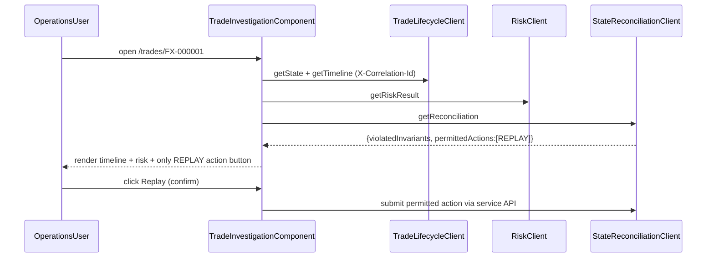
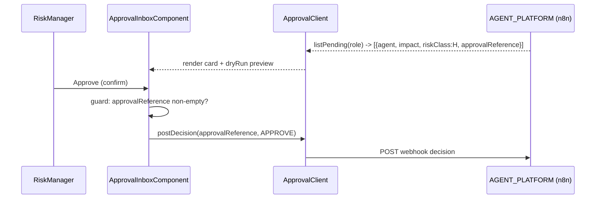

# Design Document — Admin Portal (Operations & Risk)

> **Stage 2 of 3** (`requirements.md → design.md → tasks.md`). This document realizes `requirements.md` for the Admin Portal bounded context. Unlike requirements (which are technology-agnostic), **design is where Technology Roles resolve to concrete products** — per `01-initial-setup/01-technology-stack`. This is an **Angular standalone frontend application**, not a Spring Boot service: the backend golden-path service NFRs (health probes, DB optimistic locking, event/offset atomicity, Kafka consumption) do **not** apply here. §7 states which cross-cutting concerns *do* apply to a browser UI. Every design decision below traces to a requirement (see §12).

## 1. Overview

The Admin Portal is a standalone single-page web application that gives operations staff and risk managers one place to investigate trades, monitor End-of-Day (EOD) close readiness, inspect risk aggregations, triage exceptions, and act on human-in-the-loop (HITL) agent approval requests. It is a **pure consumer of backend REST APIs** — it holds no domain logic, connects to no data store, event stream, or agent runtime directly, and never performs exact arithmetic or authoritative state transitions. All displayed data is read from `Middleware/` service APIs; all state-changing actions are POSTed back through those same APIs (or the `AGENT_PLATFORM` webhook), which enforce the deterministic action-gate.

**Role → concrete binding** (resolved from the technology-stack registry — the *only* place these products are otherwise named):

| Technology Role | Concrete product | Use in this portal |
|---|---|---|
| `FRONTEND_FRAMEWORK` | Angular 19.x (standalone components) | the SPA runtime; standalone components only, no `NgModule` declarations |
| *(language)* | TypeScript (strict) | all component, service, and model code |
| *(styling)* | Angular component styles + design tokens | WCAG 2.1 AA theming, colour-plus-icon breach indicators |
| *(HTTP)* | Angular `HttpClient` + typed API clients | talks to backend services over their REST / MCP-tool-backed APIs |
| `AGENT_PLATFORM` | n8n | source of HITL approval requests; target of approve/reject webhook POSTs |
| *(unit/component test)* | Angular TestBed + Jasmine/Karma (`ng test`) | component + service specs |
| *(e2e test)* | Playwright (`ng e2e`) against a mock API | end-to-end flows with synthetic data |

The portal talks only to backend services; it never names or imports a data store, `EVENT_STREAM`, `RULES_ENGINE`, or agent runtime — those are backend concerns exposed to the UI solely as JSON over HTTP.

## 2. Application and folder structure

Angular workspace `Portals/Admin/` (project name `admin-portal`), source root `src/app`. Standalone components, feature-lazy routes, a `core/` singleton layer, and a `shared/` presentational layer:

```
Portals/Admin/
  angular.json  package.json  tsconfig.json
  src/
    environments/
      environment.ts            API base URLs + polling intervals (dev)     (Req 6.3)
      environment.prod.ts       production config placeholders               (Req 6.3)
    app/
      app.config.ts             standalone bootstrap: providers, router, HttpClient, interceptors
      app.routes.ts             top-level route map (§3)
      app.component.ts          shell: nav, role banner, approval-inbox badge
      core/
        api/                    typed API clients (§4)
          trade-lifecycle.client.ts
          risk.client.ts
          eod.client.ts
          state-reconciliation.client.ts
          exception-materiality.client.ts
          approval.client.ts        (AGENT_PLATFORM webhook client)
        http/
          correlation-id.interceptor.ts   generates/propagates X-Correlation-Id  (§7)
          error.interceptor.ts            maps API errors → typed AppError        (§7)
        config/
          app-config.service.ts   reads environment (base URLs, intervals)  (Req 6.3)
        auth/
          auth.placeholder.ts     Phase-N token-auth TODO marker, no secrets (Req 6.4)
        models/                   TypeScript interfaces mirroring API DTOs (§4)
      shared/
        components/             status-badge, breach-indicator, confirm-dialog,
                                error-panel, retry-button, loading-spinner, empty-state
        a11y/                   focus-trap, live-region announcer            (Req 6.2)
        pipes/                  elapsed-time, utilization-percent
      features/
        trade-investigation/   (§3.1)
        eod-dashboard/         (§3.2)
        risk-aggregation/      (§3.3)
        exception-queue/       (§3.4)
        approval-inbox/        (§3.5, §6)
```

Model interfaces (`TradeStatus`, `RiskResult`, `RegionalCloseStatus`, `ReconciliationResult`, `ExceptionEntry`, `ApprovalRequest`) live under `core/models/` and are hand-mirrored from the backend service contracts — the UI never redefines domain rules, only the shapes it renders.

## 3. Route map and feature views (Req 1–5)

Top-level routes in `app.routes.ts`, each a lazily-loaded standalone component; default redirect to the EOD dashboard.

| Route | Feature view | Primary source service(s) | Req |
|---|---|---|---|
| `/eod` (default) | `EodDashboardComponent` | EOD Processing | 2 |
| `/trades` | `TradeSearchComponent` | Trade Lifecycle | 1.1 |
| `/trades/:tradeId` | `TradeInvestigationComponent` | Trade Lifecycle, Risk, State Reconciliation | 1.2–1.5 |
| `/risk` | `RiskAggregationComponent` | Risk Calculation | 3 |
| `/exceptions` | `ExceptionQueueComponent` | EOD Processing, Exception/DLQ | 4 |
| `/approvals` | `ApprovalInboxComponent` | `AGENT_PLATFORM` (n8n) | 5 |
| `**` | `NotFoundComponent` | — | — |

### 3.1 Trade Investigation (Req 1)
Search accepts a `FX-######` id and routes to `/trades/:tradeId`. The view fans out (parallel loads) to render: current `TradeStatus` + ordered lifecycle timeline (Trade Lifecycle), `RiskResult` if present (Risk), active `SequenceViolation` anomalies, any `DLQTopic` presence with `dlq.failure.reason`, and reconciliation status (`violatedInvariants`, `permittedActions`) from State Reconciliation. **State-changing actions (replay, reconcile) render only when the matching `permittedAction` is present** in the reconciliation result — the UI never invents an action the deterministic service did not authorize (Req 1.5, consistent with §6 action-gate).

### 3.2 EOD Readiness Dashboard (Req 2)
Shows `RegionalCloseStatus` per `RegionCode` (`APAC`, `EMEA`, `AMERICAS`) and `GlobalConsolidationStatus`. Refreshes on a **configurable poll (default 30s)**, externalized via config; upgrades to SSE/websocket push if the backend advertises it. States `IN_PROGRESS`/`READY`/`BLOCKED`/`CLOSED` use accessible colour **plus** label/icon. A `BLOCKED` region shows `blockerCode` + `blockerDescription` and deep-links to `/exceptions?region=<code>`. Displays `GlobalBusinessDate` and per-region elapsed-since-start.

### 3.3 Risk Aggregation (Req 3)
Groups risk totals by `regionCode` and `tradingBookId` from the Risk service. Per group: total `riskAmount`, configured `Limit`, utilization %, `RiskLevel`. Breaches are highlighted with an **icon/text label, not colour alone**, and link to affected trades. Shows the most-recent-calculation timestamp per aggregate so staleness is visible.

### 3.4 Exception Management Queue (Req 4)
Lists unresolved exceptions from EOD Processing (late trades, branch blockers) and the DLQ layer (dead-lettered + poison messages). Filterable by type, `regionCode`, `tradeId`, date range. Each row shows type, `tradeId` (if any), `regionCode`, created-at, status. A resolution action button appears only when a permitted action exists (per State Reconciliation / EOD) and **requires a confirm step** before routing through the service API. `PoisonMessage` rows are flagged and show a **"requires manual review"** label with no auto-replay button.

### 3.5 Approval Inbox (Req 5)
See §6 — the HITL widget surfaced as its own route and as a shell badge.

## 4. API integration layer (Req 1–5, 6.3, 6.5)

Each backend service gets **one typed client** under `core/api/`, injectable, returning typed `Observable`s of `core/models` interfaces. Clients read their base URL from `AppConfigService` (never hard-coded — Req 6.3) and never build cross-service knowledge; a feature view composes multiple clients.

| Client | Backing service | Representative calls |
|---|---|---|
| `TradeLifecycleClient` | Trade Lifecycle | `getState(tradeId)`, `getTimeline(tradeId)`, `getExpectedLifecycle(tradeId)` |
| `RiskClient` | Risk Calculation | `getRiskResult(tradeId)`, `getAggregation({groupBy})` |
| `EodClient` | EOD Processing | `getRegionalStatuses(businessDate)`, `getGlobalStatus()` |
| `StateReconciliationClient` | State Reconciliation | `getReconciliation(tradeId)` → `{violatedInvariants, permittedActions}` |
| `ExceptionMaterialityClient` | Exception / DLQ + materiality | `listExceptions(filter)`, `submitResolution(id, action)` |
| `ApprovalClient` | `AGENT_PLATFORM` (n8n) | `listPending(role)`, `postDecision(approvalReference, decision, note?)` |

**Cross-cutting client behaviour (HTTP interceptors, applied to all clients):**
- **Correlation-id propagation** — `CorrelationIdInterceptor` attaches an `X-Correlation-Id` header to every outbound request (generating one per user-initiated flow, reusing it across the fan-out of a single view) so a UI action is traceable end-to-end into backend logs (§7).
- **Typed error handling** — `ErrorInterceptor` catches non-2xx responses, maps the backend error envelope to a typed `AppError { code, userMessage, correlationId }`, strips any raw stack trace / internal detail, and surfaces only a user-friendly message + retry affordance (Req 6.5, §7). Network/timeout failures map to a distinct retryable `AppError`.

## 5. State and data-loading approach (Req 2.2, 5.6)

The portal is **read-mostly**; it deliberately avoids a heavy global store. Approach:
- **Local component state via Angular signals** for view-scoped data; `AppConfigService` and auth placeholder are the only app-wide singletons.
- **Declarative loading** — each view exposes a `ViewState<T> = { status: 'loading' | 'ready' | 'error', data?, error? }` so templates render loading / empty / error / ready uniformly (pairs with §7 error display and the shared `error-panel`/`retry-button`).
- **Polling** for live views (EOD 30s, Approval 15s) implemented with an RxJS `timer`+`switchMap` stream whose interval comes from config (Req 2.2, 5.6); pauses when the tab is hidden and on `error` until retry.
- **Fan-out reads** (trade investigation) use `forkJoin` across clients with per-source graceful degradation — a missing `RiskResult` or reconciliation does not blank the whole view.
- No client-side caching of authoritative values beyond the current view; the backend `RELATIONAL_STORE` remains the source of truth, and staleness timestamps (§3.3) are shown rather than hidden.

## 6. Human-in-the-loop approval UI (Req 5) — action-gate consistent

The Approval Inbox is the UI surface of the platform's HITL gate. It renders only what the deterministic backend authorizes and captures the `approvalReference` token that binds a decision to its request:

- **Listing** — `ApprovalClient.listPending(role)` returns pending `AGENT_PLATFORM` requests routed to the current user's role; polled at a configurable default **15s** (Req 5.1, 5.6). Shell shows a live pending-count badge.
- **Request card** renders: requesting agent name (e.g. `eod-readiness-agent`), proposed-action description, the deterministic **impact / dryRun preview report** generated by the service, risk classification (`M`/`H`), and the `approvalReference` token (Req 5.2).
- **permittedActions rendering** — approve/reject controls (and any per-request permitted actions) are derived from the request payload, never hard-coded; this mirrors the Trade Investigation action-gate (§3.1) so the UI is uniformly incapable of surfacing an unauthorized action.
- **Confirmation** — both Approve and Reject route through the shared `confirm-dialog` before submission (Req 5.3); Reject captures an optional operator note.
- **Decision POST** — on approve, `ApprovalClient.postDecision(approvalReference, 'APPROVE')` POSTs to the configured `AGENT_PLATFORM` webhook (base URL from config); on reject it POSTs `'REJECT'` + note (Req 5.4).
- **Guard** — the submit control is disabled and submission is blocked when `approvalReference` is absent or empty (Req 5.5), enforced in both the component and the client.

## 7. Cross-cutting UI concerns (which golden-path concerns apply to a frontend)

The backend service NFRs (readiness probes, DB optimistic locking, event/offset atomicity, idempotent Kafka consumption) have **no frontend analogue** and are intentionally omitted. The concerns that *do* apply to this browser UI:

| Concern | Concrete implementation here | Req |
|---|---|---|
| Correlation-id propagation | `CorrelationIdInterceptor` sets `X-Correlation-Id` on all outbound calls; surfaced in `AppError` for support (§4) | (traceability) |
| Structured error display | `ErrorInterceptor` → typed `AppError`; `error-panel` + `retry-button`; user-friendly message, **retry allowed**, never raw stack traces or internal details | 6.5 |
| No secrets in the client | No credentials/tokens committed; `auth.placeholder.ts` marks where Phase-N token auth wires in; config holds URLs/intervals only | 6.4 |
| Externalized configuration | All API base URLs + poll intervals in `environment*.ts` via `AppConfigService`; nothing hard-coded | 6.3 |
| i18n-ready | User-facing strings authored through Angular i18n (`$localize` / message ids), no concatenated literals; ready for translation | (baseline) |
| Accessibility (WCAG 2.1 AA) | Semantic landmarks, keyboard nav, focus-trap dialogs, live-region announcements, AA contrast, **colour-plus-icon/label** for states and breaches | 6.2, 2.3, 3.5 |
| Standalone component model | No `NgModule` declarations; every component/route/provider standalone | 6.1 |
| Synthetic-data safeguard | All fixtures, e2e data, and documented screenshots use `FX-` ids and fictional names only | 1.6, 6.6 |

### Testing strategy (Req 6; component + e2e)
- **Component/service specs** (`ng test`, TestBed + Jasmine): each feature component renders loading/empty/error/ready states; the correlation-id and error interceptors behave; the action-gate hides unauthorized actions; the approval guard blocks an empty `approvalReference`.
- **e2e** (`ng e2e`, Playwright against a mock API returning synthetic `FX-` payloads): trade search → investigation render; EOD dashboard poll + `BLOCKED` deep-link; risk breach indicator (icon+label); exception filter + poison-message no-replay; approval approve/reject happy path with `approvalReference`.
- **a11y checks** integrated into e2e (axe scan) asserting WCAG 2.1 AA on each view.
- All fixtures use `SyntheticData` only (Req 1.6, 6.6).

## 8. Key interaction flows

Trade investigation fan-out and the action-gate:



Approval decision (HITL gate):



## 9. Error handling strategy (Req 6.5)
- API non-2xx → `ErrorInterceptor` → typed `AppError` → `error-panel` with a plain-language message + retry; the `correlationId` is shown for support, internal details are not.
- Partial fan-out failure → degrade gracefully: render the sections that loaded, show a per-section error for the rest (§5).
- An absent/empty `approvalReference` is treated as a hard block, not an error toast (Req 5.5).
- Never surface a raw stack trace or backend internal error string in the UI.

## 10. Design decisions (ADR-lite)
- **Signals + per-view `ViewState` over a global store**: the portal is read-mostly and view-scoped; a heavy store (NgRx) would add ceremony without cross-view shared mutable state. Revisit if shared write-state emerges.
- **One typed client per backend service**: keeps the UI honest about service boundaries, mirrors the microservice topology, and localizes contract changes to one file.
- **Action-gate rendering everywhere**: both trade actions and approval controls derive from server-supplied `permittedActions` — the UI is structurally unable to offer an unauthorized action, matching the deterministic backend gate.
- **Interceptor-based cross-cutting (correlation-id, errors)**: applied once for all clients rather than per-call, so no client can forget them.
- **Colour-plus-icon/label for every status and breach**: satisfies WCAG 2.1 AA and removes colour as a single point of meaning.

## 11. Non-applicable backend NFRs (explicitly out of scope)
Health/readiness probes, DB optimistic locking (`@Version`), event/offset atomicity and ack-after-commit, idempotent Kafka consumption, and server-side security config are **backend service** responsibilities and are deliberately not part of this frontend design. The portal relies on those services having enforced them; it only consumes their APIs.

## 12. Requirement → design traceability

| Requirement | Satisfied by |
|---|---|
| Req 1 Trade Investigation View | §3.1, §4, §8 |
| Req 2 EOD Status Dashboard | §3.2, §5 (polling) |
| Req 3 Risk Aggregation View | §3.3, §7 (a11y) |
| Req 4 Exception Management Queue | §3.4, §4 |
| Req 5 Agent Approval Widget (HITL) | §6, §8 |
| Req 6 Portal NFRs | §2 (standalone), §7 (a11y/config/security/error), §7 testing |
