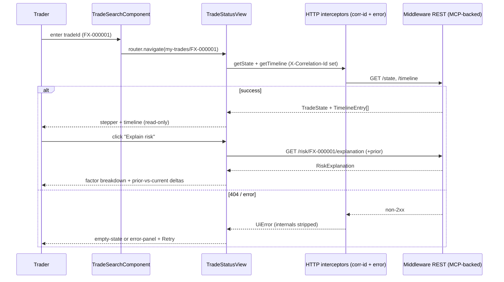

# Design Document — TraderDesk Portal (Customer-Facing Trader UI)

> **Stage 2 of 3** (`requirements.md → design.md → tasks.md`). This document realizes `requirements.md` for the TraderDesk Portal. Unlike requirements (which are technology-agnostic), **design is where Technology Roles resolve to concrete products** — per `01-initial-setup/01-technology-stack`. This is an **Angular standalone frontend application**, not a Spring service: backend service NFRs (Kafka consumption, transactional atomicity, optimistic locking, readiness of data stores) **do not apply**. The cross-cutting concerns that *do* apply to a browser client are called out in §7. Every design decision below traces to a requirement (see §11).

## 1. Overview

The **TraderDesk Portal** is a read-mostly, query-focused single-page application that gives an FX trader visibility into their own trades: lifecycle status and timeline, human-readable risk explanations, aggregate position summary, and book-level views. It **originates no state-changing actions** — trade capture, recovery, and exception management live in other systems (front-office capture; Admin Portal). It is a pure consumer of `Middleware/` service REST APIs (which are in turn backed by the MCP-exposed service capabilities).

**Role → concrete binding** (resolved from the technology-stack registry — the *only* place these products are otherwise named):

| Technology Role | Concrete product | Use in this portal |
|---|---|---|
| `FRONTEND_FRAMEWORK` | Angular 19.x (standalone components, no NgModules) | the SPA runtime; pinned to the same major as all other portals (Req 5.1) |
| `FRONTEND_LANGUAGE` | TypeScript (strict mode) | all component/service/model code |
| `SERIALIZATION` | JSON, ISO-8601 temporals, monetary values as JSON numbers | typed DTO (de)serialization of API responses (§4) |
| `UNIT_TEST_FRAMEWORK` (frontend) | Angular TestBed + Jasmine/Karma (`ng test`) | component and service specs (§10) |
| `E2E_TEST_HARNESS` (frontend) | Playwright / Cypress via `ng e2e` against a mocked API | end-to-end view flows with synthetic data (§10) |
| Backend contract | `Middleware/` REST APIs (MCP-backed) for trade-lifecycle, risk-explainability, exposure/aggregation | consumed over HTTP; base URLs externalized (Req 5.3) |

The portal owns **presentation and read orchestration only** — no domain state, no arithmetic of record (risk amounts and aggregates are computed server-side and displayed verbatim).

## 2. Application and folder structure

Standalone Angular application under `Portals/TraderDesk/`. No `NgModule` declarations (Req 5.1); features are lazy-loaded standalone routes.

```
Portals/TraderDesk/
  angular.json, package.json, tsconfig*.json
  src/
    main.ts                         bootstrapApplication(AppComponent, appConfig)
    app/
      app.component.ts              root shell (nav, router-outlet)
      app.config.ts                 providers: router, HttpClient + interceptors
      app.routes.ts                 top-level route map (§3)
      core/
        config/
          app-config.token.ts       InjectionToken<AppConfig> (API base URLs, poll interval)
          app-config.ts             env-provided config values (Req 5.3)
        http/
          correlation-id.interceptor.ts   attach X-Correlation-Id to every request (§7)
          error.interceptor.ts            map API errors → user-safe UiError (§4, Req 5.5)
        auth/
          auth.placeholder.ts       TODO marker for token auth (Req 5.4) — no secrets
      shared/
        models/                     TradeState, TimelineEntry, RiskExplanation,
                                    ContributingFactor, PositionGroup, BookTrade (typed DTOs)
        components/
          lifecycle-stepper/        accessible WCAG 2.1 AA step indicator (Req 1.3)
          risk-level-badge/         non-colour-only RiskLevel indicator (Req 3.5)
          factor-bar/               contributing-factor breakdown bar (Req 2.3)
          error-panel/              user-friendly error + retry (Req 5.5)
          empty-state/, loading-spinner/
        a11y/                       focus, live-region, keyboard helpers
      api/
        trade-lifecycle.client.ts   typed client → lifecycle endpoints (§4)
        risk-explainability.client.ts typed client → risk explanation endpoints (§4)
        exposure.client.ts          typed client → position/aggregation endpoints (§4)
      features/
        trade-search/               search box → navigate to my-trades/:tradeId
        my-trades/                  TradeStatusView (lifecycle status + timeline) (Req 1)
        risk-explanation/           RiskExplanationView drill-down (Req 2)
        position-summary/           PositionSummary aggregate view (Req 3)
        trading-book/               TradingBookView list (Req 4)
  src/environments/                 environment.ts / environment.prod.ts (Req 5.3)
```

Typed domain models under `shared/models/` mirror the backend service DTOs (trade fields, `TradeStatus`, `RiskLevel`, factors) — they are the frontend contract, kept in sync with `shared-domain-contracts` field names, not redefined semantics.

## 3. Route map and feature views (Req 1–4)

All routes are lazy-loaded standalone components. The default landing route is the trade search.

| Route | View (component) | Requirement | Notes |
|---|---|---|---|
| `''` → `search` | `TradeSearchComponent` | Req 1.1 | accepts `tradeId`, navigates to `my-trades/:tradeId` |
| `my-trades/:tradeId` | `TradeStatusViewComponent` | Req 1 | lifecycle status + ordered timeline + stepper |
| `my-trades/:tradeId/risk` | `RiskExplanationViewComponent` | Req 2 | drill-down; reachable only when a `RiskResult` exists (Req 2.1) |
| `positions` | `PositionSummaryComponent` | Req 3 | aggregate notional + risk grouped by pair/region; polling |
| `books/:tradingBookId` | `TradingBookViewComponent` | Req 4 | sortable/filterable/paginated trade list; rows link to `my-trades/:tradeId` |
| `**` | `NotFoundComponent` | — | safe fallback, no internals |

**View responsibilities:**

- **TradeStatusView** (Req 1.2–1.5): displays `tradeId`, `currencyPair`, `notionalAmount`, `direction`, `tradeDate`, `valueDate`, `regionCode`, `tradingBookId`, current `TradeStatus`, and the ordered lifecycle timeline. Uses `lifecycle-stepper` to mark stages complete/current/pending (WCAG 2.1 AA). `TRADE_FAILED` / sequence-anomaly states show a clearly labelled indicator with **no** stack traces or internal error text (Req 1.4). Read-only — no action controls (Req 1.5). Links to the risk drill-down when a risk result exists.
- **RiskExplanationView** (Req 2): displays `riskAmount`, `riskCurrency`, `riskLevel`, `ruleVersion`, ordered `contributingFactors` (name, contribution, currency) via `factor-bar` showing each factor's share (Req 2.3), and `rulesFired` (synthetic ids, Req 2.5). Compares current vs prior risk result when available, highlighting changed factors and deltas (Req 2.4). Read-only (Req 2.6).
- **PositionSummary** (Req 3): aggregate notional + risk grouped by `currencyPair` and `regionCode` (Req 3.1); per group shows total notional+currency, total risk, group `RiskLevel`, trade count (Req 3.2), and the freshness timestamp of the most recent risk calc (Req 3.3). Refreshes on a configurable polling interval (default 60s, externalized — Req 3.4). `RiskLevel` indicators do not rely on colour alone (Req 3.5).
- **TradingBookView** (Req 4): lists all trades in a `tradingBookId` with `tradeId`, `currencyPair`, `notionalAmount`, `direction`, `tradeDate`, `TradeStatus`, `RiskLevel` (Req 4.1). Sort by `tradeDate`/`notionalAmount`/`RiskLevel` (Req 4.2), filter by `TradeStatus`/`RiskLevel` (Req 4.3), each row links to TradeStatusView (Req 4.4), paginated at a configurable default page size of 25 (Req 4.5).

## 4. Typed API integration (Req 1–4; Req 5.3, 5.5)

Three thin, typed clients wrap `HttpClient`. Base URLs come from injected `AppConfig` (Req 5.3) — never hard-coded. Each returns typed models from `shared/models/`.

| Client | Method | Backend endpoint (role: `Middleware/` REST) | Returns |
|---|---|---|---|
| `trade-lifecycle.client` | `getState(tradeId)` | `GET /api/v1/trades/{tradeId}/state` | `TradeState` |
| | `getTimeline(tradeId)` | `GET /api/v1/trades/{tradeId}/timeline` | `TimelineEntry[]` |
| | `getExpectedLifecycle(tradeId)` | `GET /api/v1/trades/{tradeId}/expected-lifecycle` | `LifecycleStage[]` |
| `risk-explainability.client` | `getExplanation(tradeId)` | `GET /api/v1/risk/{tradeId}/explanation` | `RiskExplanation` |
| | `getPriorExplanation(tradeId)` | `GET /api/v1/risk/{tradeId}/explanation/prior` | `RiskExplanation \| null` |
| `exposure.client` | `getPositionSummary()` | `GET /api/v1/exposure/positions` | `PositionGroup[]` + `asOf` |
| | `getBookTrades(bookId, query)` | `GET /api/v1/exposure/books/{tradingBookId}/trades` | paged `BookTrade[]` |

**Correlation-id propagation** (§7): `correlation-id.interceptor` generates a UUID per user-initiated request (or reuses one for a view's fan-out) and sets the `X-Correlation-Id` header on every outbound call, so a trader action is traceable end-to-end through the backend services and logs.

**Error handling** (Req 5.5): `error.interceptor` catches non-2xx responses and network failures, maps them to a `UiError { title, message, retryable }` with a user-friendly message, and **strips any raw backend body, stack trace, or internal detail** before it reaches a view. 404 renders an empty/not-found state; 5xx and network errors render `error-panel` with a **Retry** action. No error internals are ever shown (Req 1.4, 5.5).

## 5. Data loading and state (Req 3.4)

- **Local, view-scoped state** via Angular signals (or `BehaviorSubject` where a stream fits). No global store is warranted — each view owns its own query state; there is no cross-view mutable domain state to share.
- **Load lifecycle**: every view models `loading → loaded | empty | error`. `loading` shows `loading-spinner`; `empty` shows `empty-state`; `error` shows `error-panel` with retry.
- **Polling** (PositionSummary, Req 3.4): a `timer(0, pollIntervalMs)` from injected `AppConfig` drives refresh; the interval is externalized config, not a literal. Polling pauses when the view is detached; each poll reuses the typed client.
- **Route params** drive `my-trades/:tradeId`, `my-trades/:tradeId/risk`, and `books/:tradingBookId`; param changes re-trigger the load.
- **No client-side risk arithmetic**: aggregates and risk amounts are displayed exactly as returned by the backend (source of truth is server-side).

## 6. UX for read-only trader views

This portal is **investigative / read-mostly**; unlike an admin portal it has **no privileged action gates** (no approve/recover/override controls) because it surfaces no state-changing actions at all (Req 1.5, 2.6).

- Every view is unambiguously read-only: no forms that mutate domain state, no submit/confirm affordances beyond navigation, search, sort, filter, and pagination.
- The search-first flow (Req 1.1) is the primary entry: a trader looks up a `tradeId`, lands on TradeStatusView, and drills into risk from there.
- Cross-view navigation is deep-link friendly: TradingBookView rows and the risk drill-down are plain router links, so any view is bookmarkable/shareable by URL (URLs carry only synthetic `FX-` ids).
- Accessibility is a first-class UX concern (Req 1.3, 3.5, 5.2): keyboard-navigable, ARIA live regions for async loads, focus management on route change, and status/risk conveyed by text + shape/icon, never colour alone.
- Freshness is always visible where data polls or aggregates (Req 3.3), so a trader can trust how current a view is.

## 7. Cross-cutting UI concerns (which apply to a frontend)

Backend NFRs (idempotent Kafka consumption, transactional atomicity, optimistic locking, data-store readiness) **do not apply** to a browser client. The concerns that do apply:

| UI cross-cutting concern | Concrete implementation here | Applies? |
|---|---|---|
| Correlation-id on API calls | `correlation-id.interceptor` sets `X-Correlation-Id` on every outbound request (§4) | ✅ yes |
| Error display (user-safe) | `error.interceptor` → `UiError`; `error-panel` with retry; never expose internals (Req 5.5, 1.4) | ✅ yes |
| No client secrets | `auth.placeholder` TODO marker only; no tokens/credentials committed; secrets injected at deploy, not in repo (Req 5.4) | ✅ yes |
| Externalized configuration | API base URLs + poll interval via `AppConfig` / environments, never hard-coded (Req 5.3) | ✅ yes |
| Accessibility (WCAG 2.1 AA) | accessible stepper, non-colour-only risk badges, keyboard/focus/live-region helpers (Req 1.3, 3.5, 5.2) | ✅ yes |
| Synthetic data only | all fixtures/mocks use `FX-` ids and fictional names (Req 5.6) | ✅ yes |
| Read-only posture | no state-changing controls surfaced (Req 1.5, 2.6) | ✅ yes |
| Testing (component + e2e) | TestBed component specs + e2e flows against mocked APIs (§10) | ✅ yes |
| ~~Idempotency / dedup~~ | N/A — no event consumption on the client | ❌ no |
| ~~Transactional atomicity / optimistic lock~~ | N/A — no writes of record from the client | ❌ no |
| ~~Store readiness health~~ | N/A — the portal has no data stores | ❌ no |

## 8. Key interaction flow (search → status → risk drill-down)



## 9. Error handling strategy (Req 1.4, 5.5)

- All HTTP errors funnel through `error.interceptor` → `UiError`; views never see raw responses.
- 404 → empty/not-found state (no scary error). 4xx/5xx/network → `error-panel` with user-friendly copy + **Retry**.
- `TRADE_FAILED` / sequence-anomaly is a **domain status to display clearly**, not an application error — rendered as a labelled indicator, with no internal detail (Req 1.4).
- No stack trace, backend exception message, or internal identifier ever reaches the DOM.

## 10. Testing strategy (Req 5.6)

- **Component** (`ng test` — TestBed + Jasmine): each view renders correctly for `loading/loaded/empty/error`; `lifecycle-stepper` marks complete/current/pending; `factor-bar` renders factor shares; `risk-level-badge` conveys level without colour; TradingBookView sort/filter/pagination behave; error/empty states render on interceptor-mapped errors.
- **Client/interceptor unit tests**: typed clients call the configured base URL; `correlation-id.interceptor` sets the header; `error.interceptor` strips internals and maps to `UiError`.
- **E2E** (`ng e2e` against a mocked API): search → TradeStatusView → risk drill-down; PositionSummary poll refresh; TradingBookView filter+paginate+row-link to TradeStatusView. All against a stubbed backend serving **synthetic `FX-` fixtures**.
- **Accessibility checks** in component/e2e specs for WCAG 2.1 AA (roles, labels, non-colour-only indicators).
- **Synthetic data only** (Req 5.6): every fixture, mock response, and stub uses `FX-` ids and fictional counterparty/book/region names.

## 11. Requirement → design traceability

| Requirement | Satisfied by |
|---|---|
| Req 1 Trade lifecycle status view | §3 (TradeStatusView), §4 (lifecycle client), §8, §9 |
| Req 2 Risk explanation view | §3 (RiskExplanationView), §4 (risk client), §5 |
| Req 3 Position summary | §3 (PositionSummary), §4 (exposure client), §5 (polling) |
| Req 4 Trading book view | §3 (TradingBookView), §4 (exposure client) |
| Req 5.1 Standalone at pinned major | §1 (role binding), §2 (no NgModules) |
| Req 5.2 WCAG 2.1 AA | §2 (a11y components), §6, §7, §10 |
| Req 5.3 Externalized config | §2 (config), §4, §5 (poll interval), §7 |
| Req 5.4 Auth placeholder, no secrets | §2 (`auth.placeholder`), §7 |
| Req 5.5 Graceful error handling | §4 (`error.interceptor`), §7, §9 |
| Req 5.6 Synthetic data | §7, §10 |

## 12. Design decisions (ADR-lite)

- **No global state store**: views are independent read queries with no shared mutable domain state; signals + view-scoped state are simpler and fully testable. A store would be gold-plating.
- **Interceptors for cross-cutting HTTP concerns**: correlation-id and error normalization live in interceptors, not per-client code, so every call is consistently traced and every error is consistently sanitized.
- **Thin typed clients, server-side arithmetic**: the portal never recomputes risk or aggregates; it displays backend values verbatim, keeping the client free of domain logic and drift.
- **Frontend, not service**: this spec deliberately drops backend NFRs (Kafka/dedup/atomicity/store readiness) as N/A (§7) and keeps only the UI-relevant cross-cutting concerns.
