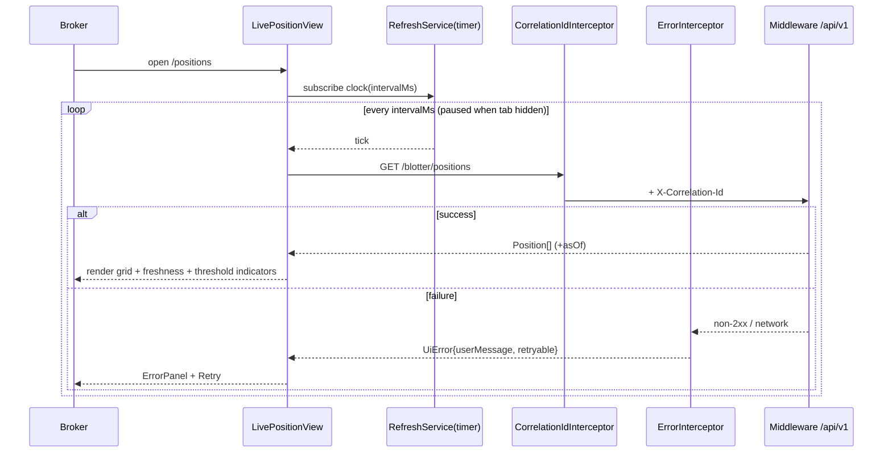

# Design Document — FX Trade Blotter Portal (Broker-Facing)

> **Stage 2 of 3** (`requirements.md → design.md → tasks.md`). This document realizes `requirements.md` for the FX Trade Blotter Portal. Unlike requirements (which are technology-agnostic), **design is where Technology Roles resolve to concrete products** — per `01-initial-setup/01-technology-stack`. This is a **standalone frontend application** (`Portals/FXTradeBlotter/`), **not** a Spring service: it owns no data, runs no server-side business logic, and consumes `Middleware/` service APIs read-only. Backend service NFRs (Kafka consumption, optimistic locking, transactional atomicity, readiness against stores) therefore **do not apply**; the applicable cross-cutting concerns are the *UI* ones — correlation-id propagation on outbound API calls, graceful error display, no committed secrets, synthetic data, and component/e2e testing (see §6, §7). Every design decision below traces to a requirement (see §10).

## 1. Overview

The `FXTradeBlotter` portal is the **broker-facing real-time blotter**: it renders live aggregate positions by currency pair, net exposure by pair/region, settlement status for today and the next business date, and counterparty exposure with limit utilization. It is **position-centric and counterparty-centric** (contrast the trade-by-trade TraderDesk), read-only, and sources everything from Middleware REST/MCP-backed aggregation APIs. It advances no state — it observes and displays it.

**Role → concrete binding** (resolved from the technology-stack registry — the *only* place these products are otherwise named):

| Technology Role | Concrete product | Use in this portal |
|---|---|---|
| `FRONTEND_FRAMEWORK` | Angular `19.x` (standalone components, no `NgModule`) | the portal runtime, routing, DI |
| `FRONTEND_LANGUAGE` | TypeScript (strict) | all application code, typed API models |
| HTTP transport | Angular `HttpClient` + typed services | consume backend REST/MCP-backed aggregation APIs under `/api/v1` |
| Real-time update | **client polling** via RxJS `timer` (configurable interval, default 30s) | near-real-time refresh of live views (Req 1.3); no server-push is implied by the requirements, so polling — not SSE/WebSocket — is the chosen approach (§5) |
| Data grid | Angular CDK virtual scroll (`cdk-virtual-scroll-viewport`) | large blotter/settlement grids without DOM blow-up (§5) |
| Config | Angular environment files + runtime `AppConfigService` | externalized API base URLs, polling interval, thresholds (Req 5.3) |
| Styling / a11y | Angular + WCAG 2.1 AA patterns (icon+text indicators, not colour alone) | breach/warning/at-risk indicators (Req 1.4, 2.3, 3.3, 4.3/4.4) |
| `UNIT_TEST_FRAMEWORK` (frontend) | Karma + Jasmine via `ng test` | component/service unit tests |
| E2E test | Playwright (or Angular's default e2e runner) against synthetic fixtures | view-level end-to-end flows (§7) |

Angular major version is pinned to match the other portals (`01-portal-admin`, `02-portal-traderdesk`) to prevent drift (Req 5.1).

## 2. Application and folder structure

Standalone Angular workspace at `Portals/FXTradeBlotter/`, source root `src/app`:

```
src/app/
  app.config.ts               standalone bootstrap providers (router, HttpClient, interceptors)
  app.routes.ts               route map (§3)
  app.component.ts            shell: nav, freshness banner, router-outlet
  core/
    config/                   AppConfigService, environment loading (Req 5.3)
    http/
      correlation-id.interceptor.ts   attach X-Correlation-Id to every outbound call (§4)
      error.interceptor.ts            map API errors → typed UiError, feed error surface (§4, Req 5.5)
    auth/                     auth-placeholder.interceptor.ts + TODO marker (Req 5.4)
    models/                   typed API models: Position, ExposureGroup, SettlementRow, CounterpartyExposure, RiskLevel, UiError
  shared/
    ui/                       StatusBadge, BreachIndicator, FreshnessStamp, ErrorPanel, RetryButton (a11y-compliant)
    grid/                     VirtualBlotterGrid (CDK virtual scroll wrapper), column defs
    a11y/                     accessible-indicator utilities (icon+text, aria-live)
  features/
    live-position/           LivePositionView (Req 1)
    exposure/                ExposureView (Req 2)
    settlement/              SettlementStatusView (Req 3)
    counterparty-exposure/   CounterpartyExposureView (Req 4)
  services/
    position-api.service.ts       GET aggregate positions (Trade Lifecycle + Risk)
    exposure-api.service.ts       GET exposure by pair/region (Risk aggregation)
    settlement-api.service.ts     GET settlement rows by valueDate (Lifecycle)
    counterparty-api.service.ts   GET counterparty exposure (Risk + State Reconciliation)
    refresh.service.ts            shared polling clock (RxJS timer) (§5)
src/environments/             environment.ts / environment.prod.ts (API base URLs, intervals, thresholds)
```

Shared domain enums (`TradeStatus`, `RiskLevel`, `Direction`) mirror the backend `shared-domain-contracts` as TypeScript types — kept in `core/models`, not redefined per feature.

## 3. Route map and feature views (Req 1–4)

Lazy-loaded standalone components via `loadComponent`:

| Route | View | Source services | Req |
|---|---|---|---|
| `/positions` (default) | `LivePositionView` — live grid: net long/short notional, net position, trade count per `currencyPair`; threshold highlight; row → filtered settlement | Trade Lifecycle + Risk Calculation | Req 1 |
| `/exposure` | `ExposureView` — risk amount + `RiskLevel` grouped by `currencyPair` and `regionCode`; limit/utilization; breach indicator; freshness stamp | Risk Calculation aggregation | Req 2 |
| `/settlement` | `SettlementStatusView` — trades with `valueDate` = today or next business date, grouped by `valueDate`; filters (valueDate/status/pair); pagination (default 25); at-risk flag; row → TraderDesk deep-link | Trade Lifecycle | Req 3 |
| `/counterparty-exposure` | `CounterpartyExposureView` — aggregate exposure + limit utilization per counterparty; 80% warning / 100% breach indicators; expandable contributing trades; freshness stamp | Risk Calculation + State Reconciliation | Req 4 |
| `**` | redirect → `/positions` | | |

`LivePositionView` row link carries `currencyPair` as a query param into `/settlement` (Req 1.5). `SettlementStatusView` row optionally deep-links to TraderDesk `TradeStatusView` by `tradeId` when cross-portal navigation is configured (Req 3.6).

## 4. Typed API integration (Req 1.1, 2.1, 3.1, 4.2; Req 5.5)

One typed Angular service per bounded read model; all return strongly-typed models from `core/models`, all go through the two global interceptors.

| Service | Endpoint (read-only, `/api/v1`) | Returns |
|---|---|---|
| `PositionApiService` | `GET /api/v1/blotter/positions?broker={id}` | `Position[]` `{currencyPair, netLongNotional, netShortNotional, netPosition, tradeCount}` |
| `ExposureApiService` | `GET /api/v1/risk/exposure?groupBy=pair,region` | `ExposureGroup[]` `{currencyPair, regionCode, riskAmount, riskCurrency, riskLevel, limit?, utilizationPct, asOf}` |
| `SettlementApiService` | `GET /api/v1/blotter/settlements?valueDate={d}&page=&size=` | `Page<SettlementRow>` `{tradeId, currencyPair, notionalAmount, direction, counterpartyId, tradeStatus, flags[]}` |
| `CounterpartyApiService` | `GET /api/v1/risk/counterparty-exposure` | `CounterpartyExposure[]` `{counterpartyId, riskAmount, limit, utilizationPct, riskLevel, asOf, contributingTrades[]}` |

**Correlation id** — `CorrelationIdInterceptor` generates/propagates an `X-Correlation-Id` header on every outbound request (a UUID per user-initiated action, reused across the polling cycle it triggers), so a broker's view maps to backend traces (the UI-side analogue of the backend GP correlation-id NFR).

**Error handling** — `ErrorInterceptor` catches non-2xx / network failures, maps them to a typed `UiError{code, userMessage, retryable}` (never the raw payload), and routes them to the view's `ErrorPanel` with a retry action (Req 5.5). Raw internals are never rendered.

**Auth placeholder** — `AuthPlaceholderInterceptor` is a no-op with a `// TODO(phase-6): attach bearer token` marker; no credential values are committed (Req 5.4).

## 5. Real-time / refresh strategy + data-table design (Req 1.3, 5.1)

**Refresh strategy — polling (not push).** The requirements ask for a *configurable polling interval, default 30s, externalized as config* (Req 1.3) — they do not imply a server-push channel, so the design deliberately uses **client polling** rather than SSE/WebSocket. `RefreshService` exposes a single shared `timer(0, intervalMs)` clock (interval from `AppConfigService`); each live view `switchMap`s the clock into its API call, so a slow response cannot stack requests. Polling pauses when the tab is hidden (`document.visibilitychange`) and resumes on focus, and each view shows a **freshness stamp** (Req 2.4, 4.6) from the payload's `asOf`/last-calculation time, so a stale cache is visibly stale.

**Data-table design — large grid + virtual scroll.** Blotter and settlement grids can hold many rows; each grid uses CDK `cdk-virtual-scroll-viewport` (`VirtualBlotterGrid`) so only visible rows render. Column definitions are declarative; sorting/filtering happen client-side over the fetched page for settlement (server-paginated, default size 25, Req 3.5), and over the full aggregate for positions/exposure (small, pre-aggregated). Accessible indicators (§6) are icon+text with `aria-live` for threshold/breach changes.

## 6. Cross-cutting UI concerns (which apply, and how)

| UI cross-cutting concern | Applies? | Concrete implementation here |
|---|---|---|
| Correlation-id on API calls | **Yes** | `CorrelationIdInterceptor` adds `X-Correlation-Id` to every outbound request (§4) |
| Graceful error display + retry | **Yes** | `ErrorInterceptor` → typed `UiError` → `ErrorPanel` + `RetryButton`; no raw internals (Req 5.5) |
| No committed client secrets | **Yes** | `AuthPlaceholderInterceptor` TODO marker only; API base URLs in environment config, no tokens committed (Req 5.4) |
| Externalized configuration | **Yes** | `AppConfigService` + `environments/*` for base URLs, polling interval, display thresholds (Req 5.3) |
| Accessibility (WCAG 2.1 AA) | **Yes** | indicators are icon+text (not colour alone), `aria-live` on live regions, keyboard-navigable grids/expanders (Req 1.4, 2.3, 3.3, 4.3/4.4, 5.2) |
| Synthetic data only | **Yes** | all fixtures/mocks use `FX-` ids and fictional counterparty/region names (Req 5.6) |
| Backend transactional/atomicity NFRs | **No** — backend-only | portal is read-only; owns no writes, no stores, no Kafka |
| Optimistic locking / readiness probes / dedup | **No** — backend-only | not applicable to a frontend consumer |

## 7. Testing strategy (Req 5.6; component + e2e)

- **Component/service unit** (`ng test`, Karma + Jasmine): each `*ApiService` (correlation-id header attached, error mapped to `UiError`); each view renders rows, applies threshold/breach indicators, paginates/filters; `RefreshService` emits on the configured interval and pauses when hidden. **Verify:** `ng test` green.
- **E2E** (Playwright / default e2e): load `/positions` against synthetic fixtures → grid renders `FX-` rows; exceed-threshold row shows accessible indicator; `/settlement` filter + pagination; `/counterparty-exposure` 80%/100% indicators + row expansion; simulated API failure → `ErrorPanel` + retry.
- All fixtures use **synthetic `FX-` ids** and fictional counterparty/region names (Req 5.6).

## 8. Design decisions (ADR-lite)

- **Polling over server-push**: requirements specify a configurable poll interval and nothing that requires push; polling via a single shared `timer` is simpler, needs no persistent connection, and satisfies near-real-time. Revisit (SSE/WebSocket) only if a sub-second SLA appears.
- **Virtual scroll for grids**: broker blotters are wide and long; CDK virtual scroll keeps the DOM bounded and interaction responsive regardless of row count.
- **Typed service-per-read-model + global interceptors**: keeps correlation-id, error mapping, and the auth placeholder in exactly one place each, so no view re-implements cross-cutting behavior.
- **Standalone components, no NgModule**: matches the pinned Angular major and the sibling portals; smaller, lazily-loadable views (Req 5.1).
- **Read-only by construction**: no service exposes a mutating method — the portal cannot write state, matching the requirement that all data is Middleware-sourced.

## 9. Key view flow (live position refresh)



## 10. Requirement → design traceability

| Requirement | Satisfied by |
|---|---|
| Req 1 Live Position View | §3, §4 (`PositionApiService`), §5 (polling, threshold indicator), §7 |
| Req 2 Exposure View | §3, §4 (`ExposureApiService`), §5 (freshness), §6 (breach a11y) |
| Req 3 Settlement Status View | §3, §4 (`SettlementApiService`), §5 (pagination/virtual scroll), filters, deep-link |
| Req 4 Counterparty Exposure View | §3, §4 (`CounterpartyApiService`), §6 (80%/100% a11y), expandable rows, freshness |
| Req 5.1 standalone / pinned major | §1, §2, §8 |
| Req 5.2 WCAG 2.1 AA | §6 (a11y row), shared/a11y utilities |
| Req 5.3 externalized config | §1, §2 (`AppConfigService`, environments) |
| Req 5.4 auth placeholder / no secrets | §4, §6 (`AuthPlaceholderInterceptor`) |
| Req 5.5 graceful error handling | §4, §6 (`ErrorInterceptor`, `ErrorPanel`) |
| Req 5.6 synthetic data | §7 |
