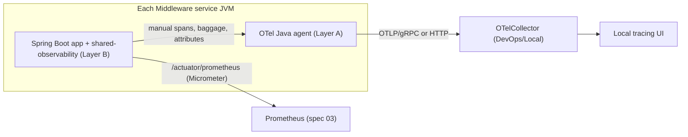
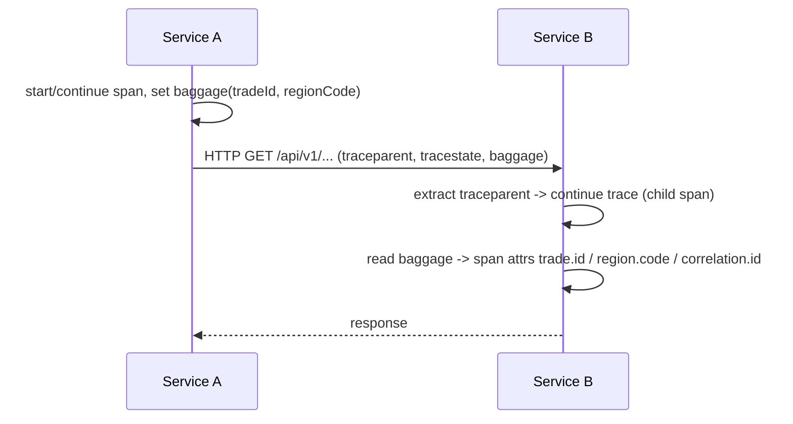

# Design Document — OTel Spring Boot Instrumentation (Cross-Cutting)

> **Stage 2 of 3** (`requirements.md → design.md → tasks.md`). This document realizes `requirements.md` for the OpenTelemetry instrumentation standard. Unlike requirements (which are technology-agnostic), **design is where Technology Roles resolve to concrete products** — per `01-initial-setup/01-technology-stack` — and where inherited golden-path NFRs get concrete implementations. Every design decision below traces to a requirement (see §12).
>
> **NATURE — cross-cutting instrumentation, not a service.** This spec introduces **no new business logic and no new service module**. It defines a uniform tracing/metrics wiring **applied to every existing `Middleware/` `SERVICE_FRAMEWORK` service** built in phase `02-microservices`. It realizes golden-path **GP-Rq-8 (Observability)** concretely and platform-wide. Because there is no bounded context here, there is no domain model, no persistence, no API, and no state machine — those sections of the reference service design are deliberately **N/A** (see §1.3).

## 1. Overview

The OTel Spring Boot standard makes **distributed tracing and runtime metrics uniform across all services** so that a single request or event can be followed end-to-end, and so every span carries the business context (`tradeId`, `regionCode`, `correlation.id`) needed to investigate a specific trade. It is delivered as a **shared convention plus one shared config module** that every service imports — not as a per-service reinvention.

### 1.1 Role → concrete binding (resolved from the technology-stack registry — the *only* place these products are otherwise named)

| Technology Role | Concrete product | Use in this standard |
|---|---|---|
| `OBSERVABILITY_TRACING` | OpenTelemetry (`1.x`) | trace/span model, context propagation, OTLP export |
| — auto-instrumentation agent | OpenTelemetry Java agent (`OTelAgent`) | JVM-startup capture of HTTP / JDBC / Mongo / Redis / Kafka spans |
| — framework starter | Spring Boot OpenTelemetry / Micrometer Tracing bridge starter | manual spans + baggage + resource attributes from application code |
| `OBSERVABILITY_METRICS` | Micrometer → Prometheus (`2.x`) + Grafana (`11.x`) | runtime + business metrics scraped from `/actuator/prometheus` |
| `OBSERVABILITY_LOGGING` | ELK (`8.x`) | trace-id / span-id in structured logs (log↔trace correlation detailed in `04-otel-log-correlation`) |
| `SERVICE_FRAMEWORK` | Java 21 / Spring Boot `3.4.x` | the instrumented runtime (Micrometer Observation API is the in-app seam) |
| `EVENT_STREAM` | Apache Kafka (KRaft) `3.x` | producer/consumer spans (trace-through-Kafka detailed in `02-otel-kafka-tracing`) |
| `CONTAINER_RUNTIME` | Docker + Docker Compose | `DevOps/Local/` collector + local tracing UI, pinned image tags |

### 1.2 Companion specs (cross-references, not duplicated here)

- **`05-observability/02-otel-kafka-tracing`** — W3C context injected/extracted through **Kafka message headers**, producer↔consumer span linkage. This design covers **HTTP** propagation and the shared wiring only; Kafka header propagation is **owned by 02** and is **not** re-specified here (§4.4).
- **`05-observability/03-otel-metrics-dashboards`** — Prometheus scrape config, Grafana dashboards, alert rules. This design exposes the Micrometer/Prometheus **endpoint and the metric surface**; dashboards/alerts live in 03.
- **`05-observability/04-otel-log-correlation`** — ELK pipeline and `traceId`/`spanId`/`tradeId` in log lines. This design guarantees the ids are **on the span and in MDC**; the log pipeline lives in 04.

### 1.3 Which NFRs are the subject here

| Golden-path NFR | Status in this spec |
|---|---|
| **GP-Rq-8 Observability — tracing** | **SUBJECT** — Requirements 1–5 (auto-instrumentation, propagation, span naming, baggage, span status) |
| **GP-Rq-8 Observability — metrics** | **SUBJECT (surface only)** — Micrometer→Prometheus endpoint wired here; dashboards in `03` |
| **GP-Rq-8 Observability — logging** | **SUBJECT (correlation only)** — trace/span ids placed in MDC here; ELK pipeline in `04` |
| GP-Rq-2 Correlation id | **Referenced** — `CorrelationId` (already produced per service) is surfaced as span attribute `correlation.id` (§5); not re-implemented |
| GP-Rq-10 Resilience | **Referenced** — export failure must not surface as a service error (§7.4) |
| GP-Rq-11 Configuration | **Referenced** — OTLP endpoint externalized per environment (§7) |
| GP-Rq-14 Synthetic data | **Referenced** — only `FX-` ids in local traces/examples |
| GP-Rq-1/3/4/5/6/7/9/12/13 | **N/A** — no APIs, error envelopes, readiness deps, idempotency, locking, atomic publish, security surface, or new business rules are introduced by an instrumentation layer |

## 2. How OTel is applied to every service

Two layers, applied uniformly so no service hand-rolls tracing:

**Layer A — the `OTelAgent` (zero-code, out-of-process).** The OpenTelemetry Java agent is attached at JVM startup via a `JAVA_TOOL_OPTIONS`/`-javaagent` flag supplied by the `DevOps/Local/` compose file and the `SERVICE_BUILD_TOOL` run configuration — **not** baked into any service jar (Req 1.1). It captures inbound HTTP, outbound HTTP-client, `RELATIONAL_STORE` (JDBC), `DOCUMENT_STORE`, `CACHE`, and `EVENT_STREAM` producer/consumer spans automatically (Req 1.4). No service source changes for the auto path.

**Layer B — the shared config module `Middleware/shared-observability` (in-process convention).** A thin, dependency-only Maven module every service already-or-newly declares. It is a **shared kernel for wiring**, mirroring how `01-shared-domain-contracts` is the shared kernel for types — it holds *no business logic*. It contributes, via Spring auto-configuration (`META-INF/spring/...AutoConfiguration.imports`), the pieces that must be identical everywhere:

```
Middleware/shared-observability/            (packaging: jar; a convention library, not a runnable service)
  src/main/java/com/fxtradeops/observability/
    ObservabilityAutoConfiguration.java     Micrometer ObservationRegistry + tracing bridge beans
    ResourceAttributesContributor.java       service.name, service.region resource attributes (§3.2)
    W3cPropagationConfig.java                 force W3C traceparent/tracestate propagator (§4)
    BaggageConfig.java                        register tradeId / regionCode / correlationId as baggage+attribute fields (§5)
    SpanNamingConfig.java                     HTTP route-template + custom-span naming conventions (§3.1)
    BusinessContextObservationFilter.java     copy baggage → span attributes trade.id / region.code / correlation.id
  src/main/resources/
    META-INF/spring/org.springframework.boot.autoconfigure.AutoConfiguration.imports
    application-observability.yml             shared OTLP/exporter/actuator defaults (imported via spring.config.import)
```

Each service participates by two edits only: (1) add the `shared-observability` dependency; (2) `spring.config.import: classpath:application-observability.yml`. Everything else (propagator choice, resource attributes, baggage fields, span naming, metric endpoint) is inherited — the single-point-of-change property that GP requires of cross-cutting behavior.



## 3. Span naming conventions and resource attributes

### 3.1 Span naming (Req 3)

Auto-instrumentation names are overridden to a queryable convention via `SpanNamingConfig` (HTTP) and an `@Observed`/`Observation` helper (custom):

| Span kind | Convention | Example (synthetic) |
|---|---|---|
| Inbound HTTP controller | `{service-name} {HTTP_METHOD} {route-template}` | `trade-lifecycle-service GET /api/v1/trades/{tradeId}/state` |
| `EVENT_STREAM` consumer | `{service-name} receive {topic-name}` | `trade-lifecycle-service receive fxops.trade.events` |
| `EVENT_STREAM` producer | `{service-name} send {topic-name}` | `trade-ingest-service send fxops.trade.events` |
| `RELATIONAL_STORE` query | agent default + `db.operation`, `db.sql.table` attributes; **no literal SQL in name** | `SELECT trade_current_state` |
| Custom application span | `{service-name}/{domain-operation}` | `trade-lifecycle-service/process-lifecycle-transition` |

Route templates (not expanded paths) keep cardinality bounded — `.../{tradeId}/state`, never `.../FX-000001/state`.

### 3.2 Resource attributes (Req 1.2)

Set once by `ResourceAttributesContributor` on every span emitted by a service:

| Resource attribute | Source | Note |
|---|---|---|
| `service.name` | `spring.application.name` | e.g. `trade-lifecycle-service` — never hard-coded literally |
| `service.region` | `FXOPS_REGION` env (GP-Rq-11) | region binding for the deployment; enum value only |
| `service.version` | build metadata | for release correlation |
| `deployment.environment` | active Spring profile | `local` / `aws` / `azure` |

`region` is a **resource attribute** (identity of the emitter) as well as being available as **baggage** `regionCode` (business context on the unit of work) — see §5.

## 4. W3C TraceContext propagation over HTTP

- **Propagator (Req 2.1):** `W3cPropagationConfig` pins the propagator to **W3C** (`traceparent` + `tracestate`) for both extract and inject. No proprietary/legacy header format is enabled. Applied to the auto-configured `RestClient`/`WebClient`/`RestTemplate` builders so every outbound HTTP call carries context.
- **Inbound continue (Req 2.2):** when an inbound request carries `traceparent`, the server span **adopts the incoming trace id** (child of the caller), never a new root.
- **Inbound root (Req 2.3):** when no `traceparent` is present, a **new root span** starts.
- **Kafka boundary (Req — cross-ref):** propagation through `EVENT_STREAM` headers is **owned by `02-otel-kafka-tracing`**; this spec only guarantees the W3C propagator instance is the shared one both HTTP and Kafka paths reuse (§4.4).
- **Correlation join (Req 2.4):** the existing `CorrelationId` (GP-Rq-2, already resolved by each service's correlation filter/consumer copy) is attached to **every span** as attribute `correlation.id`, so operators can pivot from a log's correlation id to its trace and back.



## 5. Baggage — business context carried on spans

`BaggageConfig` registers exactly three baggage fields, and `BusinessContextObservationFilter` copies each present field onto **every span within the unit of work** as a span attribute (Req 4):

| Baggage key | Span attribute | Set when | Allowed values |
|---|---|---|---|
| `tradeId` | `trade.id` | request/event is for a specific trade | `FX-` + digits only |
| `regionCode` | `region.code` | request/event carries a region | region enum value |
| `correlationId` | `correlation.id` | always (from GP-Rq-2) | UUID |

- **Downstream inheritance (Req 4.3):** because these are baggage, they auto-propagate on outbound HTTP calls (§4) so child services inherit the business context without re-deriving it.
- **Safety (Req 4.4 / GP-Rq-14):** baggage carries **no PII, no monetary value, no non-synthetic identifier** — only the `FX-`-prefixed `tradeId`, the `regionCode` enum, and the `correlationId` UUID. `BaggageConfig` is the single enforcement point; adding a field is a deliberate edit in one place.

## 6. Auto vs manual instrumentation boundaries

| Concern | Owner | Rationale |
|---|---|---|
| Inbound/outbound HTTP spans | **Auto** (`OTelAgent`) | framework-level, identical everywhere |
| JDBC / Mongo / Redis spans | **Auto** (`OTelAgent`) | driver-level hooks; `db.*` attributes for free |
| Kafka producer/consumer spans | **Auto** (`OTelAgent`); header propagation in spec `02` | messaging hooks standard; trace-through is 02's concern |
| HTTP span **renaming** to route-template convention | **Manual** (`SpanNamingConfig`, Layer B) | agent default names are not the platform convention (Req 3.1) |
| Resource attributes (`service.region`, …) | **Manual** (Layer B) | not derivable by the agent |
| Baggage register + baggage→attribute copy | **Manual** (Layer B) | business context the agent cannot know |
| Custom domain spans (`{service}/{domain-operation}`) | **Manual**, per service | e.g. `process-lifecycle-transition`; declared via `@Observed` in that service, named per §3.1 |
| Span **status/error** tagging (`ERROR` on 500, `OK` on 4xx, no stack trace in span) | **Manual** convention (Layer B defaults) + agent | Req 5; keeps 4xx out of error rate, stack trace stays in logs |

Guiding rule: **the agent captures the plumbing; Layer B enforces the conventions; each service adds only its own named domain spans.** No service re-implements propagation, resource attributes, or baggage.

## 7. Exporter configuration (OTLP endpoint) per environment

- **Externalized, never hard-coded (Req 1.3 / GP-Rq-11):** the exporter endpoint is an environment variable `OTEL_EXPORTER_OTLP_ENDPOINT`, resolved per profile:

| Profile | `OTEL_EXPORTER_OTLP_ENDPOINT` resolves to | Backend |
|---|---|---|
| `local` | the `DevOps/Local/` `OTelCollector` service (compose DNS name) | local tracing UI (Req 6) |
| `aws` | cloud collector endpoint via env/secret | cloud tracing backend |
| `azure` | cloud collector endpoint via env/secret | cloud tracing backend |

- **Local stack (Req 6):** `DevOps/Local/` compose adds an `OTelCollector` and a local tracing UI, both pinned to **explicit image tags (never `latest`)**, UI port documented in `DevOps/Local/README.md`. Local traces contain only `SyntheticData` (`FX-` ids, fictional service names).
- **Sampling:** parent-based sampler (respect upstream decision), full sampling locally, ratio-based in cloud — set via `OTEL_TRACES_SAMPLER*` env, not code.
- **Resilience (Req 1.5 / GP-Rq-10):** the OTLP exporter is **fire-and-forget with a bounded queue**; when the `OTelCollector` is unreachable, spans are dropped after the queue fills and export errors are logged at WARN — they **never** propagate as a service error or block the request path.

## 10. Testing / verification strategy (Req — all; GP-Rq-12)

Instrumentation is verified by **asserting the emitted telemetry**, using an in-memory span exporter (`InMemorySpanExporter`) in the shared module's tests and one representative service integration test:

- **Shared-module unit tests (`UNIT_TEST_FRAMEWORK`):**
  - W3C propagator is the active one; a synthetic inbound `traceparent` is **continued** (same trace id, child span); absent `traceparent` → **new root** (Req 2.2/2.3).
  - Baggage `tradeId=FX-000123` + `regionCode` set → resulting span has attributes `trade.id=FX-000123`, `region.code`, `correlation.id` (Req 4.1/4.2, 2.4).
  - Span naming: an HTTP span is renamed to `{service} {METHOD} {route-template}`; a custom span follows `{service}/{domain-operation}` (Req 3.1/3.5).
  - Span status: simulated 500 → span status `ERROR` + `error.type` set, **no stack trace attribute**; simulated 404 → status `OK` + `http.response.status_code` (Req 5.1/5.2/5.3).
  - `BaggageConfig` rejects/omits any key other than the three allowed fields (Req 4.4).
- **Web-layer test (`WEB_LAYER_TEST`) in one host service:** a `GET /api/v1/trades/{tradeId}/state` produces exactly one server span named per convention with `service.name`, `service.region`, `trade.id=FX-…`, `correlation.id`.
- **Integration test (`INTEGRATION_TEST_HARNESS`):** two-service (or service + stub) HTTP hop exports to an in-memory/collector-stub exporter; assert **one trace, two spans**, child adopts parent trace id, baggage present on both (Req 2, 4.3).
- **Local smoke (Req 6):** bring up `DevOps/Local/` collector + UI; drive one synthetic `FX-` request; the trace is visible in the UI with expected attributes.
- All fixtures use synthetic `FX-` ids and fictional service names only (GP-Rq-14).

## 11. Design decisions (ADR-lite)

- **Agent for plumbing + thin shared module for convention** (not full manual instrumentation, not agent-only): the agent gives zero-code coverage of framework spans; the shared module guarantees *identical* propagation, resource attributes, baggage, and naming everywhere. Agent-only cannot set business baggage or rename to the platform convention; manual-only would drift per service.
- **`shared-observability` as a wiring shared-kernel, jar not service:** cross-cutting behavior belongs in one importable module (single-point-of-change), analogous to `01-shared-domain-contracts` for types — and it holds no business logic, honoring the "instrumentation adds no business logic" nature of this spec.
- **Baggage restricted to three enforced fields:** propagating business context is valuable but a data-exfiltration risk; a single `BaggageConfig` allow-list keeps only synthetic, non-sensitive keys crossing service boundaries (GP-Rq-14).
- **Export is fire-and-forget:** observability must never degrade availability; a dropped span is acceptable, a blocked trade is not (GP-Rq-10).
- **Kafka trace-through deferred to `02`:** keeps this spec to the shared wiring + HTTP path; messaging propagation is a cohesive concern of its own spec.

## 12. Requirement → design traceability

| Requirement | Satisfied by |
|---|---|
| Req 1 Auto-instrumentation config | §2 (agent + shared module), §7 (exporter), §6 |
| Req 2 W3C TraceContext over HTTP | §4, §5 (correlation.id) |
| Req 3 Span naming convention | §3.1, §6 |
| Req 4 Business-context baggage | §5, §3.2 (region) |
| Req 5 Span status & error tagging | §6 (status row), §10 |
| Req 6 Local tracing backend | §7, §10 (smoke) |
| GP-Rq-8 (tracing/metrics/logging) | §1.3, §1.2, §3, §4, §5 |
| GP-Rq-10 / 11 / 14 | §7 (resilience/externalized), §5.safety, §10 |
| Kafka propagation | cross-ref `02-otel-kafka-tracing` (§1.2, §4.4, §6) |
