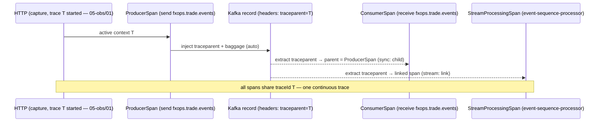
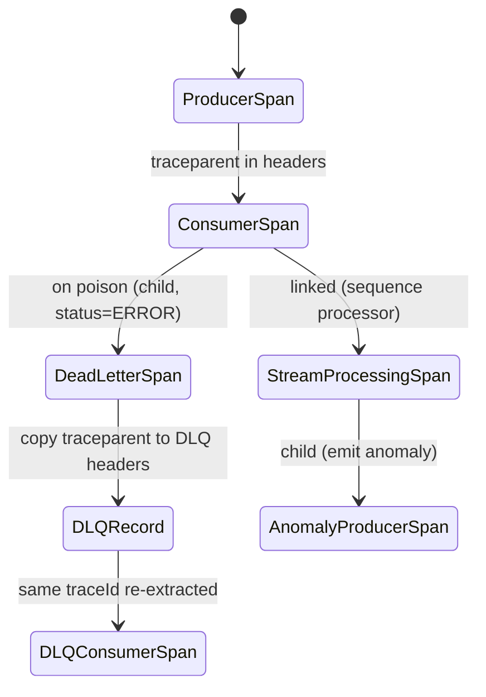

# Design Document — OTel Kafka Tracing (Cross-Cutting Instrumentation)

> **Stage 2 of 3** (`requirements.md → design.md → tasks.md`). This document realizes `requirements.md` for the OTel Kafka Tracing feature. Unlike requirements (which are technology-agnostic), **design is where Technology Roles resolve to concrete products** — per `01-initial-setup/01-technology-stack` — and where the inherited golden-path observability NFR (`architecture-golden-path/01-service-nfrs` GP-Rq-8.2) gets a concrete implementation for the event boundary. Every design decision below traces to a requirement (see §11).
>
> **This is a cross-cutting instrumentation spec — it introduces no new service.** It extends the producers and consumers already specced in phases 02 (`02-microservices/*`) and 03 (`03-events/*`) so that a trade's span chain is **continuous across the `EVENT_STREAM`**. It is the event-boundary companion to `05-observability/01-otel-spring-boot` (HTTP boundary): **01 makes a trace continuous across HTTP hops; 02 makes the same trace continuous across the Kafka hop.** Where 01 and 02 overlap (baggage keys, `correlation.id` attribute, DLQ error tagging), 02 defers to 01 and only adds the message-boundary specifics.

## 1. Overview

Today a trace started at trade capture (an HTTP span, per `05-observability/01`) **breaks** the moment the resulting event is written to Kafka: the consuming service starts a fresh root span with no link back to the producer. This spec closes that gap by carrying the **W3C TraceContext through Kafka record headers** — injected on produce, extracted on consume — so producer and consumer spans join the *same* trace. The result: from one trade a single trace spans `capture (HTTP) → produce (Kafka) → lifecycle-consume (Kafka) → sequence-process (Kafka Streams) → anomaly-produce (Kafka) → ...`, navigable end-to-end in the tracing backend.

Scope: **configuration and wiring only.** No business logic, no state, no new topic, no new module. The changes land in each event-touching service's `ObservabilityConfig`/`KafkaConfig` and in shared build/agent configuration.

**Role → concrete binding** (resolved from the technology-stack registry — the *only* place these products are otherwise named):

| Technology Role | Concrete product | Use in this feature |
|---|---|---|
| `OBSERVABILITY_TRACING` | OpenTelemetry (`1.x`) | trace/span model, W3C propagators, exporter to the `OTelCollector` |
| `OBSERVABILITY_TRACING` (messaging) | the OTel Kafka instrumentation (auto-instrumentation for Kafka clients) | automatic `traceparent` inject on send / extract on receive; producer & consumer spans |
| `EVENT_STREAM` (local) | Apache Kafka (KRaft mode, `3.x`) | the message boundary the trace must survive; record **headers** carry the `TraceHeader` |
| `EVENT_STREAM` (cloud, Azure) | Azure Event Hub (Kafka-compatible) | same client contract → same header propagation, no code change |
| `STREAM_PROCESSING` | Kafka Streams | `event-sequence-processor` — `StreamProcessingSpan` per record (§5) |
| `SERVICE_LANGUAGE` / `SERVICE_FRAMEWORK` | Java 21 / Spring Boot 3.4.x | host runtime the OTel agent attaches to |
| `SERIALIZATION` | Jackson | event envelope (de)serialization; `tradeId`/`correlationId` are read from the envelope, not the headers |
| `INTEGRATION_TEST_HARNESS` | Testcontainers | Kafka container: produce → consume, assert one continuous trace (§9) |

Fictional topics used throughout: `fxops.trade.events` (primary), `fxops.sequence.anomalies` (anomaly output), and their dead-letter siblings `fxops.trade.events.dlq` / `fxops.sequence.anomalies.dlq`. All identifiers are synthetic `FX-` ids (e.g. `FX-000001`) (GP-Rq-14).

## 2. Trace context in Kafka record headers (Req 1, 2)

The unit of propagation is the **Kafka record header**. The active `SpanContext` is serialized by the W3C `TraceContext` propagator into two headers and rehydrated on the far side:

| Header key | Origin | Meaning |
|---|---|---|
| `traceparent` | W3C TraceContext | `00-{traceId}-{spanId}-{flags}` — carries the trace id + the producing span id + the sampled flag |
| `tracestate` | W3C TraceContext | optional vendor state; propagated verbatim if present |
| `baggage` | W3C Baggage | `tradeId` / `regionCode` business context (§4), propagated as an OTel `Baggage` header |

**On produce** (Req 1): the OTel Kafka instrumentation intercepts `KafkaTemplate.send(...)` / the `ProducerRecord`, opens a `ProducerSpan`, and **injects** `traceparent` (and `tracestate`/`baggage` when present) into `record.headers()` **automatically** — no service writes header code (Req 1.2). The injected `traceparent` carries the `traceId` of the *triggering* unit of work (the inbound HTTP request or upstream consume), not a fresh one (Req 1.4). When one unit of work publishes N records, each carries the same `traceId` but a distinct `ProducerSpan` `spanId` (Req 1.5).

**On consume** (Req 2): the instrumentation reads the `traceparent` header off each incoming `ConsumerRecord`, **extracts** it into a parent `Context`, and opens the `ConsumerSpan` under it (Req 2.1–2.2). If the header is **absent** (e.g. a record produced before this instrumentation shipped, or an externally injected record), the consumer starts a **new root** `ConsumerSpan` rather than failing (Req 2.3) — the trace is discontinuous for that one record but processing is never blocked.

Both spans follow the naming convention from `05-observability/01` Req 3.2/3.3 — `{service-name} send {topic}` / `{service-name} receive {topic}` — so 01 owns the *names*, 02 owns the *header propagation* that makes those two spans one trace.

## 3. Producer / consumer span linkage across the topic (Req 3)

Two topologies, two linkage semantics — chosen per consumer, not globally:

| Consumer pattern | Linkage | Rationale |
|---|---|---|
| **Synchronous** — one record per poll processed inline (e.g. `trade-lifecycle-service` `@KafkaListener`) | `ConsumerSpan` **parent = `ProducerSpan`** (parent/child) | the consume is causally *the continuation* of the produce; one clean depth-first branch (Req 3.1) |
| **Batch** — many records in one poll (e.g. a batch listener or a Kafka Streams punctuation) | batch span **links** to each record's `ProducerSpan` (span links, not parent) | one batch has many unrelated producers; parenting all of them would render a wide, misleading tree (Req 3.2) |
| **Stream** — `event-sequence-processor` per-record | `StreamProcessingSpan` **linked** to the source `ProducerSpan` via the extracted `traceparent` (Req 3.3, §5) | high-volume; link preserves causality without forcing every record into one giant trace |

The tracing backend renders **both** parent/child edges and span links, so an investigator can navigate producer→consumer for the sync case and producer→batch for the batch case in one query (Req 3.4).



## 4. correlationId + tradeId on event flows (Req 2.5) — composes with 05-observability/01

This spec does **not** re-define baggage — `05-observability/01` Req 4 owns the `tradeId`/`regionCode` `Baggage` contract and Req 2.4 owns the `correlation.id` span attribute. 02 only ensures they **survive the Kafka hop**:

- **`tradeId` (`trade.id`)** — the OTel `Baggage` set on the producer side is propagated in the `baggage` header (§2) and re-established on the consumer side; additionally, the consumer sets `trade.id` as a span attribute on the `ConsumerSpan`, read from the **event envelope's `tradeId` field** (authoritative), not solely from baggage (Req 2.5). This guards against a missing/stale baggage header while keeping the two consistent.
- **`correlationId` (`correlation.id`)** — carried both as `Baggage`/header (for trace joins) and mirrored to MDC by the consumer for `OBSERVABILITY_LOGGING` correlation (inherited GP-Rq-2 / GP-Rq-8.1); the golden-path `CorrelationIdFilter`+consumer MDC copy already specced per service performs the MDC side.
- **Message-locator attributes** on the `ConsumerSpan`: `messaging.destination.name` (topic), `messaging.kafka.destination.partition`, `messaging.kafka.message.offset` (Req 2.4); and on the `ProducerSpan`: `messaging.destination.name` (topic) and `messaging.kafka.message.key` = the `PartitionKey` (`tradeId` or `regionCode`) (Req 1.3). These let an investigator jump from a span straight to the exact partition+offset.
- **Baggage hygiene** — per 01 Req 4.4, only `tradeId` (`FX-` prefixed) and `regionCode` (enum) ride as business baggage; **no monetary values, PII, or non-synthetic ids** are ever placed in headers or attributes.

## 5. Composition with event-sequence-processor + DLQ — traces survive to the DLQ (Req 3.3, 4, 5)

**Event-sequence-processor (`STREAM_PROCESSING`, Req 5).** The processor consumes `fxops.trade.events`; the OTel Kafka Streams instrumentation extracts each record's `traceparent` and opens a `StreamProcessingSpan` **linked** to the source `ProducerSpan` (Req 5.1). The span carries `trade.id` and, when a violation is detected, the `violationType` attribute (Req 5.3). When the processor emits an `AnomalyEnvelope` to `fxops.sequence.anomalies`, that publish opens a `ProducerSpan` that is a **child** of the `StreamProcessingSpan` (Req 5.2) — so the full chain **trade event → detection → anomaly publication** is one navigable trace, tying anomaly detection back to the exact upstream event that triggered it.

**DLQ (`03-events/04-dlq-management`, Req 4).** When a consumer routes a poison/failed record to a `DLQTopic` (e.g. `fxops.trade.events` → `fxops.trade.events.dlq`):

1. The dead-letter action is a **child `Span` of the `ConsumerSpan`**, named `{service-name} dead-letter {origin-topic}` (Req 4.1).
2. It carries `dlq.origin.topic`, `dlq.origin.partition`, `dlq.origin.offset`, `dlq.failure.reason` (truncated to 200 chars), `dlq.poison.flag` (Req 4.2), and is set to status **`ERROR`** (Req 4.3) — consistent with `05-observability/01` Req 5.4.
3. Critically, the **original record's `traceparent` is copied onto the DLQ record's headers** (Req 4.4). The dead-letter *breaks the processing flow but not the trace*: when the DLQ consumer (or a `dlq-triage` operator) later reads the dead-lettered message, it extracts the same `traceId` and its work joins the original trade's trace. A message can therefore be dead-lettered, sit in the DLQ, and be replayed hours later, and the entire arc remains one queryable trace.



## 6. Sampling considerations for high-volume topics (Req 3, 5 — non-functional)

`fxops.trade.events` is a high-volume topic; tracing every record head-on would flood the `OTelCollector` and trace store. Design choices:

- **Head-based parent-based sampling (default).** The sampler is `parent_based(root = trace_id_ratio(p))`: the **producer** (usually rooted at an HTTP request per 01) makes the sampling decision, and it is encoded in the `traceparent` **sampled flag** (§2). Because Kafka consumers *inherit* that flag from the header, a trade sampled at capture is sampled **all the way through** produce→consume→stream→anomaly — the whole chain is kept or dropped **together**, never half a trace. This is the key reason W3C flag propagation (not just id propagation) matters here.
- **Ratio is externalized config** (inherited GP-Rq-11): `OTEL_TRACES_SAMPLER_ARG` per environment — e.g. a low ratio for `fxops.trade.events` in load environments, `1.0` (always-on) locally so developers see every trade (aligns with `05-observability/01` Req 6).
- **Never sample by dropping headers.** Even for un-sampled traces the `traceparent` is still injected/propagated (only the sampled flag is `00`), so a downstream **error path can still be upgraded** and correlated; DLQ/error spans (§5) are always recorded regardless of the ratio so no dead-letter is ever invisible.
- **Consider tail-based sampling at the `OTelCollector`** (deployment-time, out of service scope) to retain 100% of *error* traces while sub-sampling successful high-volume ones — noted as an operational lever, configured in `05-observability/03`/collector config, not in service code.

## 7. Configuration touch points (concrete, per event-touching service)

No new module. Changes are additive config on services that already produce/consume:

```
ObservabilityConfig   propagators = W3C tracecontext,baggage ; parent-based sampler ; Kafka instrumentation enabled
KafkaConfig           producer/consumer factories observed by the OTel Kafka instrumentation (no manual header code)
application.yml        otel exporter endpoint (externalized), OTEL_TRACES_SAMPLER / _ARG, OTEL_PROPAGATORS=tracecontext,baggage
DevOps/Local compose   OTel agent attached at JVM startup (per 05-observability/01 Req 1.1); OTelCollector reachable
```

The JVM agent attachment, `service.name`, exporter endpoint, and collector wiring are **owned by `05-observability/01`**; 02 only asserts the **Kafka producer/consumer instrumentation is enabled** and the **propagator set includes `tracecontext,baggage`** so headers are actually written/read.

## 8. Testing strategy (Req 1–5 + GP-Rq-12)

- **Integration (`INTEGRATION_TEST_HARNESS` — Testcontainers Kafka)**, the primary bar:
  - **Continuous trace:** produce a `TradeEvent` for `FX-000001` to `fxops.trade.events` inside an active parent span; a test consumer reads it; assert the `ConsumerSpan`'s `traceId` **equals** the `ProducerSpan`'s `traceId` and its parent is the `ProducerSpan` (Req 1, 2, 3.1). Use an in-memory span exporter to capture spans and assert the tree.
  - **Header presence:** assert the produced `ProducerRecord` carries a `traceparent` header, and that `tradeId=FX-000001` rides as baggage / appears as the `trade.id` attribute on the `ConsumerSpan` (Req 1.1, 2.5, 4).
  - **Missing-header resilience:** produce a record with **no** `traceparent`; assert the consumer opens a new **root** span and does not throw (Req 2.3).
  - **DLQ trace survival:** force a poison record; assert a `dead-letter` child span (status `ERROR`, `dlq.*` attributes) exists, and that the DLQ record's headers carry the **same** `traceparent` as the original (Req 4).
  - **Stream chain:** feed a sequence-violating series; assert a `StreamProcessingSpan` linked to the source producer and a child `ProducerSpan` on `fxops.sequence.anomalies` share the trade's `traceId` (Req 5).
- **Unit** (`UNIT_TEST_FRAMEWORK`): W3C propagator inject→extract round-trip over a header carrier (fast, no broker) — same `traceId`/`spanId` recovered; sampled flag preserved.
- **Sampling** test: with ratio `1.0` a trade is fully sampled end-to-end; with a parent un-sampled decision the whole chain is consistently un-sampled (no partial traces) (§6).
- All fixtures use synthetic `FX-` ids and fictional `fxops.*` topics (GP-Rq-14).

## 9. Design decisions (ADR-lite)

- **Headers, not payload, carry trace context.** `traceparent` lives in Kafka record headers so the *envelope schema stays untouched* and non-instrumented consumers ignore it harmlessly — trace propagation is orthogonal to the domain contract (`03-events/02`).
- **Auto-instrumentation over hand-rolled header code.** The OTel Kafka instrumentation injects/extracts automatically (Req 1.2/2.2); hand-written header code would drift per service and is explicitly disallowed. 02 is *configuration*, not code in service logic.
- **Parent for sync, link for batch/stream.** Parenting a batch/stream span to many producers makes a misleading wide tree; span **links** preserve causality without distortion (Req 3.2/3.3). One rule per consumer topology, chosen deliberately.
- **Propagate the sampled flag, decide once at the root.** Parent-based sampling keeps a trade's whole chain all-or-nothing — no half-traces across the Kafka hop — the decisive reason W3C flag propagation (not bespoke id copying) is used (§6).
- **Trace survives the DLQ.** Copying `traceparent` onto the DLQ record (Req 4.4) means a dead-lettered, later-replayed message stays in the original trade's trace — essential for the `dlq-triage` and `transaction-recovery` investigations downstream.
- **Envelope `tradeId` is authoritative for `trade.id`.** Read the attribute from the domain envelope, not solely from baggage, so a dropped baggage header never loses the business key (Req 2.5).
- **Defer to `05-observability/01`.** Span names, baggage keys, `correlation.id`, exporter/agent/collector wiring, and DLQ error tagging are owned by 01; 02 adds only the message-boundary propagation — no duplication (inheritance discipline).

## 10. Cross-references

| Related spec | Relationship |
|---|---|
| `05-observability/01-otel-spring-boot` | **Companion.** 01 = HTTP-boundary continuity + span names + baggage + agent/collector wiring; 02 = Kafka-boundary continuity. Same trace, different hop. 02 does not restate 01. |
| `architecture-golden-path/01-service-nfrs` GP-Rq-8.2 | 02 is the concrete realization of "propagate trace context across `EVENT_STREAM` boundaries." |
| `03-events/03-event-sequence-processor` | Source of the `StreamProcessingSpan` topology instrumented in §5. |
| `03-events/04-dlq-management` | Source of the DLQ routing whose spans + header copy are defined in §5. |
| `03-events/01-kafka-topic-design` | Owns the `fxops.*` topic + partition-key conventions surfaced as span attributes (§4). |

## 11. Requirement → design traceability

| Requirement | Satisfied by |
|---|---|
| Req 1 Trace context injection by producers | §2 (inject), §4 (producer attributes), §7 |
| Req 2 Trace context extraction by consumers | §2 (extract + missing-header), §4 (consumer attributes + `trade.id`) |
| Req 3 Producer-consumer span linking | §3 (parent/link table + diagram) |
| Req 4 DLQ span tracing | §5 (dead-letter span, attributes, ERROR status, header copy) |
| Req 5 Stream processing trace coverage | §5 (StreamProcessingSpan link + child anomaly producer span) |
| Sampling (non-functional, spans Req 3/5) | §6 |
| Inherited GP-Rq-8.2 / GP-Rq-11 / GP-Rq-14 | §1, §6 (externalized ratio), §8 (synthetic data) |
