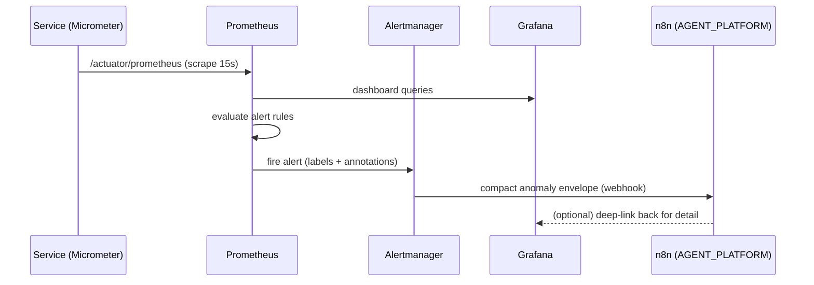

# Design Document — Metrics and Dashboards (Cross-Cutting)

> **Stage 2 of 3** (`requirements.md → design.md → tasks.md`). This document realizes `requirements.md` for the platform **metrics and dashboards** layer. It is **not a service** — it produces no runtime code, only version-controlled configuration under `DevOps/Local/OBSERVABILITY_METRICS/`. Unlike requirements (which are technology-agnostic), **design is where Technology Roles resolve to concrete products** — per `01-initial-setup/01-technology-stack`. This spec realizes the **metrics half of golden-path `GP-Rq-8`** (observability): every `Service_Module` already declares business metrics in its own design; here we scrape, visualize, and alert on them centrally. Every design decision below traces to a requirement (see §11).

## 1. Overview

This feature configures the collection, visualization, and alerting layer that sits *around* the services built in phases 02–03. It scrapes the Micrometer metrics each service already exposes (per `GP-Rq-8.3`), stores them, renders one dashboard per service plus a global business-health dashboard, and fires alerts on critical conditions — all as code, provisioned on a clean environment with no manual UI steps.

It owns configuration only: it defines *which* metrics matter, *how* they are scraped, *what* dashboards render, and *when* alerts fire. It does not emit metrics (services do) and contains no business logic.

**Role → concrete binding** (resolved from the technology-stack registry — the *only* place these products are otherwise named):

| Technology Role | Concrete product | Use in this spec |
|---|---|---|
| `OBSERVABILITY_METRICS` (collector) | Prometheus | scrape + store time-series; evaluate alert rules |
| `OBSERVABILITY_METRICS` (visualization) | Grafana | provisioned dashboards (one per service + global) |
| metrics facade (via `SERVICE_FRAMEWORK`) | Micrometer + Spring Boot Actuator | the `/actuator/prometheus` endpoint each service exposes; the API services instrument against (`Counter`/`Timer`/`Gauge`) |
| `EVENT_STREAM` | Apache Kafka | consumer-lag and broker metrics scrape target (JMX/native exporter) |
| `CONTAINER_RUNTIME` | Docker + Docker Compose | local stack that provisions Prometheus + Grafana with mounted config |
| `AGENT_PLATFORM` | n8n | receives compact anomaly envelopes from Alertmanager (§6) — never raw metrics |

**Micrometer is the facade, Prometheus the backend.** Services never depend on Prometheus directly: they publish to the Micrometer registry provided by Actuator, Prometheus scrapes the resulting `/actuator/prometheus` endpoint, and Grafana queries Prometheus. Swapping the backend is a technology-stack edit, not a service edit.

**Config tree** (version-controlled, the single source of truth per `Rq-5`):

```
DevOps/Local/OBSERVABILITY_METRICS/
  prometheus.yml                     # global + scrape_configs (§3)
  targets/
    services.json                    # file_sd: per-service targets + labels (§3)
    infra.json                       # file_sd: Kafka broker / exporter targets (§3)
  alerts/
    platform-alert-rules.yml         # all AlertRules (§5)
  alertmanager/
    alertmanager.yml                 # routes alerts → n8n webhook receiver (§6)
  grafana/
    provisioning/
      datasources/prometheus.yml     # Prometheus datasource
      dashboards/dashboards.yml       # dashboard provider (folder scan)
    dashboards/
      svc-trade-ingest.json          # per-service dashboards (§4)
      svc-trade-lifecycle.json
      svc-risk-calculation.json
      svc-eod-processing.json
      svc-business-calendar.json
      svc-state-reconciliation.json
      svc-event-sequence-processor.json
      platform-business-health.json   # global dashboard (§4)
```

## 2. The platform metric catalogue (Req 2, 3; GP-Rq-8)

The catalogue is the contract between what services *emit* and what this spec *consumes*. It is expressed as data (a table), not scattered across dashboards — every panel and alert references a name here. Metrics divide into **technical** (uniform across every service) and **business** (declared in each service's own design).

### 2.1 Technical metrics (every `Service_Module`)

| Metric (Micrometer name) | Type | Key labels | Meaning |
|---|---|---|---|
| `http_server_requests_seconds_count` | counter | `service`, `uri`, `status` | request rate source |
| `http_server_requests_seconds` (bucket/sum) | histogram | `service`, `uri`, `status` | p50/p95/p99 latency, error rate (`status=~"5.."`) |
| `jvm_memory_used_bytes` / `jvm_memory_max_bytes` | gauge | `service`, `area`, `id` | heap/non-heap pressure |
| `jvm_gc_pause_seconds` | histogram | `service`, `action`, `cause` | GC pause distribution |
| `jvm_threads_live_threads` | gauge | `service` | live thread count |
| `process_cpu_usage` | gauge | `service` | CPU saturation |
| `kafka_consumer_fetch_manager_records_lag_max` | gauge | `service`, `topic`, `client_id` | consumer lag (backpressure) |
| `spring_kafka_listener_seconds` | histogram | `service`, `result` | listener processing time / failures |

### 2.2 Business metrics (already declared in service designs)

These names originate in the referenced service designs (e.g. `03-trade-lifecycle-service/design.md` §7 declares `lifecycle_transitions_total`). This spec **consumes** them; it does not define them.

| Metric | Type | Key labels | Owning service | Dashboard / alert use |
|---|---|---|---|---|
| `trades_captured_total` | counter | `service`, `region` | trade-ingest | throughput; global captures/min |
| `trade_validation_failures_total` | counter | `reason` | trade-ingest | validation failure breakdown |
| `lifecycle_transitions_total` | counter | `from`, `to`, `rejected` | trade-lifecycle | transition rate; illegal-transition rate |
| `risk_calculations_total` | counter | `region`, `risk_level` | risk-calculation | per-region risk throughput |
| `risk_calculation_duration_seconds` | histogram | `region` | risk-calculation | risk p95 latency SLA |
| `fallback_rule_firings_total` | counter | `region`, `rule` | risk-calculation | fallback-rule firing rate |
| `eod_region_status` | gauge | `region` | eod-processing | 0=IN_PROGRESS,1=READY,2=BLOCKED,3=CLOSED |
| `eod_branch_completion_ratio` | gauge | `region` | eod-processing | branch completion % per region |
| `eod_time_to_close_seconds` | gauge | `region` | eod-processing | time-to-close per region |
| `eod_readiness` | gauge | `region` | eod-processing | EOD readiness (global panel) |
| `sequence_violations_total` | counter | `violation_type` | event-sequence-processor | violation rate |
| `sequence_facts_active` | gauge | — | event-sequence-processor | active `SequenceFact` count |
| `dlq_messages_total` / `dlq_depth` | counter / gauge | `topic` | (all consumers) | DLQ depth per topic |
| `dlq_poison_message_count` | counter | `topic` | (all consumers) | poison-message quarantine alert |

All example label values use synthetic `FX-` ids and fictional region codes (`FX-REGION-EMEA`, `FX-REGION-APAC`, `FX-REGION-AMER`).

## 3. Prometheus scrape configuration (Req 1)

`prometheus.yml` holds two globals and references `file_sd` target files so that adding a service is a one-line edit to `targets/services.json` (`Rq-1.5`, `Rq-5.4`), never an edit to the scrape logic.

```yaml
global:
  scrape_interval: 15s          # service default (Rq-1.3), externalized
  evaluation_interval: 15s
rule_files:
  - alerts/platform-alert-rules.yml
alerting:
  alertmanagers:
    - static_configs: [ { targets: ["alertmanager:9093"] } ]
scrape_configs:
  - job_name: fxops-services      # Rq-1.1
    metrics_path: /actuator/prometheus
    scrape_interval: 15s
    file_sd_configs: [ { files: ["targets/services.json"] } ]
  - job_name: fxops-infra         # Rq-1.2 (Kafka broker / JMX exporter)
    scrape_interval: 30s          # infra interval (Rq-1.3)
    file_sd_configs: [ { files: ["targets/infra.json"] } ]
```

`targets/services.json` — every `Service_Module` in `Middleware/`, each carrying a `service` label matching its `SERVICE_FRAMEWORK` application name (`Rq-1.4`) and a `region` label so dashboards filter by service and region without IP/port:

```json
[
  { "targets": ["trade-ingest-service:8080"],
    "labels": { "service": "trade-ingest-service", "region": "FX-REGION-EMEA" } },
  { "targets": ["trade-lifecycle-service:8080"],
    "labels": { "service": "trade-lifecycle-service", "region": "FX-REGION-EMEA" } },
  { "targets": ["risk-calculation-service:8080"],
    "labels": { "service": "risk-calculation-service", "region": "FX-REGION-EMEA" } },
  { "targets": ["eod-processing-service:8080"],
    "labels": { "service": "eod-processing-service", "region": "FX-REGION-EMEA" } },
  { "targets": ["business-calendar-service:8080"],
    "labels": { "service": "business-calendar-service", "region": "FX-REGION-EMEA" } },
  { "targets": ["state-reconciliation-service:8080"],
    "labels": { "service": "state-reconciliation-service", "region": "FX-REGION-EMEA" } },
  { "targets": ["event-sequence-processor:8080"],
    "labels": { "service": "event-sequence-processor", "region": "FX-REGION-EMEA" } }
]
```

`targets/infra.json` points at the `EVENT_STREAM` broker's JMX/native metrics exporter with `service: kafka`. Both interval values are externalized (top-level `global` + per-job override) so tuning is a config edit (`Rq-1.3`).

## 4. Grafana dashboard set (Req 2, 3, 5) — provisioned JSON

Dashboards are **provisioned JSON**: committed model files under `grafana/dashboards/`, loaded by the file-provider in `grafana/provisioning/dashboards/dashboards.yml` at startup (`Rq-5.1`). None are authored in the UI; a UI-built dashboard must be exported and committed before rebuild (`Rq-5.3`). Every panel query filters by `service` and, where relevant, `region` — the labels §3 attaches. All dashboards share a `datasource` provisioned from `provisioning/datasources/prometheus.yml`.

**Per-service dashboards (7)** — one JSON per service in `Rq-2.1`. Each carries the common row (from §2.1): request rate (`rate(http_server_requests_seconds_count[1m])`), error rate (`5xx / total`), p50/p95/p99 latency (`histogram_quantile` over the `_bucket` series), and JVM memory/GC. Each then adds its service-specific business panels:

| Dashboard JSON | Service-specific panels (source: §2.2) | Req |
|---|---|---|
| `svc-trade-ingest.json` | `trades_captured_total` rate; `trade_validation_failures_total` by `reason`; idempotency hit rate | 2.3 |
| `svc-trade-lifecycle.json` | `lifecycle_transitions_total{from,to}`; illegal-transition rate (`rejected="true"`); duplicate-event rate | 2.4 |
| `svc-risk-calculation.json` | `risk_calculations_total{region,risk_level}`; `risk_calculation_duration_seconds` histogram; `fallback_rule_firings_total` rate | 2.5 |
| `svc-eod-processing.json` | per-region close status (`eod_region_status` state-timeline); `eod_branch_completion_ratio`; `eod_time_to_close_seconds` | 2.6 |
| `svc-business-calendar.json` | common row (request/error/latency/JVM) | 2.1/2.2 |
| `svc-state-reconciliation.json` | common row (request/error/latency/JVM) | 2.1/2.2 |
| `svc-event-sequence-processor.json` | `sequence_violations_total{violation_type}`; `sequence_facts_active` gauge | 2.7 |

**Global business-health dashboard (1)** — `platform-business-health.json` (`Rq-3`): total trade captures/min across regions (`sum(rate(trades_captured_total[1m]))`); overall error rate across all services; global EOD status for the current `GlobalBusinessDate` (from `eod_region_status`/`eod_readiness`); `dlq_depth{topic}` per `DLQTopic` as a time series with a horizontal threshold line at the alert value (`Rq-3.2`); `sequence_violations_total` grouped by `violation_type` (`Rq-3.3`); per-region risk throughput so a regional slowdown is visible relative to peers (`Rq-3.4`). Example values use only synthetic `FX-` labels (`Rq-3.5`).

## 5. Alert rules (Req 4) — version-controlled PromQL

All rules live in `alerts/platform-alert-rules.yml`, loaded by Prometheus at startup via `rule_files` (`Rq-4.7`, `Rq-5.2`); none are created in the UI. Each `expr` references only catalogue metrics (§2); each `for` and threshold is expressed as an externalized value.

| Alert | Condition (`expr` sketch) | `for` | Annotation carries | Req |
|---|---|---|---|---|
| `ServiceErrorRateHigh` | 5xx ratio per `service` > 5% | 2m | `service`, current rate | 4.1 |
| `DlqDepthHigh` | `dlq_depth{topic} > 10` (configurable) | 5m | `topic` | 4.2 |
| `PoisonMessageQuarantined` | `increase(dlq_poison_message_count[1m]) > 0` | 0 (immediate) | origin `topic`, `tradeId` if present | 4.3 |
| `RiskLatencyHigh` | p95 `risk_calculation_duration_seconds` > 2s (configurable) | 5m | `region`, current p95 | 4.4 |
| `EodCloseBlocked` | `eod_region_status == 2` (BLOCKED) | 30m (configurable) | `regionCode`, `blockerCode` | 4.5 |
| `SequenceViolationSpike` | `rate(sequence_violations_total[1m]) > 10/min` | 2m | `violation_type` | 4.6 |
| `TradeThroughputDrop` | `sum(rate(trades_captured_total[5m]))` falls below floor | 5m | region breakdown | 3.1/4 (throughput) |
| `EodCompletionStalled` | `eod_branch_completion_ratio` flat below 1.0 past cutoff | cfg | `region` | 4/3 (EOD completion) |
| `ConsumerLagHigh` | `kafka_consumer_fetch_manager_records_lag_max` > floor | 5m | `service`, `topic` | 1.2 / GP-Rq-8 |

Thresholds default as stated but are surfaced as top-of-file template values so tuning is a single edit.

## 6. Feeding anomaly envelopes to n8n (compact, not raw metrics)

Prometheus evaluates rules; **Alertmanager** (config in `alertmanager/alertmanager.yml`) routes a *firing* alert to an n8n webhook receiver as a compact **anomaly envelope** — never a raw metric stream. This respects the platform boundary (`01-technology-stack` Req 5.2/5.5, `GP-Rq-13`): high-volume streams are never routed through the `AGENT_PLATFORM`; only a small, already-reasoned signal is.

```json
{
  "envelopeType": "metric-anomaly",
  "alert": "RiskLatencyHigh",
  "severity": "warning",
  "service": "risk-calculation-service",
  "region": "FX-REGION-APAC",
  "summary": "risk p95 latency 3.1s over 2s SLA for 5m",
  "firedAt": "2026-07-25T09:14:00Z",
  "correlationHint": "FX-000123"
}
```

The envelope carries the alert name, labels (`service`/`region`/`topic`/`tradeId`), a human summary, severity, and a fire timestamp — enough for an n8n workflow to triage, notify, or open a case, and nothing more. Raw time series stay in Prometheus; n8n pulls detail on demand via Grafana links in the envelope if needed. Alertmanager grouping/dedup ensures one envelope per incident, not one per scrape.



## 7. Testing and validation strategy (Req 5)

No unit tests (no code). Validation is config-lint + provisioning smoke, runnable on a clean environment:

- **Scrape config valid**: `promtool check config prometheus.yml` passes; `targets/*.json` parse and every `Service_Module` has exactly one target with a `service` label matching its application name (`Rq-1.4`, `Rq-5.5`).
- **Alert rules valid**: `promtool check rules alerts/platform-alert-rules.yml` passes; unit-test a representative rule with `promtool test rules` (e.g. `ServiceErrorRateHigh` fires at 6% error for 2m, silent at 4%).
- **Dashboards provision**: bring up the local stack (`CONTAINER_RUNTIME`); assert Grafana loads all 8 dashboards from the provider with no import errors, each bound to the Prometheus datasource; every dashboard JSON parses and references only catalogue metric names (§2).
- **Envelope route valid**: `amtool check-config alertmanager/alertmanager.yml` passes; a synthetic fired alert produces one envelope at the n8n webhook.
- All example/screenshot label values are synthetic `FX-` ids and fictional regions (`Rq-3.5`, `GP-Rq-14`).

## 8. Design decisions (ADR-lite)

- **Config-as-code, no UI authoring**: dashboards and alerts are committed JSON/YAML provisioned at startup, so the observability stack is reproducible on a clean box and reviewable in PRs (`Rq-5`). A UI-built dashboard is treated as drift until exported and committed.
- **`file_sd` targets, not inline static configs**: adding a `Service_Module` is a one-line append to `targets/services.json` in the same PR as the service (`Rq-5.4`) — the scrape logic never changes.
- **Metric catalogue as a table, owned by services**: this spec consumes business metric names declared in each service design; it never redefines them, keeping the emitter (service) and consumer (dashboards/alerts) in one contract (§2).
- **Alertmanager → compact envelope → n8n**: the agent platform receives a small, reasoned anomaly signal, never a raw stream — preserving the architectural boundary that high-volume/exact work stays in `SERVICE_LANGUAGE` services (`GP-Rq-13`, tech-stack Req 5).
- **Micrometer facade, Prometheus backend**: services target the vendor-neutral registry; swapping the metrics backend is a technology-stack edit, not a service edit.

## 9. Application of inherited golden-path NFRs

This is infrastructure config, so most `GP-Rq-*` (APIs, locking, atomicity) do not apply. The relevant ones:

| Golden-path | Realization here |
|---|---|
| GP-Rq-8 observability (metrics half) | the entire spec: scrape (§3) + dashboards (§4) + alerts (§5) over the metrics every service emits |
| GP-Rq-11 configuration | all thresholds/intervals externalized; no hard-coded endpoints — targets via `file_sd` |
| GP-Rq-13 determinism/LLM boundary | n8n receives compact envelopes only (§6); no raw stream through the agent platform |
| GP-Rq-14 synthetic data | all example labels use `FX-` ids and fictional regions |

## 10. Traceability — requirement → design

| Requirement | Satisfied by |
|---|---|
| Req 1 Scrape configuration | §3 |
| Req 2 Per-service dashboards | §2, §4 (per-service table) |
| Req 3 Platform-wide dashboard | §4 (global), §5 (throughput/DLQ threshold lines) |
| Req 4 Alert rules | §5 |
| Req 5 Config as code | §1 (tree), §4, §5, §7 |
| GP-Rq-8 observability | §2–§6, §9 |
| Golden-path GP-Rq-8 (metrics half) | whole spec (§1 role binding) |
