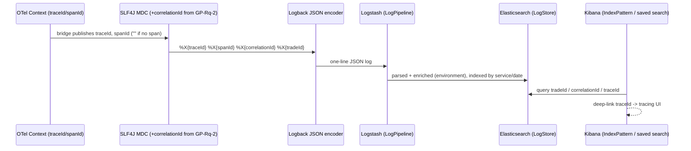

# Design Document — Log Correlation (Cross-Cutting Logging Pipeline)

> **Stage 2 of 3** (`requirements.md → design.md → tasks.md`). This document realizes `requirements.md` for the platform-wide **structured logging pipeline**. It is a **cross-cutting infrastructure/configuration spec**, not a microservice — it has no bounded context, no domain model, and no HTTP API. It configures how every `Middleware/` service *formats* logs and how the `OBSERVABILITY_LOGGING` role ingests, indexes, correlates, retains, and surfaces them. Unlike requirements (technology-agnostic), **design is where Technology Roles resolve to concrete products** — per `01-initial-setup/01-technology-stack`. This spec realizes the **logging half of GP-Rq-8** and **consumes** the `correlationId` produced by GP-Rq-2; it does not re-implement either. Every design decision below traces to a requirement (see §11).

## 1. Overview

This pipeline makes the platform's logs a first-class, queryable, correlated data source. Each service emits **structured JSON logs** carrying the identifiers needed to pivot between a log line, its distributed trace, and its business context (`tradeId`). A log shipper parses that JSON, stamps ingest-time metadata, and indexes it; a UI provides pre-built index patterns and saved searches so an operator can answer "show me every log line for `FX-000001`" or "show me every line for this `correlationId`" without hand-writing queries.

The pipeline **consumes** two upstream contracts and adds nothing to them:
- **GP-Rq-2** `correlationId` — already placed in the MDC by each service's `CorrelationIdFilter` / consumer MDC copy. This spec only *renders* it into the log line and *indexes* it.
- **`05-observability/01-otel-spring-boot` Req 2** trace context — `traceId`/`spanId` are already on the active `OBSERVABILITY_TRACING` context. This spec only *bridges* them into the MDC and *renders* them.

**Role → concrete binding** (resolved from the technology-stack registry — the *only* place these products are otherwise named):

| Technology Role | Concrete product | Use in this pipeline |
|---|---|---|
| `OBSERVABILITY_LOGGING` | Elasticsearch + Logstash + Kibana (ELK) 8.x | `LogStore` (Elasticsearch), `LogPipeline` (Logstash), `LogDashboard`/`IndexPattern` UI (Kibana) |
| `OBSERVABILITY_TRACING` | OpenTelemetry 1.x | source of `traceId`/`spanId` bridged into the MDC |
| `SERVICE_LANGUAGE` / `SERVICE_FRAMEWORK` | Java 21 / Spring Boot 3.4.x | the logging backend (Logback) configured to emit JSON |
| `SERIALIZATION` | Jackson (ISO-8601 temporals) | JSON encoder timestamp/number rendering |
| `EVENT_STREAM` | Apache Kafka | broker logs shipped alongside service logs (Req 2.5) |
| `CONTAINER_RUNTIME` | Docker + Docker Compose | `DevOps/Local/` logging stack + log-driver/file shipping (Req 2.1) |
| `INTEGRATION_TEST_HARNESS` | Testcontainers | assert-a-log-line and cross-service-query integration tests (§9) |

**What this spec does NOT own:** it does not generate the `correlationId` (GP-Rq-2), does not start/propagate spans (`01-otel-spring-boot`, `02-otel-kafka-tracing`), and does not own metrics dashboards (`03-otel-metrics-dashboards`). It is the **logging** leg only.

**Shared realization surface.** Because every service must emit the identical JSON shape, the Logback configuration and the MDC-enrichment glue live **once** in the `shared-domain-contracts` (or an equivalent `shared-observability`) module and are inherited by every `Middleware/` service via the parent build — not copied per service. This is the logging analogue of the golden-path "define once, inherit everywhere" rule.

## 2. Structured log format (Req 1, Req 4)

Every log line is a single JSON object (one line, newline-delimited) emitted by a JSON `encoder` on the Logback root appender. **Every line carries** the correlation quartet plus service/region context:

```json
{
  "timestamp":     "2026-07-24T09:15:22.418Z",
  "level":         "INFO",
  "service":       "trade-lifecycle-service",
  "region":        "EMEA",
  "traceId":       "4bf92f3577b34da6a3ce929d0e0e4736",
  "spanId":        "00f067aa0ba902b7",
  "correlationId": "FX-CORR-7f3a9c21",
  "tradeId":       "FX-000001",
  "logger":        "com.fxtradeops.tradelifecycle.application.LifecycleService",
  "message":       "transition CAPTURED -> VALIDATED",
  "exception":     null
}
```

| Field | Source | Always present? | Notes |
|---|---|---|---|
| `timestamp` | Logback event, ISO-8601 UTC (`SERIALIZATION`) | yes | default time field in Kibana (Req 3.3) |
| `level` | Logback event | yes | keyword-indexed |
| `service` | `spring.application.name` (static field) | yes | keyword-indexed; matches metrics/traces `service` |
| `region` | `regionCode` MDC / static field | where present | keyword-indexed (Req 1.4); `regionCode` is the canonical field name |
| `traceId` | `OBSERVABILITY_TRACING` context via MDC (§3) | yes — **empty string** when no active trace | keyword-indexed (Req 4.1/4.3) |
| `spanId` | `OBSERVABILITY_TRACING` context via MDC (§3) | yes — **empty string** when no active trace | keyword-indexed (Req 4.3) |
| `correlationId` | GP-Rq-2 MDC (`%X{correlationId}`) | yes | keyword-indexed; **consumed**, not generated |
| `tradeId` | MDC when a unit of work is trade-scoped | **where present** (Req 1.3) | keyword-indexed; top-level, never embedded in `message` |
| `logger` | Logback logger name | yes | class name |
| `message` | log statement | yes | free text; stack traces excluded (Req 1.5) |
| `exception` | Logback throwable, structured | on error only | separate field, never folded into `message` (Req 1.5) |

Rules enforced by the encoder/config:
- **Stack traces** go to the structured `exception` field, never into `message` (Req 1.5) — `message` stays cleanly queryable.
- **No secrets/PII** — only `SyntheticData` (`FX-` `tradeId`s, fictional names) may appear in any field (Req 1.6 / GP-Rq-14).
- **Untraced paths are explicit** — a background/scheduled task with no active span emits `traceId:""` and `spanId:""` (present-but-empty), so a `traceId:""` query finds untraced code (Req 4.3).

## 3. Log → trace correlation (Req 4)

Correlation is achieved by making the **log line and the span share the same `traceId`**, so there is nothing to join at query time — the identifier is literally the same string on both sides.

- The `OBSERVABILITY_TRACING` (OTel) context exposes the active `traceId`/`spanId`. A tracing↔MDC bridge (Spring Boot's OTel/Micrometer-tracing MDC integration) publishes them into the **MDC** as `traceId`/`spanId` keys before each log line is rendered, and clears them when the scope closes — mirroring how GP-Rq-2 manages `correlationId` in the MDC.
- The JSON encoder reads `%X{traceId}`, `%X{spanId}`, and `%X{correlationId}` straight from the MDC — the encoder itself is trace-unaware; it just serializes MDC keys.
- **Empty-string fallback** (Req 4.3): the bridge (or a Logback default-value converter) guarantees the keys exist as `""` when no span is active, so the fields are never *omitted* — required for the "find untraced paths" query and for a stable, keyword-mappable index.
- **Pivot to trace** (Req 4.2): Kibana renders a deep-link from a log line's `traceId` to the corresponding trace in the tracing-backend UI, so one click moves from log → trace; the shared `traceId` also lets the operator go trace → log by querying `traceId:<value>` in the services index.



## 4. Log pipeline / ingest design (Req 2)

The `LogPipeline` (Logstash) is version-controlled under `DevOps/Local/OBSERVABILITY_LOGGING/` and loaded automatically when the local logging stack starts (Req 2.4). It runs in the `DevOps/Local/` `CONTAINER_RUNTIME` compose stack alongside the `LogStore` and UI.

Pipeline stages:
1. **Input** — collect service container logs via the `CONTAINER_RUNTIME` logging driver or file-based shipping from all `Service_Module` containers (Req 2.1); a second input collects `EVENT_STREAM` broker logs (Req 2.5).
2. **Parse** — decode each line as JSON (`json` filter). Because services already emit structured JSON, **no grok/free-text parsing** is applied to already-structured fields (Req 2.2). Broker logs (non-JSON) are minimally parsed and mapped onto the same core fields where available.
3. **Enrich** — add `environment` (e.g. `local`) at ingest time so multiple environments share one `LogStore` (Req 2.3). Ensure `traceId`/`spanId`/`correlationId`/`tradeId`/`regionCode`/`service`/`level` are typed as keywords for exact-match queries.
4. **Route/Output** — index into Elasticsearch **by source and date**:
   - service logs → `fxops-services-YYYY.MM.dd` (backing the `fxops-services-*` pattern),
   - broker logs → `fxops-kafka-YYYY.MM.dd` (backing the `fxops-kafka-*` pattern, same pipeline, Req 2.5).

Date-suffixed indices make per-day retention/rollover (§6) a simple index-lifecycle operation.

## 5. Kibana index patterns + saved searches (Req 3, Req 5)

All UI objects are provisioned as **version-controlled** files and imported automatically at startup (Req 3.2, Req 5.2); nothing is created solely through the UI (Req 5.3).

**Index patterns** (Req 3.1) under `DevOps/Local/OBSERVABILITY_LOGGING/` init:

| IndexPattern | Backs | Default time field | Keyword fields (Req 3.3) |
|---|---|---|---|
| `fxops-services-*` | all platform service logs | `timestamp` | `traceId`, `spanId`, `correlationId`, `tradeId`, `regionCode`, `service`, `level` |
| `fxops-kafka-*` | `EVENT_STREAM` broker logs | `timestamp` | `service`, `level` (subset available on broker logs) |

**Saved searches / dashboards** (Req 5.1), committed under `DevOps/Local/OBSERVABILITY_LOGGING/saved-queries/`:

| Saved search | Filter | Ordering / grouping |
|---|---|---|
| **Trade timeline by tradeId** | `tradeId : "<value>"` across all services | ordered by `timestamp` — the cross-service story of one trade |
| **Correlation ID trace** | `correlationId : "<value>"` across all services | ordered by `timestamp` — one logical request end-to-end |
| **Errors by service** | `level : ERROR` | grouped by `service` over a time range |
| **DLQ events** | lines containing `dlq.origin.topic` | ordered by `timestamp` |

Each saved search parameterizes on a keyword field so an operator supplies only the `FX-` value. A `traceId` column carries the deep-link to the tracing UI (§3, Req 4.2).

## 6. Retention (Req 6)

Retention is enforced by Elasticsearch index-lifecycle configuration under `DevOps/Local/OBSERVABILITY_LOGGING/`, version-controlled, never edited through the UI (Req 6.3):

| Index family | Minimum retention | Mechanism |
|---|---|---|
| `fxops-services-*` | **30 days** (Req 6.1, configurable) | delete phase on daily indices |
| `fxops-kafka-*` | **14 days** (Req 6.2) | delete phase on daily indices |

When storage exceeds a configurable threshold the **oldest indices are deleted automatically** by the policy — no manual deletion (Req 6.4). Because indices are date-suffixed (§4), "delete oldest" is a whole-index drop, cheap and atomic.

## 7. Configuration surface & inheritance

- **Emit side (in every service):** shared Logback JSON config + tracing-MDC bridge + static `service`/`region` fields, inherited via the parent build. A service adds nothing except its `spring.application.name` and (when trade-scoped) `MDC.put("tradeId", …)` at the unit-of-work boundary — the same boundary GP-Rq-2 already uses for `correlationId`.
- **Ingest/store/UI side (once, in DevOps):** everything under `DevOps/Local/OBSERVABILITY_LOGGING/` — Logstash pipeline, Kibana index patterns + `saved-queries/`, retention policy — all committed and auto-loaded.

## 8. Interaction with adjacent observability specs

| Spec | Boundary |
|---|---|
| GP-Rq-2 (correlation id) | **produces** `correlationId` into MDC; this spec only renders/indexes it |
| GP-Rq-8 (observability) | this spec **is** its logging leg (structured logs w/ `correlationId`+`tradeId`) |
| `01-otel-spring-boot` | **produces** `traceId`/`spanId` on the OTel context; this spec bridges them to MDC |
| `02-otel-kafka-tracing` | ensures trace context survives Kafka hops, so cross-service `traceId` is continuous in logs |
| `03-otel-metrics-dashboards` | sibling leg (metrics); shares the `service` label convention, not owned here |

## 9. Testing strategy (Req 1, 4, 5; GP-Rq-12/14)

- **Log-line assertion (unit/slice):** capture a log event through the shared JSON encoder and assert the emitted line is valid JSON carrying **`correlationId` and `traceId`** (and `tradeId` when set) as top-level fields, with stack traces confined to `exception`, never `message` (Req 1.2/1.5, Req 4.1).
- **Empty-context assertion:** a log emitted with no active span produces `traceId:""`/`spanId:""` (present, empty) — never omitted (Req 4.3).
- **Cross-service query (integration, `INTEGRATION_TEST_HARNESS`: Elasticsearch + Logstash):** ship synthetic service logs for `FX-000001` from two distinct `service` values through the real pipeline, then query the `fxops-services-*` index by `tradeId:"FX-000001"` and assert it **returns both services' lines ordered by `timestamp`** (Req 5.1 trade-timeline). A parallel case asserts a `correlationId` query returns the full cross-service set (Req 5.1 correlation trace).
- **Pipeline parse assertion:** a structured JSON line survives Logstash with fields typed as keywords and an `environment` field added at ingest (Req 2.2/2.3).
- Every fixture uses only synthetic `FX-` ids and fictional names (Req 1.6 / GP-Rq-14).

## 10. Design decisions (ADR-lite)

- **Correlation by shared identifier, not join.** The log and the span carry the *same* `traceId` string, so trace↔log navigation is a lookup, not a correlation query — cheaper and unambiguous. Cost: every emit path must have the tracing-MDC bridge active; enforced by putting it in shared config.
- **Present-but-empty trace ids.** Emitting `traceId:""` for untraced paths (vs. omitting the field) keeps the Elasticsearch mapping stable as a keyword and makes "which logs have no trace?" a first-class query (Req 4.3). Omission would create mapping gaps and hide untraced code.
- **Shared logging config, not per-service copies.** The JSON encoder + MDC bridge live once and are inherited, guaranteeing identical field shape across services (Req 1.1) — the same "single source of truth" principle the golden path uses for behavior.
- **JSON-only parsing in the pipeline.** Because services already emit structured JSON, the pipeline does not re-parse structured fields with grok (Req 2.2) — avoids double-parsing, preserves field types, and keeps ingest cheap. Broker logs get minimal mapping onto the shared fields.
- **Date-suffixed indices.** `fxops-{services,kafka}-YYYY.MM.dd` makes retention a whole-index delete (§6) and keeps per-day volumes bounded — retention and rollover become index-lifecycle config, not query-time deletes.
- **All UI objects version-controlled.** Index patterns, saved searches, and retention are committed files auto-imported at startup (Req 3.2/5.2/5.3/6.3) so a clean environment is immediately queryable and nothing lives only in a mutable UI.

## 11. Requirement → design traceability

| Requirement | Satisfied by |
|---|---|
| Req 1 Structured log format | §2, §7 (emit side); §9 (assertion) |
| Req 2 Log pipeline configuration | §4, §7 (DevOps side) |
| Req 3 Index patterns | §5 |
| Req 4 Trace-log correlation | §3, §2 (empty-string fields) |
| Req 5 Dashboards / saved queries | §5 |
| Req 6 Retention policy | §6, §4 (date indices) |
| GP-Rq-2 correlation id (consumed) | §1, §3 (rendered/indexed, not generated) |
| GP-Rq-8 observability (logging leg) | §1, §2, §8 |
| GP-Rq-12 / GP-Rq-14 testing / synthetic data | §9 |
