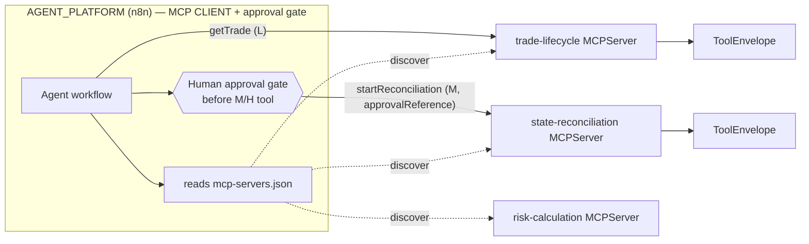

# Design Document — MCP Server Setup (Agent Tool Layer)

> **Stage 2 of 3** (`requirements.md → design.md → tasks.md`). This document realizes `requirements.md` for the **MCP Server Setup** feature. Unlike requirements (which are technology-agnostic), **design is where Technology Roles resolve to concrete products** — per `01-initial-setup/01-technology-stack` — and where the inherited golden-path NFRs (`architecture-golden-path/01-service-nfrs`) get concrete implementations. Every design decision below traces to a requirement (see §10). This is the **first phase in which Spring AI and MCP dependencies enter `Middleware/`** — Phases 01–05 build the services as plain Spring Boot REST + Kafka + JPA with no agent surface (MASTER-PLAN architectural decision).

## 1. Overview

This feature adds the **agent tool layer**: it wires **Spring AI's MCP Server** into the existing `Middleware/` business services so their already-deterministic capabilities are exposed as **typed MCP tools**, and it introduces the shared `shared-mcp-contracts` library that defines the single agent-facing envelope every tool returns. This is the first time the services become **agent-callable**.

The architecture is deliberately asymmetric:

- **`AGENT_PLATFORM` (n8n) is the MCP *client* / agent host.** It discovers tools, plans, and calls them. It never runs business logic (inherited GP-Rq-13).
- **Each `SERVICE_FRAMEWORK` service is an MCP *server*.** Spring AI's MCP Server exposes selected Spring Boot methods as tools; the underlying computation is the same deterministic Java that already exists.
- The PRD **agent envelope** (`{requestId, businessEntity, status, facts, violations, permittedActions, evidence, dataClassification, expiresAt}`) maps onto **MCP structured tool output**, and the PRD **structured action payload** (`{action, entityId, reasonCode, expectedVersion, idempotencyKey, approvalReference, dryRun}`) maps onto a tool's **typed `inputSchema`** — so an agent can only ever submit a well-formed, validated payload. This is the concrete enforcement of the PRD principle: *"much safer than allowing natural-language-generated arbitrary payloads."*
- The **human-approval gate lives in the client (n8n), before any M/H-risk tool call** — not inside the tool. The typed boundary is what makes the gate meaningful: there is no free-text path around it.

**Role → concrete binding** (resolved from the technology-stack registry — the *only* place these products are otherwise named):

| Technology Role | Concrete product | Use in this feature |
|---|---|---|
| `AGENT_TOOL_PROTOCOL` | Model Context Protocol via **Spring AI MCP Server `1.0.x`** | expose service methods as typed MCP tools |
| `AGENT_PLATFORM` | **n8n** (pinned tag) | MCP **client** / agent host that discovers + calls tools, owns the approval gate |
| `SERVICE_FRAMEWORK` | **Spring Boot `3.4.x`** | host the embedded `MCPServer` in each service |
| `SERVICE_LANGUAGE` | Java `21` | tool method + envelope/record definitions |
| `SERVICE_BUILD_TOOL` | Maven `3.9.x` | `shared-mcp-contracts` module + `Parent_Build_Descriptor` dependency mgmt |
| `BEAN_VALIDATION` | Jakarta Bean Validation + Hibernate Validator | validate every tool input DTO (Req 3.2) |
| `SERIALIZATION` | Jackson (ISO-8601 temporals, JSON numbers) | envelope ↔ MCP schema (de)serialization |
| `CONTAINER_RUNTIME` | Docker + Docker Compose | compose-network hostnames in the gateway config (Req 5.3) |
| `UNIT_TEST_FRAMEWORK` / `INTEGRATION_TEST_HARNESS` | JUnit 5 / Testcontainers | envelope unit tests + local end-to-end tool-call test (§8) |

## 2. The `shared-mcp-contracts` library (Req 1)

New Maven module **`Middleware/shared-mcp-contracts`**, package root **`com.fxtradeops.mcp`**, added to the parent `<modules>`. It declares a compile-scope dependency on the `AGENT_TOOL_PROTOCOL` MCP SDK, so every service that depends on it inherits the MCP server starter via the `Parent_Build_Descriptor` dependency management (Req 1.2). It contains **no service logic** — only the agent contract types.

```
com.fxtradeops.mcp
  envelope/
    ToolEnvelope         (record — the agent-facing response wrapper)
    BusinessEntity       (record — {type, id}, id is the FX- business key)
    EnvelopeStatus       (enum   — SUCCESS | PARTIAL | FAILURE)
    Fact                 (record — {key, value} key-value pair)
    Evidence             (record — {source, timestamp, reference})
    PermittedAction      (enum   — fixed catalogue: RECALCULATE_RISK,
                                    START_RECONCILIATION, REPLAY_EVENT,
                                    QUARANTINE_TRADE, HOLD_EOD, NONE, ...)
  action/
    ActionRequest        (record — the structured action payload, tool input)
  risk/
    ToolRisk             (enum   — L | M | H)
    GatedTool            (annotation — marks M/H methods for gateway enforcement)
  error/
    ToolValidationError  (structured validation-error body, never a raw exception)
```

### 2.1 The agent envelope — `ToolEnvelope` (Req 1.1, maps PRD read-tool JSON)

Java `record`, immutable, Jackson-serialized. Every field carries field-level Javadoc referencing its contract definition (Req 1.4).

```java
public record ToolEnvelope(
    UUID requestId,                     // correlates the tool call end-to-end (GP-Rq-2)
    BusinessEntity businessEntity,      // {type:"FX_TRADE", id:"FX-000001"}
    EnvelopeStatus status,              // SUCCESS | PARTIAL | FAILURE
    List<Fact> facts,                   // deterministic figures/state the agent may cite
    List<String> violations,            // machine-readable violation codes (e.g. APPROVAL_REFERENCE_REQUIRED)
    List<PermittedAction> permittedActions, // from the fixed catalogue — service-authored, NEVER LLM-authored
    List<Evidence> evidence,            // source references {source, timestamp, reference}
    String dataClassification,          // e.g. INTERNAL | CONFIDENTIAL (§7)
    Instant expiresAt) {}               // ISO-8601 staleness bound, or null
```

`permittedActions` is a `List<PermittedAction>` drawn from a **fixed catalogue enum**, not free strings — the agent may only *choose among* actions the deterministic service already computed (Req 3.3, GP-Rq-13.1). A static factory `ToolEnvelope.success(...)` / `.failure(entity, violations)` keeps population uniform.

### 2.2 The structured action payload — `ActionRequest` (maps PRD action-tool JSON)

The typed `inputSchema` for every action (M/H) tool. There is no untyped/string-blob entry point.

```java
public record ActionRequest(
    @NotNull PermittedAction action,    // must be a catalogue value (e.g. RECALCULATE_RISK)
    @NotBlank String entityId,          // FX- business key the action targets
    @NotBlank String reasonCode,        // e.g. STALE_MARKET_DATA
    Long expectedVersion,               // optimistic-lock guard (GP-Rq-6); null = unconditional-disallowed for H
    @NotBlank String idempotencyKey,    // exactly-once guard (GP-Rq-5)
    String approvalReference,           // HITL authorization; validated non-null by GatedTool (Req 3.4)
    boolean dryRun) {}                  // true = simulate + return impact, commit nothing
```

Field-level `BEAN_VALIDATION` constraints mean a malformed agent payload is rejected by the framework and surfaces as a structured `ToolValidationError` inside a `FAILURE` `ToolEnvelope`, never a raw exception (Req 3.2).

### 2.3 Risk classification — `ToolRisk` + `@GatedTool` (Req 1.3)

`ToolRisk { L, M, H }` (L read/explain; M blocks/holds/quarantines; H moves money/state/config). `@GatedTool(risk = ToolRisk.M|H)` marks a tool method as requiring a `ReplayApproval`-equivalent authorization; the gateway/registration layer enforces the `approvalReference` precondition (§6, Req 3.4). All fixtures/examples use `SyntheticData` (Req 1.5, GP-Rq-14).

## 3. How each business service registers MCP tools (Req 2, 3, 4)

Every `Service_Module` under `Middleware/` (except `shared-mcp-contracts` and `shared-domain-contracts`) adds the `AGENT_TOOL_PROTOCOL` MCP server starter (compile scope) plus a dependency on `shared-mcp-contracts`, and registers an `MCPServer` bean whose **server name = its `spring.application.name`** (Req 2.1/2.2). Only methods explicitly annotated `@MCPTool` are registered; helpers are never auto-exposed (Req 2.4). If the MCP server cannot bind, the service **fast-fails** at startup rather than running degraded (Req 2.5).

**Two tool shapes:**

| Tool shape | Verb prefix | Input | Output | Risk | Side effect |
|---|---|---|---|---|---|
| **Read tool** | `get` / `list` / `check` | a bare key (e.g. `tradeId`) | `ToolEnvelope` | L | none (side-effect-free, GP-Rq-1.4) |
| **Action tool** | `start` / `replay` / `quarantine` | `ActionRequest` (typed) | `ToolEnvelope` | M / H (`@GatedTool`) | idempotent, **dry-run capable** |

Tool names follow `{verb}{Entity}` camelCase (Req 3.1). Each tool lives in a thin `mcp/` package inside the service and **delegates to the service's existing deterministic application layer** — it adds no new business logic (GP-Rq-13). A read tool populates `businessEntity`, `status`, `facts`, `evidence`, and `permittedActions` (the last sourced from the deterministic reconciliation/rules result, Req 3.3). An action tool, when `dryRun=true`, runs the deterministic simulation and returns the projected `facts`/`violations` with **nothing committed**; when `dryRun=false`, it re-checks `approvalReference`, `expectedVersion`, and `idempotencyKey`, then commits exactly once.

**Representative initial tool set** (Req 4 — minimum viable, per service):

| Service (`server name`) | Read tools (Risk L) | Action tools |
|---|---|---|
| `trade-lifecycle-service` | `getTrade(tradeId)`, `getTradeEvents(tradeId)`, `getTradeTimeline(tradeId)` | — (lifecycle is read-only to agents) |
| `state-reconciliation-service` | `evaluateCanonicalState(tradeId)` | `startReconciliation(ActionRequest)` — **Risk M, `@GatedTool`**; the narrow recovery/replay action surface |
| `risk-calculation-service` | `getRiskResult(tradeId)`, `getRuleTrace(calculationId)` | — |
| `eod-processing-service` | `getRegionalCloseStatus(regionCode)`, `getReadinessStatusMap()` | — |
| `business-calendar-service` | `getBusinessCalendar(regionCode)`, `classifyBookingDate(regionCode, instant)` | — |

The recovery-style narrow action tools (replay/quarantine/reconcile) are intentionally the *only* state-changing tools and are all `@GatedTool` — the agent can read broadly but can only act through a small, human-gated, typed door.

## 4. Local MCP gateway / transport config (Req 5)

Each service exposes its `MCPServer` on a **dedicated MCP port, distinct from the REST port** and externalized as configuration (Req 2.3, GP-Rq-11). For local deploy the transport is **SSE over HTTP** (Spring AI MCP Server, WebMVC SSE) so that a containerized n8n can reach each service over the compose network; **stdio** transport is documented as the fallback for single-process local runs but is not used across the compose network.

A single gateway file **`DevOps/Local/AGENT_PLATFORM/mcp-servers.json`** lists every service's `MCPServer` endpoint — `{server name, host, port}` — using **`CONTAINER_RUNTIME` service names as hostnames (not `localhost`)** so service-to-service discovery works inside the compose network (Req 5.1/5.3). The `AGENT_PLATFORM` compose service mounts this file and reads it at startup, making all listed tools discoverable to agents in one place (Req 5.2). The file contains **no credentials** — only env-var placeholders (Req 5.5, GP-Rq-9.4). Adding a new service's `MCPServer` requires updating `mcp-servers.json` in the same PR (Req 5.4).



## 5. Mapping the agent envelope ↔ MCP schema (Req 1, 3)

Spring AI's MCP Server derives each tool's JSON `inputSchema` and structured-output schema from the Java types — the shared records *are* the schema, so client and server cannot drift.

| PRD / envelope concept | MCP surface |
|---|---|
| structured action payload (`ActionRequest`) | tool **`inputSchema`** (typed, `BEAN_VALIDATION`-constrained) |
| `ToolEnvelope` (facts/violations/permittedActions/evidence/expiresAt) | tool **structured output** |
| read tool | tool with a scalar-key `inputSchema`, no side effect |
| action tool | tool with `ActionRequest` `inputSchema`, `@GatedTool` |
| validation failure | structured `ToolValidationError` in a `FAILURE` envelope — never a stack trace (Req 3.2, GP-Rq-3) |
| `requestId` / correlation | carried on the envelope + MDC, honoring inbound `X-Correlation-Id` (GP-Rq-2) |
| `expiresAt` | staleness bound the client honors before citing `facts` |

Because the boundary is a typed schema, an agent literally cannot submit a natural-language / arbitrary payload — the only accepted shape is `ActionRequest`. This is the design's realization of the PRD safety claim.

## 6. The approval-gate boundary (Req 3.4)

The **human-in-the-loop approval gate is enforced in the client (n8n), before any M/H-risk tool call** — it is a workflow step that produces an `approvalReference` (a `ReplayApproval`-equivalent token) which is then passed into the tool's `ActionRequest`. The gate is *not* a tool.

The **service side is the defensive backstop**, not the gate: a `@GatedTool` method validates that `approvalReference` is non-null before any side effect; if missing it returns a `ToolEnvelope{status=FAILURE, violations=[APPROVAL_REFERENCE_REQUIRED]}` and commits nothing (Req 3.4). Thus:

- **n8n** decides *whether* an action is allowed (policy + human approval).
- **The service** guarantees *no* action executes without a passed approval reference and a valid typed payload (belt-and-braces; the deterministic service remains the source of `permittedActions`, GP-Rq-13).

## 7. Security and data classification (Req 5.5; GP-Rq-9, GP-Rq-13, GP-Rq-14)

- **Security placeholder unchanged:** the MCP endpoints inherit the phase's `SecurityPlaceholder` permit-all with the standard auth TODO marker (GP-Rq-9). No credentials, tokens, or secrets appear in `mcp-servers.json` or any config — env-var placeholders only (Req 5.5, GP-Rq-9.4).
- **`dataClassification`** is a first-class envelope field so the client can apply handling policy per tool response; read tools default to `INTERNAL`, risk/trade detail to `CONFIDENTIAL`.
- **Determinism boundary preserved:** tools are thin adapters over deterministic Java; no tool invokes an LLM, and `permittedActions`/`facts`/`violations` are always service-computed (GP-Rq-13.1).
- **Synthetic data only:** every example, fixture, and doc uses `FX-`-prefixed synthetic identifiers and fictional names (GP-Rq-14, Req 1.5/3.5).

## 8. Testing strategy (GP-Rq-12)

- **Unit** (`UNIT_TEST_FRAMEWORK`): `ToolEnvelope` construction/serialization round-trip; `PermittedAction` catalogue is closed; `ActionRequest` `BEAN_VALIDATION` rejects blank `entityId`/`idempotencyKey`; a `@GatedTool` with null `approvalReference` yields `FAILURE` + `APPROVAL_REFERENCE_REQUIRED`.
- **Web/registration layer:** an `@MCPTool`-annotated method is registered and discoverable; a non-annotated helper is not (Req 2.4); MCP server fast-fails on port conflict (Req 2.5).
- **Local end-to-end** (`INTEGRATION_TEST_HARNESS`): boot `trade-lifecycle-service` with its MCP server on a Testcontainers-backed stack, invoke `getTrade("FX-000001")` **through the MCP transport as a client would**, and assert a **valid `ToolEnvelope`** comes back (well-formed `requestId`, `businessEntity.id="FX-000001"`, `status=SUCCESS`, populated `facts`, `permittedActions` from the deterministic layer). A second case: an action tool with `dryRun=true` commits nothing; with a missing `approvalReference` returns `FAILURE`.
- **Synthetic `FX-` data only** (GP-Rq-14).

## 9. Design decisions (ADR-lite)

- **Envelope in a shared library, not per service:** one `ToolEnvelope` record means every service returns an identically shaped response the client parses uniformly (Req 1) — and the record *is* the MCP schema, eliminating client/server drift.
- **Typed `ActionRequest` as the only action input:** closes the "natural-language-generated arbitrary payload" hole the PRD warns about; `BEAN_VALIDATION` + a closed `PermittedAction` catalogue make malformed or invented actions unrepresentable.
- **Approval gate in the client, backstop in the service:** the human decision belongs in the agent workflow (n8n), but the service still refuses any un-approved side effect — defense in depth without duplicating policy.
- **SSE over HTTP for local transport:** works across the compose network (stdio cannot); stdio kept only as a single-process fallback.
- **MCP added only in Phase 06:** keeps Phases 01–05 services pure deterministic Spring Boot; the agent surface is a clean, late, additive layer (MASTER-PLAN decision).

## 10. Requirement → design traceability

| Requirement | Satisfied by |
|---|---|
| Req 1 Shared MCP contracts library | §2 (all subsections), §5 |
| Req 2 Per-service MCP server config | §3, §4 |
| Req 3 Tool registration conventions | §2.2, §3, §5, §6 |
| Req 4 Initial tool set per service | §3 (representative tool-set table) |
| Req 5 Local MCP gateway config | §4, §7 |
| PRD agent contract (envelope + action payload) | §1, §2.1, §2.2, §5 |
| Inherited GP-Rq-2/3/6/9/11/12/13/14 | §5, §6, §7, §8 |
