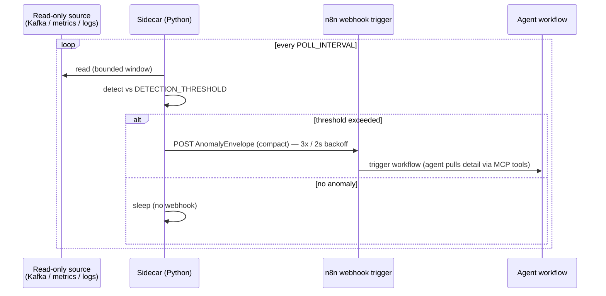

# Design Document — Python Sidecars Local Deploy

> **Stage 2 of 3** (`requirements.md → design.md → tasks.md`). This document realizes `requirements.md` for the four detection/embedding sidecars. Unlike requirements (which are technology-agnostic), **design is where Technology Roles resolve to concrete products** — per `01-initial-setup/01-technology-stack`, the *only* place these products are otherwise named. Every design decision below traces to a requirement (see §7). These sidecars are the bottom band of the standing architecture in `runtime_agents_catalog.md`: *"Python sidecars (detection models, embeddings) — emit compact anomaly envelopes as triggers; NEVER business logic."*

## 1. Overview

The four sidecars are **stateless Python detection/embedding processes** that run as containers **beside** the `AGENT_PLATFORM` and `SERVICE_FRAMEWORK` services. Each one polls a read-only source (Kafka, metrics, or logs), runs a statistical/ML detector, and — only when a `DetectionThreshold` is exceeded — emits a **compact `AnomalyEnvelope`** and POSTs it to an `AGENT_PLATFORM` webhook. That POST *triggers* an agent workflow; the high-volume source data never flows through the agent. A sidecar makes **no risk or business decision** — it emits a signal and stops (Req 3.4, 4.4, platform boundary in technology-stack Req 2.4 / Req 5.5).

**Role → concrete binding** (resolved from the technology-stack registry — the *only* place these products are otherwise named):

| Technology Role | Concrete product | Use in these sidecars |
|---|---|---|
| `SIDECAR_LANGUAGE` | Python `>=3.11` | the only language permitted under `Sidecars/` — detection/embedding only, never business logic |
| `SIDECAR_BUILD_BACKEND` | Hatchling (current) | PEP 621 `[build-system]` backend for every sidecar `pyproject.toml` |
| `CONTAINER_RUNTIME` | Docker + Docker Compose | each sidecar builds a slim-Python image; the four run as compose services in `DevOps/Local/` |
| `AGENT_PLATFORM` | n8n (pinned container tag) | receives each `AnomalyEnvelope` via a webhook-trigger node; hosts the agent workflow |
| `AGENT_TOOL_PROTOCOL` | MCP via Spring AI MCP Server (Spring AI `1.0.x`) | the `AnomalyEnvelope` is shape-compatible with the `ToolEnvelope` in `shared-mcp-contracts`, so agents parse sidecar output and MCP tool output with one parser |
| `EVENT_STREAM` (local) | Apache Kafka (KRaft mode) `3.x` | read-only consumer source for `dlq-cluster-analyzer` (DLQ topics) |
| `OBSERVABILITY_METRICS` | Prometheus `2.x` + Grafana `11.x` | metrics-scrape / actuator source for `kpi-anomaly-detector` and `capacity-forecast-model` |
| `OBSERVABILITY_LOGGING` | Elasticsearch + Logstash + Kibana (ELK) `8.x` | structured-log source for `log-normalizer` |

**Non-negotiables inherited from the catalog and technology-stack:** Python is restricted to detection/embedding sidecars — never agents (those are `AGENT_PLATFORM` workflows), never `SERVICE_FRAMEWORK` business logic. LLMs never compute official numbers. High-volume Kafka never flows through an agent — the sidecar detects, then triggers n8n with an envelope.

## 2. The four sidecars (`Sidecars/`)

Each is a subdirectory scaffolded in phase `01-initial-setup/02-repo-skeleton` Req 6; this spec builds their detector logic, webhook emitter, image, and tests.

| Sidecar (dir / package) | Detection technique | Read-only source | Threshold semantics |
|---|---|---|---|
| **`kpi-anomaly-detector`** (`kpi_anomaly_detector`) | time-series anomaly against a **calendar-aware seasonal baseline** (same day-of-week / regional calendar context) over per-region business KPIs (capture / booking / settlement rate) | `OBSERVABILITY_METRICS` scrape + `SERVICE_FRAMEWORK` actuator (Req 3.1) | deviation from rolling baseline exceeds `DETECTION_THRESHOLD` (Req 3.2) |
| **`dlq-cluster-analyzer`** (`dlq_cluster_analyzer`) | **stack-trace clustering / lightweight embeddings** grouping dead-letters by failure signature | `EVENT_STREAM` DLQ topic consumer, read-only (Req 4.1) | a cluster's message count exceeds `DETECTION_THRESHOLD` (Req 4.3) |
| **`capacity-forecast-model`** (`capacity_forecast_model`) | **completion-time-vs-cutoff forecasting** from current backlog + throughput | `SERVICE_FRAMEWORK` metrics (backlog size, throughput rate) (Req 5.1) | forecast completion exceeds the next regional cutoff by > configurable margin (Req 5.2) |
| **`log-normalizer`** (`log_normalizer`) | **perception**: normalizes raw logs / event payloads into structured fact summaries | `OBSERVABILITY_LOGGING` structured entries by `tradeId` / `correlationId` (Req 5.3) | on-demand / per-`tradeId` perception request; emits a normalized-fact envelope (Req 5.3) |

## 3. Common package layout and shared envelope

### 3.1 Package layout (src-layout, identical across all four)

Each sidecar follows the phase-01 scaffold (repo-skeleton Req 6.2) — src-layout, PEP 621 descriptor, `CONTAINER_RUNTIME` image, tests:

```
Sidecars/{sidecar-name}/
├── pyproject.toml            # PEP 621 [project]; requires-python ">=3.11";
│                             # [build-system] backend = "hatchling.build"
├── Dockerfile                # slim Python base; installs the package; ENTRYPOINT = poll loop
├── README.md                 # detection function, inputs/outputs, build+run command
├── src/{package_name}/
│   ├── __init__.py           # exposes __version__
│   ├── config.py             # env-var config: DETECTION_THRESHOLD, WEBHOOK_URL, POLL_INTERVAL,
│   │                         #   data-source endpoints — NOTHING hard-coded (Req 1.4)
│   ├── envelope.py           # shared AnomalyEnvelope dataclass + to_json() (§3.2)
│   ├── webhook.py            # shared WebhookEmitter — POST + retry (§4.2)
│   ├── detector.py           # sidecar-specific detector (the only file that differs materially)
│   └── main.py               # poll loop: read source → detect → (if anomaly) emit → sleep
└── tests/
    ├── conftest.py           # synthetic FX- fixtures
    ├── test_detector.py      # detector fires / stays silent on synthetic data
    └── test_envelope.py      # envelope shape ⊆ ToolEnvelope; no raw text / PII fields
```

`config.py`, `envelope.py`, and `webhook.py` are **structurally identical** across the four (copied from the shared template in §Tasks 1) so the envelope contract and webhook behavior cannot drift; only `detector.py` carries sidecar-specific logic.

### 3.2 Shared `AnomalyEnvelope` schema (Req 2)

Every sidecar emits exactly this compact JSON object when its threshold is exceeded. It is a subset of the `shared-mcp-contracts` `ToolEnvelope` so agents parse sidecar output and service tool output with one parser (Req 2.4):

```json
{
  "detectorName": "kpi-anomaly-detector",
  "detectedAt": "2026-07-25T13:05:00Z",
  "severity": "HIGH",
  "summary": "APAC booking rate 41% below 5-day seasonal baseline (<=200 chars)",
  "affectedEntities": [
    { "entityType": "region",  "entityId": "APAC-17" },
    { "entityType": "tradeId", "entityId": "FX-000042" }
  ],
  "evidence": [
    { "key": "observedBookingRate", "value": "0.41" },
    { "key": "baselineBookingRate", "value": "0.70" },
    { "key": "deviationSigma",      "value": "3.8" }
  ],
  "webhookTriggerWorkflow": "business-kpi-guard"
}
```

**Field rules (enforced by `test_envelope.py`):**
- `detectorName` = sidecar name; `detectedAt` = ISO-8601; `severity` ∈ {`LOW`,`MEDIUM`,`HIGH`}; `summary` ≤ 200 chars (Req 2.1).
- `affectedEntities` uses `FX-` `tradeId`s and fictional region/service names only — **no real identifiers** (Req 2.2).
- **Forbidden fields:** no raw log text, no full stack traces, no field that could carry PII or production credentials (Req 2.3, 5.4). `evidence` holds only compact metric snapshots. `envelope.py` never serializes raw source payloads — clustering/normalizing produces *signatures and facts*, not text dumps.
- `webhookTriggerWorkflow` = the synthetic `AGENT_PLATFORM` workflow name to trigger (§5).

## 4. Input sources and output

### 4.1 Inputs — read-only, env-configured

Every source connection is read-only and configured by environment variable — no hostname/port is hard-coded (Req 1.4); a sidecar never writes to any store or replays any message (Req 4.4). Sources per sidecar are the §2 table. `log-normalizer` additionally redacts/omits any field that could carry PII, real credentials, or non-synthetic ids at read time (Req 5.4).

### 4.2 Output — compact webhook POST (Req 6)

The shared `WebhookEmitter` (`webhook.py`) POSTs the `AnomalyEnvelope` — **not the raw source data** — to the `WEBHOOK_URL` (`SidecarWebhook`) env var:

- Simple HTTP `POST`, `Content-Type: application/json`, body = the envelope; no auth token in local deploy (a `# TODO(cloud-deploy): add auth header` placeholder marks where it is added) (Req 6.2).
- **Retry:** up to **3 attempts** with **2 s** backoff, then log a failure and move on — the emitter never blocks the detection poll loop while awaiting a webhook response (Req 6.3).
- **Resilience:** an unreachable `SidecarWebhook` produces a WARN log and the loop continues polling — a single delivery failure never crashes the sidecar (Req 1.5).
- Per-sidecar URLs and their synthetic workflow names are documented in `DevOps/Local/AGENT_PLATFORM/sidecar-webhooks.md`, using `SyntheticData` only (Req 6.4/6.5).



## 5. Sidecar → runtime-intelligence agent mapping

Each sidecar is the `Python sidecar` line named on a `runtime_agents_catalog.md` card; the webhook triggers that agent's `07-n8n-agents` workflow. Detection stays deterministic Python; the LLM wakes only after the envelope arrives.

| Sidecar | Feeds agent (catalog card) | Theme | `webhookTriggerWorkflow` |
|---|---|---|---|
| `kpi-anomaly-detector` | **#9 Business KPI Guard** ("Python sidecar: time-series anomaly + seasonal baseline, business-calendar aware") | Theme 6 — Observability → Business Reasoning | `business-kpi-guard` |
| `dlq-cluster-analyzer` | **#17 DLQ Triage & Remediation** ("Python sidecar: stack-trace clustering + embeddings") | Theme 4 — Event & Data-in-Motion Integrity | `dlq-triage-agent` |
| `capacity-forecast-model` | **#19 Consumer-Lag SLA Predictor** + **#16 Operational Capacity & Backlog Planning** ("Python sidecar: completion-time forecaster / capacity model") | Theme 4 / Theme 8 — Capacity & Economics | `capacity-backlog-agent` |
| `log-normalizer` | **#1 Global Trade Lifecycle Reconstruction** ("Python sidecar: log/payload normalizer (perception)") | Theme 1 — Trade Lifecycle & State Integrity | `trade-lifecycle-agent` |

The sidecar only ever *triggers* the agent. The agent then pulls authoritative detail through `AGENT_TOOL_PROTOCOL` MCP tools on the `SERVICE_FRAMEWORK` services (e.g. `getBusinessKpis`, `groupFailuresBySignature`, `getCompletionForecast`, `getTradeEvents`) and gates any M/H action behind human approval — none of which is the sidecar's concern.

## 6. Determinism, testing, decisions, traceability

### 6.1 Determinism boundary

Sidecars perform **detection only**. The official numbers — canonical KPI values, authoritative backlog counts, the actual lifecycle timeline, the real DLQ remediation decision — are owned by deterministic `SERVICE_FRAMEWORK` services and their MCP tools, retrieved by the agent *after* the trigger. A sidecar's `evidence` snapshot is an *indicator that woke the agent*, never the number of record (technology-stack Req 5.5; catalog non-negotiable "LLMs never compute official numbers"). `dlq-cluster-analyzer` clusters but never replays (Req 4.4); `capacity-forecast-model` forecasts but never scales; `kpi-anomaly-detector` flags but decides nothing (Req 3.4).

### 6.2 Testing strategy (Req 1, 2, 3, 4, 5)

- **Framework:** pytest, run per-sidecar (`python -m pytest Sidecars/{name}`), plus the phase-01 placeholder import/version test.
- **Synthetic FX- fixtures only:** `conftest.py` builds synthetic per-region KPI series, synthetic DLQ messages with fabricated signatures, synthetic backlog/throughput points, and synthetic log lines — all `FX-` ids and fictional region/service names (Req 2.2, 5.4).
- **Detector tests:** each detector fires above threshold and stays silent below it on synthetic data.
- **Envelope tests:** emitted object is a structural subset of `ToolEnvelope`; `severity` enum valid; `summary` ≤ 200 chars; asserts **absence** of raw-text/stack-trace/PII fields (Req 2.3).
- **Webhook tests:** POST body = envelope JSON; retry is 3×/2 s; unreachable URL → WARN + continue, no crash (Req 1.5, 6.3), using a stub/mock HTTP endpoint.
- **Image test:** `docker build` of each `Dockerfile` succeeds and the entry point starts the poll loop.

### 6.3 Design decisions (ADR-lite)

- **Shared `envelope.py` + `webhook.py`, per-sidecar `detector.py`:** the contract that agents depend on (envelope shape, retry/resilience behavior) is written once and copied identically, so it cannot drift across four independently-built sidecars; only detection logic varies.
- **Envelope ⊆ `ToolEnvelope`, not a bespoke schema:** one agent-side parser for both sidecar triggers and MCP tool outputs (Req 2.4).
- **Trigger, don't stream:** the sidecar sends a compact envelope and the agent pulls detail via MCP — keeps high-volume Kafka/metrics/logs out of the LLM (catalog non-negotiable), and keeps detection-to-agent latency low (Req 6).
- **Env-var everything, fail-soft webhook:** no hard-coded endpoints (Req 1.4) and a delivery failure degrades to a WARN rather than crashing the detector (Req 1.5) — a sidecar's first duty is to keep detecting.

### 6.4 Requirement → design traceability

| Requirement | Satisfied by |
|---|---|
| Req 1 Container build & run | §1 binding, §3.1 layout, §4.1 env-config, §4.2 fail-soft, §6.2 image test |
| Req 2 Anomaly envelope schema | §3.2 |
| Req 3 KPI anomaly detector | §2 (row 1), §5, §6.1 |
| Req 4 DLQ cluster analyzer | §2 (row 2), §4.1 read-only, §5, §6.1 |
| Req 5 Capacity forecast + log normalizer | §2 (rows 3–4), §4.1 redaction, §5 |
| Req 6 Sidecar→agent webhook wiring | §4.2, §5 |
