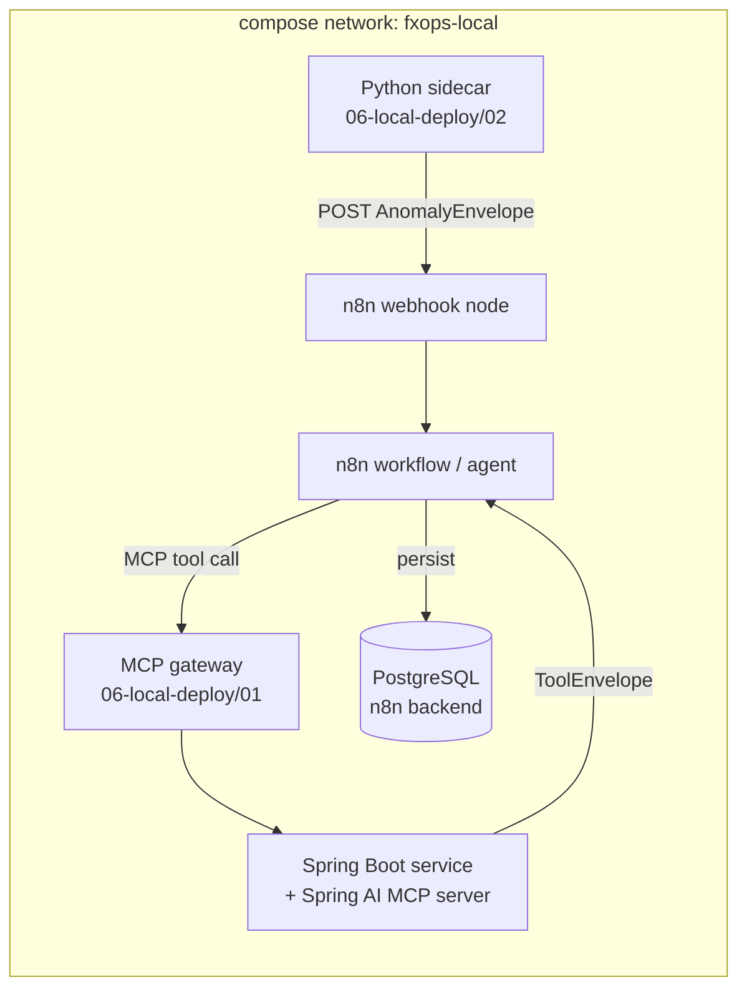

# Design Document — n8n Local Setup (Agent Host / MCP Client)

> **Stage 2 of 3** (`requirements.md → design.md → tasks.md`). This document realizes `requirements.md` for the local `AGENT_PLATFORM` instance. Unlike requirements (which are technology-agnostic), **design is where Technology Roles resolve to concrete products** — per `01-initial-setup/01-technology-stack` — and where the local-infra composition from `06-local-deploy/01` (MCP gateway) and `06-local-deploy/02` (Python sidecars) is wired together. This is the **first point an agent runs end-to-end**: a trigger fires an n8n workflow, the workflow calls a Spring AI MCP tool, the Spring Boot service answers with a `ToolEnvelope`. There is **no Spring or Python code here** — this spec is n8n configuration, credential/webhook wiring, and workflow import. Every design decision below traces to a requirement (see §9).

## 1. Overview

This feature stands up **n8n** as the platform's agent host and MCP client, then proves a live tool call reaches an already-running Spring Boot service and returns a valid envelope. n8n owns *orchestration and human-in-the-loop only*: it never does exact arithmetic, transactional state changes, or high-volume stream consumption — those stay in `SERVICE_FRAMEWORK` services (per technology-stack Req 5.5 / 7.3). The sidecars from `06-local-deploy/02` detect anomalies and POST a compact envelope to an n8n webhook; n8n reasons over it, calls MCP tools through the gateway from `06-local-deploy/01`, and gates any sensitive tool behind a human-approval `Wait` node.

**Role → concrete binding** (resolved from the technology-stack registry — the *only* place these products are otherwise named):

| Technology Role | Concrete product | Use in this spec |
|---|---|---|
| `AGENT_PLATFORM` | n8n (pinned container tag) | the agent host / MCP client, run via `DevOps/Local/n8n/docker-compose.yaml` |
| `AGENT_TOOL_PROTOCOL` | Model Context Protocol via Spring AI MCP Server (Spring AI `1.0.x`) | how n8n discovers and calls service tools |
| `CONTAINER_RUNTIME` | Docker + Docker Compose | shared compose network `fxops-local` |
| `RELATIONAL_STORE` | PostgreSQL `16.x` | n8n's own persistence backend (workflows, credentials, executions) |
| `MODEL_TIER_FAST` (perception/extraction) | Claude Haiku `claude-haiku-4-5` | envelope parsing, intent extraction, field pulls |
| `MODEL_TIER_MID` (reasoning) | Claude Sonnet `claude-sonnet-5` | routing, tool selection, single-hop reasoning |
| `MODEL_TIER_DEEP` (planning) | Claude Opus `claude-opus-4-8` | multi-step planning, approval-summary drafting |
| `OBSERVABILITY_TRACING` | OpenTelemetry `1.x` | correlation-id propagation through the tool call |

The three model tiers are the fast/mid/deep roles from technology-stack Req 7.4 — agent workflows reference them by role (`MODEL_TIER_FAST` etc.), and this spec pins each to a concrete Claude tier so the supervisor skeleton in §5 has a model to invoke. All ids in examples use the synthetic `FX-` prefix.

## 2. n8n local instance (Req 1)

**`DevOps/Local/n8n/docker-compose.yaml`** declares the `n8n` service on the shared `fxops-local` network so it reaches every `MCPServer` and the MCP gateway by container name (not `localhost`).

| Concern | Design |
|---|---|
| Image | `n8nio/n8n:<pinned-tag>` — never `latest` (Req 1.1; technology-stack Req 6.4) |
| Data volume | `n8n_data:/home/node/.n8n` — persists workflow definitions + credentials across restarts (Req 1.1) |
| UI / webhook port | host `5678:5678` (Req 1.1; repo-skeleton Req 7.5) |
| Network | joins external `fxops-local` compose network (Req 1.2) |
| DB backend | `DB_TYPE=postgresdb` → the `RELATIONAL_STORE` compose service (`postgres:5432`), DB `n8n` (Req 1.3) |
| Execution mode | `EXECUTIONS_MODE=queue` + a `n8n-worker` service sharing the same volume/image for scalable local testing (Req 1.3) |
| Secrets | all sensitive env values reference `DevOps/Local/n8n/.env` (git-ignored); a committed `.env.example` documents keys with placeholders (Req 1.4; GP-Rq-14) |

Required environment (values from `.env`, never inlined): `N8N_ENCRYPTION_KEY` (placeholder for local dev — credentials are AES-encrypted at rest with this key, so it must be stable across restarts), `DB_POSTGRESDB_{HOST,PORT,DATABASE,USER,PASSWORD}`, `QUEUE_BULL_REDIS_HOST` (queue mode uses the `CACHE` service), `WEBHOOK_URL=http://n8n:5678/` for in-network callers, and `N8N_HOST/N8N_PORT` for the UI. Startup order is enforced with `depends_on` on the `RELATIONAL_STORE` + `CACHE` services and a healthcheck on the n8n UI port.



## 3. MCP client credential / config (Req 3)

n8n connects to the MCP layer as a **client**. Discovery is centralized: `DevOps/Local/n8n/mcp-servers.json` lists every `Service_Module` that exposes an `MCPServer`, each entry giving the server's `name` and its `CONTAINER_RUNTIME` base URL + MCP port (e.g. `http://trade-lifecycle-service:8081`) — never `localhost` (Req 3.2). This file mirrors the gateway registry produced by `06-local-deploy/01`.

A **credential provisioning script** `DevOps/Local/n8n/provision-mcp-credentials.sh` reads `mcp-servers.json` and creates one `MCPClientCredential` per server through the n8n public REST API (`POST /api/v1/credentials`) — it never touches the n8n database directly (mirrors Req 2.5 for workflows). Design properties:

- **Idempotent** — the script queries existing credentials by name first; a second run updates rather than duplicating (Req 3.3).
- **No real secrets** — the credential body carries a placeholder `authToken` with an inline `TODO: production token injected in cloud deploy` marker (Req 3.4; GP-Rq-14).
- **Connectivity check** — after provisioning, the script probes each `MCPServer` base URL (MCP handshake / health) and logs a `WARN` for any unreachable server without failing the run (Req 3.5).

Workflows reference an `MCPServer` by credential name, so the agent calls a tool without per-workflow credential setup (Req 3 story).

## 4. Webhook endpoints for sidecar anomaly-envelope triggers (Req 4)

Every sidecar-triggered workflow exposes a **webhook trigger node**; its `WebhookEndpoint` URL is the entry point sidecars POST an `AnomalyEnvelope` to. The mapping lives in `DevOps/Local/n8n/sidecar-webhooks.md`, which for each `Sidecar` (from `06-local-deploy/02`: `kpi-anomaly-detector`, `dlq-cluster-analyzer`, `capacity-forecast-model`, `log-normalizer`) records: sidecar name → `WebhookEndpoint` path → the `WorkflowJSON` it triggers (Req 4.1/4.2).

URL hostname resolution (Req 4.4):

| Caller | Hostname | Example |
|---|---|---|
| Another compose service (a sidecar) | `n8n` (service name) | `http://n8n:5678/webhook/fx-kpi-anomaly` |
| Developer terminal / `curl` outside the network | `localhost` | `http://localhost:5678/webhook/fx-kpi-anomaly` |

A **verification step** in the setup (invoked by the smoke test, §6) POSTs an empty body to each registered `WebhookEndpoint` and asserts a `200`/`201` (Req 4.3). All example `AnomalyEnvelope` payloads in `sidecar-webhooks.md` use `SyntheticData`: `FX-` trade ids and fictional detector outputs, e.g. `{"tradeId":"FX-000001","detector":"kpi-anomaly-detector","signal":"settlement_rate_drop","severity":"HIGH"}` (Req 4.5).

## 5. Workflow import mechanism + supervisor skeleton (Req 2)

**Import** — `DevOps/Local/n8n/import-workflows.sh` imports every `WorkflowJSON` from `Agents/workflows/` on first startup, using the n8n public API/CLI only (Req 2.5). Design:

- **Idempotent** — keyed by workflow `name`; a duplicate import updates the existing workflow instead of creating a second copy (Req 2.2).
- **Per-file logging** — logs each workflow name + import status so a developer can see what loaded (Req 2.3).
- **Continue-on-error** — an invalid `WorkflowJSON` logs the filename + error and the loop continues with the remaining files rather than aborting (Req 2.4).

**Minimal supervisor skeleton** — `Agents/workflows/fx-supervisor-skeleton.json` is the one workflow this spec ships to validate the wiring (full agents come in `07-n8n-agents`). It is deliberately thin: a **Webhook trigger** → a **`MODEL_TIER_FAST`** node that extracts `tradeId` + intent from the `AnomalyEnvelope` → a **`MODEL_TIER_MID`** router that picks one read-only MCP tool → an **MCP tool-call** node (a low-risk `ToolRisk=L` tool such as `getTradeState`) → a **Respond** node returning the resulting `ToolEnvelope`. It calls exactly one tool and gates nothing — enough to prove the chain, not to do real agent work. The approval path (§6) is added as a branch for the sensitive-tool validation.

## 6. End-to-end proof (Req 5)

The proof is a single documented chain that exercises every wired component. `DevOps/Local/SMOKE-TEST.md` describes it step-by-step and `DevOps/Local/smoke-test.sh` executes it, exiting `0` on success and non-zero on any failed step, printing a per-step pass/fail summary (Req 5.1/5.4/5.5).

**Chain** (Req 5.2):

```mermaid
sequenceDiagram
  participant T as Trigger (sidecar webhook POST or chat)
  participant N as n8n supervisor workflow
  participant M as MODEL_TIER_MID (router)
  participant W as Wait node (human approval)
  participant G as MCP gateway
  participant S as Spring Boot service (MCP server)
  T->>N: AnomalyEnvelope { tradeId: FX-000001 }
  N->>M: classify + select tool
  alt read-only tool (ToolRisk L)
    N->>G: call getTradeState(FX-000001)
    G->>S: MCP tool invocation
    S-->>N: ToolEnvelope { status: SUCCESS }
  else sensitive tool (ToolRisk M/H)
    N->>W: pause — await human approval (Wait node)
    Note over W: blocks until approver resumes;\nno tool call yet
    W-->>N: approved
    N->>G: call sensitive tool
    G->>S: MCP tool invocation
    S-->>N: ToolEnvelope
  end
```

**Human-approval gate.** Any sensitive tool (`ToolRisk` M or H, per `06-local-deploy/01`) is preceded by an n8n **`Wait` node** configured to resume on an approval webhook/UI action. The `MODEL_TIER_DEEP` node drafts the approval summary shown to the human; the tool call node sits *after* the Wait node, so the sensitive action cannot fire until a human resumes the execution (technology-stack Req 7.3). This is the concrete realization of the platform-wide HITL gate.

**Trigger flexibility** — the same workflow accepts either a sidecar webhook POST (the primary path) or a manual/chat trigger, so the smoke test can run without a live sidecar.

## 7. Composing local infra into a runnable stack (Req 5 story)

This spec is the join point of Phase 06. The full runnable local stack is the union of the compose files from every prior phase on the shared `fxops-local` network:

| Layer | Source spec | Role in the chain |
|---|---|---|
| Services + events + stores | `02-microservices`, `03-events`, local infra | own state, arithmetic, Kafka consumption; expose read APIs |
| MCP server + gateway | `06-local-deploy/01` | expose typed tools; gateway is the single discovery point |
| Python sidecars | `06-local-deploy/02` | detect anomalies, POST compact `AnomalyEnvelope` to n8n |
| Observability | `05-observability` | correlation-id + OTel trace across the tool call |
| **n8n (this spec)** | `06-local-deploy/03` | agent host / MCP client; webhooks, import, HITL gate |

Bring-up order: infra (`RELATIONAL_STORE`, `CACHE`, `EVENT_STREAM`) → services + MCP servers → gateway → sidecars → n8n → run `import-workflows.sh` + `provision-mcp-credentials.sh` → `smoke-test.sh`. A green smoke test means the stack is runnable end-to-end and an agent can execute.

## 8. Testing / validation strategy (Req 4, 5; GP-Rq-12)

- **Instance health** — assert the n8n UI answers on `5678` and the workflow/credential data survives a container restart (Req 1.1).
- **Import** — run `import-workflows.sh` twice; assert no duplicate workflows and that a deliberately malformed JSON is logged-and-skipped, not fatal (Req 2.2/2.4).
- **Credentials** — run `provision-mcp-credentials.sh` twice; assert one credential per `MCPServer`, no duplicates, no committed secret, and a `WARN` on an intentionally unreachable server (Req 3.3/3.4/3.5).
- **Webhooks** — assert every registered `WebhookEndpoint` returns `200`/`201` on the empty-body probe (Req 4.3).
- **Live tool call** — POST a synthetic `FX-000001` `AnomalyEnvelope`; assert (a) the workflow run appears in the execution log, (b) it called ≥1 MCP tool, (c) the returned `ToolEnvelope` has `status = SUCCESS` (Req 5.2).
- **Approval gate** — trigger a sensitive-tool path; assert the execution **pauses at the `Wait` node and no tool call is emitted** until an approval is posted, then completes after approval (technology-stack Req 7.3; the design's core safety assertion).
- All fixtures use synthetic `FX-` ids and fictional detector outputs (Req 4.5, 5.3; GP-Rq-14).

## 9. Design decisions (ADR-lite)

- **PostgreSQL backend + queue mode, not SQLite/main mode** — mirrors the platform `RELATIONAL_STORE` choice and makes local execution behavior match the eventual cloud deploy; queue mode lets a worker scale independently for realistic testing.
- **Centralized `mcp-servers.json` discovery** — one file is the single source of MCP endpoints for both the gateway and n8n credential provisioning, so adding a service is a one-line edit, not per-workflow credential surgery.
- **Public-API-only scripts** — import and credential provisioning use the n8n REST/CLI surface, never direct DB writes, so the scripts stay valid across n8n upgrades and mirror how a cloud deploy would provision.
- **`Wait`-node HITL before every sensitive tool** — the human gate is a workflow-structural invariant (tool node placed strictly after the Wait node), not a prompt instruction, so it cannot be bypassed by model behavior.
- **Thin supervisor skeleton only** — this spec proves wiring; real agent logic is deferred to `07-n8n-agents`, keeping the two concerns cleanly separated.

## 10. Requirement → design traceability

| Requirement | Satisfied by |
|---|---|
| Req 1 Agent platform instance | §2 |
| Req 2 Workflow JSON import | §5 |
| Req 3 MCP client credentials | §3 |
| Req 4 Webhook endpoint registration | §4 |
| Req 5 End-to-end smoke test | §6, §7, §8 |
| Model tiers (fast/mid/deep) | §1 binding table, §5, §6 |
| HITL before sensitive tools | §6, §8 |
| Local infra composition | §7 |
