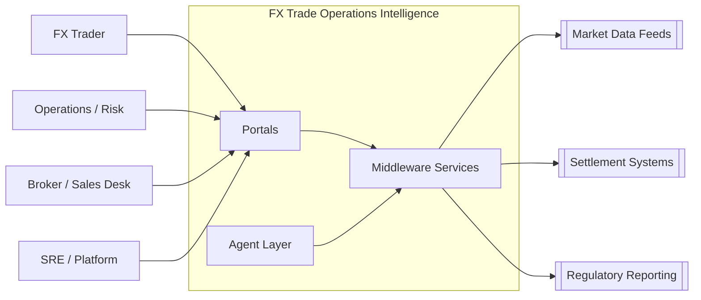
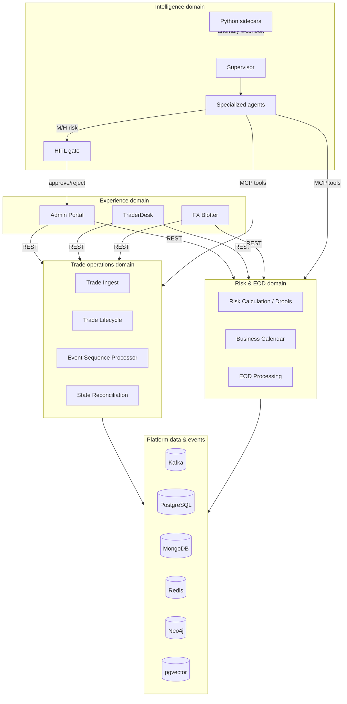
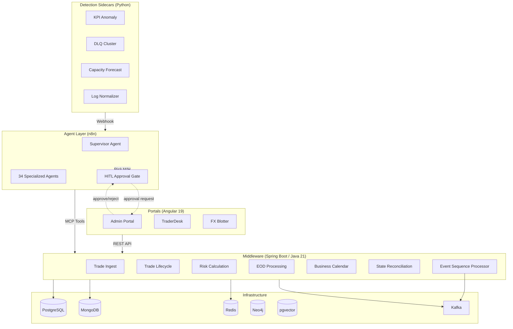

# Forex-Trade-Operations-Intelligence

[](https://openjdk.org/projects/jdk/21/)
[](https://spring.io/projects/spring-boot)
[](https://angular.dev/)
[](https://n8n.io/)
[](https://www.python.org/)
[](https://www.postgresql.org/)
[](https://kafka.apache.org/)
[](https://redis.io/)
[](https://www.mongodb.com/)
[](https://www.drools.org/)
[](LICENSE)
[](docs/adr/)
[-green)](README.md#synthetic-data-policy)

---

> **Agents propose. Services execute. Humans approve. Portals visualize.**

A runtime-intelligence platform where AI agents observe live FX trade operations, reconstruct business state across distributed services, reason about anomalies, and coordinate safe recovery — all under human control.

---

## Purpose of this Repo

This repository has two complementary purposes:

1. **Runtime FX intelligence** — a **public, synthetic reference implementation** of a platform where AI agents add operational intelligence around foreign-exchange trade systems **without replacing them**.
2. **Specification-Driven Development (Kiro)** — a working example of building that platform with Kiro SDD: technology-agnostic requirements → design → atomic tasks → code, backed by ADRs and hooks in `.kiro/`.

Concretely, the repo demonstrates:

- **Deterministic microservices first** — Spring Boot services own trade ingest, lifecycle, risk calculation, EOD processing, calendars, reconciliation, and event sequencing
- **Agents that observe and propose** — n8n hosts a supervisor plus specialized agents that investigate anomalies and recommend actions from a fixed catalogue
- **Human-in-the-loop control** — medium/high-risk actions require approval in the Admin Portal before any service executes them
- **Detection beside, not inside, the trade path** — Python sidecars flag statistical anomalies and trigger agent workflows; they never process trades
- **Operator-facing portals** — Angular apps for trading desk, blotter, and ops/risk administration
- **Spec-Driven Development with Kiro** — every feature is specified before implementation (`.kiro/specs/`), so the same artifacts guide humans and AI coding tools; see [Spec-Driven Development](#spec-driven-development-kiro-methodology) and [Kiro-Understanding.md](Kiro-Understanding.md)

It is intentionally **not** a chatbot demo, a generic “ask your database” sample, or a workplace export. All identifiers and scenarios are fictional (`FX-` prefix). Use it to study agent-assisted FX operations, practice Kiro-style SDD, or adapt either pattern for your own systems.

---

## Table of Contents

- [Purpose of this Repo](#purpose-of-this-repo)
- [The Core Idea](#the-core-idea)
- [Enterprise Architecture](#enterprise-architecture)
- [What Makes This Different](#what-makes-this-different)
- [The Agent Fleet](#the-agent-fleet)
- [Spec-Driven Development](#spec-driven-development-kiro-methodology)
- [Use Cases & Personas](#use-cases--personas)
- [Quick Start](#quick-start)
- [What's Implemented](#whats-implemented)
- [Architectural Constraints](#architectural-constraints)
- [Synthetic Data Policy](#synthetic-data-policy)

---

## The Core Idea

A foreign-exchange trade passes through 9 stages across 7 microservices. When something goes wrong — a trade stalls, risk spikes, an event goes missing, a region can't close end-of-day — **34 AI agents** investigate, explain, and propose corrective action. But they never act alone:

1. **Sidecar detects** — Python statistical detectors flag anomalies
2. **Agent investigates** — n8n workflow calls MCP tools on Spring Boot services
3. **Agent proposes** — LLM reasons about root cause, suggests action from a fixed catalogue
4. **Human approves** — Ops/Risk Manager reviews in the Admin Portal, clicks Approve
5. **Service executes** — deterministic Spring Boot service performs the action with the approval token

No LLM ever computes a risk figure, moves money, or advances trade state. Those are deterministic. Agents add intelligence without compromising correctness.

---

## Enterprise Architecture

Enterprise view of the platform: **who uses it**, **which capability domains it owns**, **how layers collaborate**, and **where control boundaries sit**. Detailed C4 / flow diagrams live in [docs/diagrams/](docs/diagrams/).

### System context



Personas interact only through portals (and observability UIs). Agents never talk to external market/settlement systems directly — they call **MCP tools** on Spring Boot services that own those integrations.

### Logical layers

| Layer | Responsibility | Technology | Boundary rule |
|-------|----------------|------------|---------------|
| **Experience** | Role-specific UI, HITL approval inbox, investigation views | Angular 19 portals (`Admin`, `TraderDesk`, `FXTradeBlotter`) | No business writes; REST clients only |
| **Intelligence** | Intent routing, investigation, explanation, recovery planning | n8n supervisor + 34 specialized agents | Propose/select actions; never invent payloads or compute official numbers |
| **Detection** | Statistical / ML anomaly envelopes that trigger agents | Python sidecars | Beside the trade path — never process trades |
| **Business services** | Trade lifecycle, risk, EOD, calendars, reconciliation, sequencing | Spring Boot / Java 21 + Drools + Kafka Streams | Sole authority for state change and arithmetic |
| **Integration / events** | Domain events, DLQ, schema contracts | Apache Kafka | High-volume stream processing stays out of LLMs |
| **Data** | System of record, audit, cache, graph, vectors | PostgreSQL, MongoDB, Redis, Neo4j, pgvector | Canonical trade state from services + event history |
| **Observability** | Traces, metrics, logs, dashboards, alerts | OTel → Jaeger, Prometheus/Grafana, ELK | Correlation across technical and business signals |
| **Delivery** | Specs, ADRs, local/cloud deploy | Kiro SDD, GitHub Actions, DevOps/Local + AWS | Spec before code; synthetic data only in public repo |

### Capability domains



| Domain | Owns | Key components |
|--------|------|----------------|
| **Trade operations** | Capture → validate → enrich → book → settle path, event integrity, multi-store reconciliation | `trade-ingest`, `trade-lifecycle`, `event-sequence-processor`, `state-reconciliation` |
| **Risk & EOD** | Official risk figures, rules, regional calendars, global close readiness | `risk-calculation`, `business-calendar`, `eod-processing` |
| **Intelligence** | Investigation, explanation, recovery plans, anomaly triage | n8n agents + Python sidecars |
| **Experience** | Persona UX and human approval | Three Angular portals |
| **Platform** | Persistence, messaging, search/recall, observability, deploy | Kafka, polyglot stores, OTel/ELK/Grafana, DevOps |

### Control & safety architecture

```text
Detect (sidecar / stream) → Investigate (agent + MCP) → Propose (fixed action catalogue)
        → Simulate / impact report → Human approve (Admin) → Execute (Spring Boot + approval token)
```

| Control | How it is enforced |
|---------|-------------------|
| **Language boundary** | Java owns transactional/business logic; Python only detection/embeddings; n8n only agent workflows |
| **Tool boundary** | Spring AI MCP tools with typed envelopes (`facts`, `violations`, `permittedActions`, `evidence`) |
| **Action catalogue** | Agents select from fixed enums — no free-form DB/shell/Kafka admin |
| **HITL gate** | Medium/high-risk actions pause in n8n until Admin Portal approval |
| **Deterministic truth** | Risk, materiality, canonical state computed in services — never by the LLM |
| **Idempotency & audit** | Redis keys, Kafka transactions/DLQ, MongoDB audit history, approval references |

### Data architecture (polyglot)

| Store | Role in the enterprise model |
|-------|------------------------------|
| **PostgreSQL** | System of record for trade/risk/EOD transactional state |
| **MongoDB** | Append-oriented audit / document history |
| **Redis** | Idempotency, short-lived locks, agent/session context |
| **Kafka** | Domain event backbone; sequence processor consumes continuously |
| **Neo4j** | Dependency / contagion / blast-radius graph |
| **pgvector** | Prior-incident and rule-document recall for agents |
| **ELK + Prometheus/Grafana + Jaeger** | Operational telemetry correlated to `tradeId` / `correlationId` |

Canonical business state is **not** “majority vote across stores.” `state-reconciliation-service` evaluates event history and invariants; agents explain and coordinate around that result.

### Runtime collaboration (reference)



### Deployment architecture

| Environment | Shape |
|-------------|--------|
| **Local** | Per-role Docker Compose under `DevOps/Local/` — stores, Kafka, n8n, OTel/Jaeger, ELK, Prometheus/Grafana; middleware and portals started via `npm run local:*` |
| **Cloud (target)** | Independently deployable services (GitHub Actions) onto AWS/Azure patterns documented in ADRs (EKS, managed Kafka/Redis/DB equivalents) |
| **Agent runtime** | n8n as MCP client/host; Spring Boot services expose MCP tool servers; workflow JSON is the deployment artifact under `Agents/` |

> Deeper views: [system context](docs/diagrams/system-context.md) · [container architecture](docs/diagrams/container-architecture.md) · [agent architecture](docs/diagrams/agent-architecture.md) · [trade lifecycle](docs/diagrams/trade-lifecycle-flow.md) · [local infrastructure](docs/diagrams/local-infrastructure.md)

---

## What Makes This Different

| Aspect | This Platform | Typical AI Agent Demos |
|--------|--------------|----------------------|
| **Risk boundary** | LLMs never compute numbers — deterministic services do | LLM does everything |
| **Action safety** | Every M/H action gated by human approval | Autonomous execution |
| **Permitted actions** | Fixed enum catalogue — agents select, never invent | LLM generates arbitrary actions |
| **Observability** | Full OTel tracing + 8 Grafana dashboards + ELK | Console.log |
| **Spec-driven** | 71 specs with requirements → design → tasks → code | Code-first, docs maybe later |
| **Multi-store reconciliation** | Canonical state from event history, not majority vote | Single DB assumed |
| **Production-grade** | Kafka transactional producers, idempotency, DLQ, circuit breakers | Happy-path only |

---

## The Agent Fleet

34 agents organized by operational concern:

| Theme | Agents | Risk |
|-------|--------|------|
| **Trade Lifecycle & State** | Lifecycle Reconstruction, State Divergence, Event Integrity, Duplicate Effect Guard, Amendment Ripple | L–H |
| **Risk & Rules** | Risk Explainability, Rule Impact, Rule Coverage, Shadow Rule Simulator, Counterparty Exposure | L–H |
| **EOD & Readiness** | EOD Readiness, Data Freshness, Exception Materiality, Settlement Fail Predictor, Databricks Lineage, Regulatory Reporting | M–H |
| **Event & Data Integrity** | DLQ Triage, Consumer Lag Predictor, Market Data Staleness, Schema Drift, Cutoff Calendar, Retry Storm | M–H |
| **Observability → Business** | Change Correlation, Business KPI Guard, Trace Latency, Canary Probe, Runtime Intent | L–M |
| **Dependency & Blast Radius** | Contagion Analysis, Service Genome | L |
| **Capacity & Economics** | Capacity Backlog, Adaptive Routing, FinOps Cost | H |
| **Recovery** | Transaction Recovery Coordinator | H |
| **Interface** | Supervisor (routes to all others) | L (inherits) |

---

## Spec-Driven Development (Kiro Methodology)

Every feature in this repo progressed through:

```
requirements.md  →  design.md  →  tasks.md  →  code
```

- **Requirements** are technology-agnostic (reference Technology Roles, not product names)
- **Design** resolves roles to concrete products (the agnostic → concrete boundary)
- **Tasks** are atomic, ordered, independently verifiable (a living checklist)
- **Code** is generated from tasks, verified per section, committed incrementally

71 specs. 46 ADRs. 5 Kiro hooks. Full methodology documented in [Kiro-Understanding.md](Kiro-Understanding.md).

---

## Use Cases & Personas

This platform serves **8 personas** across **50 documented use cases** — see [docs/use-cases.md](docs/use-cases.md) for full details.

### Personas

| Persona | Portal | Role |
|---|---|---|
| FX Trader | TraderDesk | Views trade status, risk explanations, positions |
| Broker / Sales Desk | FX Blotter | Monitors live positions, settlement, counterparty exposure |
| Operations Staff | Admin | Investigates trades, manages EOD, triages exceptions |
| Risk Manager | Admin | Monitors risk aggregations, approves limit exceptions |
| Platform Administrator | Admin + Grafana | Manages infrastructure, scaling, cost |
| Rules Owner / Quant | Admin | Deploys rules, reviews impact, simulates changes |
| Compliance Officer | Admin | Verifies reporting completeness, audit trail |
| SRE / Dev Team | Grafana + Kibana + Jaeger | Traces, metrics, logs, deployment correlation |

### Use Cases by Category

| Category | Count | Key Agents Involved |
|---|---|---|
| **Trade Lifecycle & Investigation** | 10 | Supervisor, Trade Lifecycle Reconstruction, State Divergence, Event Integrity, Duplicate Effect Guard, Amendment Ripple |
| **Risk & Rules** | 8 | Risk Explainability, Rule Impact, Rule Coverage, Shadow Rule Simulator, Counterparty Exposure |
| **End-of-Day Operations** | 7 | EOD Readiness, Exception Materiality, Data Freshness, Business Calendar |
| **Event & Data Integrity** | 8 | DLQ Triage, Consumer Lag Predictor, Market Data Staleness, Schema Drift, Cutoff Calendar, Event Integrity |
| **Observability & Correlation** | 7 | Business KPI Guard, Change Correlation, Trace Latency, Canary Probe, Runtime Intent, Service Genome, Contagion Analysis |
| **Capacity, Cost & Recovery** | 7 | Capacity Backlog, Retry Storm, FinOps Cost, Adaptive Routing, Transaction Recovery, Duplicate Effect Guard, Settlement Fail Predictor |
| **Multi-Agent & Supervisor** | 3 | Supervisor (routes to all others based on intent) |
| **Total** | **50** | **34 agents** |

> Full use case details with step-by-step portal interactions, agent invocation order, HITL gates, and outcomes: **[docs/use-cases.md](docs/use-cases.md)**

---

## Quick Start

```bash
# Containers (Postgres, Kafka, Redis, MongoDB, Neo4j, pgvector, n8n, OTel/Jaeger, ELK, Prometheus, Grafana)
npm run local:containers:start-all
npm run local:containers:status-all
npm run local:containers:stop-all

# Middleware (7 Spring Boot services on ports 8081–8087)
npm run local:middleware:start-all
npm run local:middleware:status-all
npm run local:middleware:stop-all

# Portals (Admin :4200, TraderDesk :4201, FXTradeBlotter :4202)
npm run local:portals:start-all
npm run local:portals:status-all
npm run local:portals:stop-all

# Build all microservices
mvn -f Middleware/pom.xml verify

# Shortcuts (same as local:containers:*)
npm run start
npm run status
npm run stop
```

---

## What's Implemented

| Layer | Components | Tests |
|-------|-----------|-------|
| **Middleware** (7 services) | shared-domain-contracts, trade-ingest, trade-lifecycle, risk-calculation, business-calendar, eod-processing, state-reconciliation | 346 Java tests |
| **Events** | Kafka topic registry, domain event model (25+ event types), event-sequence-processor (Kafka Streams), DLQ management | 95 tests |
| **Portals** (3 apps) | Admin (trade investigation, EOD dashboard, risk aggregation, exceptions, HITL approvals), TraderDesk (status, risk explanation, position, book view), FXTradeBlotter (live position, exposure, settlement, counterparty) | Angular 19 |
| **Observability** | OTel tracing (Jaeger), Prometheus + Grafana (8 dashboards, 6 alert rules), ELK log correlation (4 saved queries) | Config-as-code |
| **Agents** (4 MVP + 30 specced) | Supervisor, Trade Lifecycle Reconstruction, Canary Probe, DLQ Triage | n8n workflow JSON |
| **Sidecars** (4 detectors) | KPI Anomaly, DLQ Cluster Analyzer, Capacity Forecast, Log Normalizer | 24 Python tests |
| **Local Deploy** | MCP server layer (Spring AI), sidecar→agent webhook wiring, n8n import/credential scripts, smoke test | End-to-end |

---

## Architectural Constraints

- **Spring Boot only** for microservices — all business/transactional logic
- **n8n only** for AI agents — workflow JSON exports
- **Python only** for sidecars — detection/embedding, never business logic
- **LLMs never compute official numbers** — risk, exposure, state from deterministic services
- **Every M/H-risk agent action** → propose → simulate → impact report → human approval → execute

See [docs/adr/0001-monorepo-language-boundaries.md](docs/adr/0001-monorepo-language-boundaries.md) for the full ADR.

---

## Synthetic Data Policy

All examples, identifiers, and test data use synthetic `FX-` prefixed identifiers (e.g., FX-000001). No real financial institution, person, or confidential data is committed.
