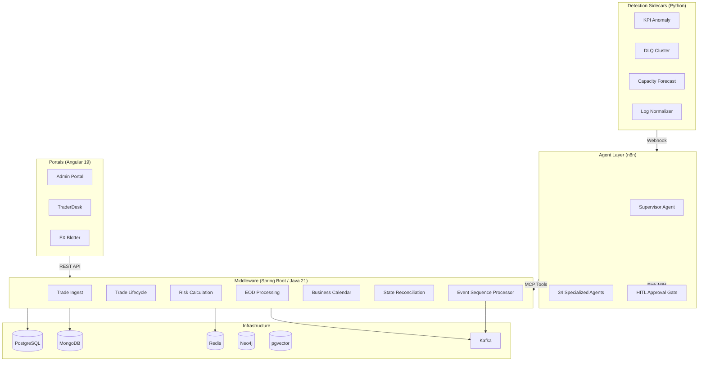

# Forex-Trade-Operations-Intelligence

[](https://openjdk.org/projects/jdk/21/)
[](https://spring.io/projects/spring-boot)
[](https://angular.dev/)
[](https://n8n.io/)
[](https://www.python.org/)
[](https://www.postgresql.org/)
[](https://kafka.apache.org/)
[](https://redis.io/)
[](https://www.mongodb.com/)
[](https://www.drools.org/)
[](LICENSE)
[](docs/adr/)
[-green)](README.md#synthetic-data-policy)

---

Forex-Trade-Operations-Intelligence is a spec-driven, publicly available reference implementation of a runtime-intelligence platform for foreign-exchange trade operations. Built using **Kiro Spec-Driven Development** — every feature progresses through `requirements.md → design.md → tasks.md → code`.

## What's Implemented

| Layer | Components | Tests |
|-------|-----------|-------|
| **Middleware** (7 services) | shared-domain-contracts, trade-ingest, trade-lifecycle, risk-calculation, business-calendar, eod-processing, state-reconciliation | 346 Java tests |
| **Events** | Kafka topic registry, domain event model (25+ event types), event-sequence-processor (Kafka Streams), DLQ management | 95 tests |
| **Portals** (3 apps) | Admin (trade investigation, EOD dashboard, risk aggregation, exceptions, HITL approvals), TraderDesk (status, risk explanation, position, book view), FXTradeBlotter (live position, exposure, settlement, counterparty) | Angular 19 |
| **Observability** | OTel tracing (Jaeger), Prometheus + Grafana (8 dashboards, 6 alert rules), ELK log correlation (4 saved queries) | Config-as-code |
| **Agents** (4 MVP + 30 specced) | Supervisor, Trade Lifecycle Reconstruction, Canary Probe, DLQ Triage | n8n workflow JSON |
| **Sidecars** (4 detectors) | KPI Anomaly, DLQ Cluster Analyzer, Capacity Forecast, Log Normalizer | 24 Python tests |
| **Local Deploy** | MCP server layer (Spring AI), sidecar→agent webhook wiring, n8n import/credential scripts, smoke test | End-to-end |

## Top-Level Directory Structure

| Directory | Role |
|-----------|------|
| `Middleware/` | Java 21 / Spring Boot microservices — 7 services + parent Maven POM |
| `Portals/` | Three Angular 19 standalone portal applications (Admin, TraderDesk, FXTradeBlotter) |
| `Agents/` | n8n workflow JSON exports — supervisor, specialized, and utility agent workflows |
| `Sidecars/` | Python 3.11+ detection and embedding sidecar packages |
| `DevOps/Local/` | Docker Compose per infrastructure role (9 services) + orchestration scripts |
| `docs/` | ADRs, observability docs, event schema catalogue, diagrams |
| `.kiro/specs/` | **Spec-driven development** — 71 specs with requirements, design, and tasks |
| `.github/` | CODEOWNERS + CI workflow placeholders |

## Spec-Driven Development (Kiro Methodology)

This repo demonstrates **full-lifecycle spec-driven development**:

```
.kiro/specs/
├── MASTER-PLAN.md                    ← project-wide progress tracking
├── 01-initial-setup/                 ← technology stack + repo skeleton
├── architecture-golden-path/         ← cross-cutting NFRs inherited by all services
├── 02-microservices/                 ← 7 bounded contexts (DDD)
├── 03-events/                        ← Kafka topics, event schemas, sequence processor, DLQ
├── 04-portals/                       ← 3 Angular portal feature specs
├── 05-observability/                 ← OTel tracing, metrics, logging
├── 06-local-deploy/                  ← MCP server, sidecars, n8n wiring
└── 07-n8n-agents/                    ← 34 agent specs (requirements + design + tasks)
```

See [Kiro-Understanding.md](Kiro-Understanding.md) for the full methodology documentation.

## Architecture Overview



> See [docs/diagrams/](docs/diagrams/) for detailed C4, data-flow, and infrastructure diagrams.

## Quick Start

```bash
# Start all local infrastructure (Postgres, Kafka, Redis, MongoDB, Neo4j, ELK, Prometheus, Grafana, n8n)
npm run start

# Build all microservices
mvn -f Middleware/pom.xml verify

# Check infrastructure status
npm run status

# Stop everything
npm run stop
```

## Architectural Constraints

- **Spring Boot only** for microservices — all business/transactional logic
- **n8n only** for AI agents — workflow JSON exports
- **Python only** for sidecars — detection/embedding, never business logic
- **LLMs never compute official numbers** — risk, exposure, state from deterministic services
- **Every M/H-risk agent action** → propose → simulate → impact report → human approval → execute

See [docs/adr/0001-monorepo-language-boundaries.md](docs/adr/0001-monorepo-language-boundaries.md) for the full ADR.

## Synthetic Data Policy

All examples, identifiers, and test data use synthetic `FX-` prefixed identifiers (e.g., FX-000001). No real financial institution, person, or confidential data is committed.
