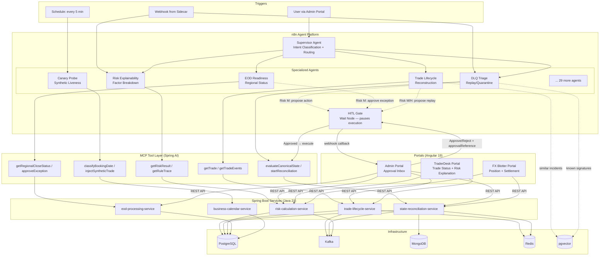

# Agent Architecture

## Flow Summary

1. **Trigger** — sidecar webhook, schedule, or user action via Admin Portal
2. **Routing** — Supervisor classifies intent, routes to specialized agent
3. **Investigation** — Agent calls MCP tools to gather data from services
4. **Decision** — Agent reasons about the data (LLM), proposes action
5. **HITL Gate** — For Risk M/H: execution pauses, approval request sent to Admin Portal
6. **Approval** — Ops/Risk Manager reviews in Admin Portal Approval Inbox, clicks Approve/Reject
7. **Execution** — On approval: agent resumes, calls gated MCP tool with `approvalReference`
8. **Result** — Service executes the action, returns ToolEnvelope, agent reports outcome

## Key Principle
> Agents propose. Services execute. Humans approve. Portals visualize.
