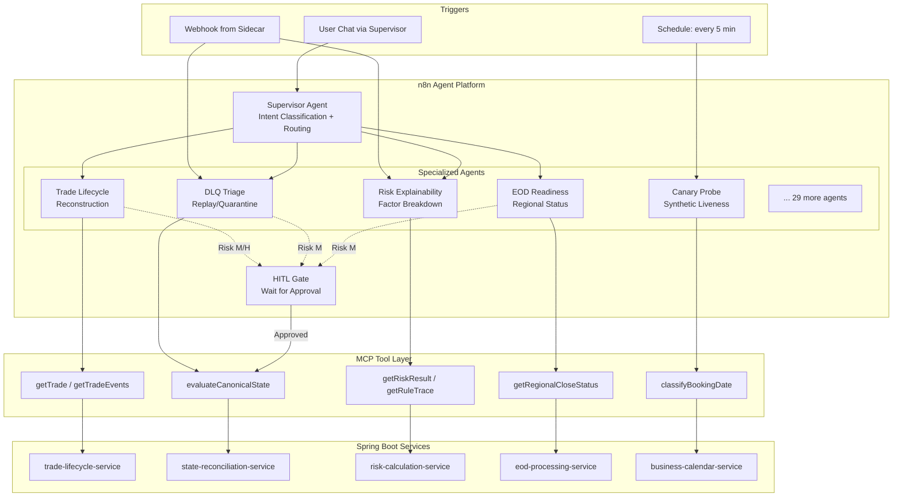

# Agent Architecture

```mermaid
flowchart TB
    subgraph Triggers
        W[Webhook from Sidecar]
        S[Schedule: every 5 min]
        U[User Chat via Supervisor]
    end

    subgraph n8n Agent Platform
        SUP[Supervisor Agent<br/>Intent Classification + Routing]
        
        subgraph Specialized Agents
            TL[Trade Lifecycle<br/>Reconstruction]
            DR[DLQ Triage<br/>Replay/Quarantine]
            CP[Canary Probe<br/>Synthetic Liveness]
            RE[Risk Explainability<br/>Factor Breakdown]
            EOD[EOD Readiness<br/>Regional Status]
            OTH[... 29 more agents]
        end

        HITL[HITL Gate<br/>Wait for Approval]
    end

    subgraph MCP Tool Layer
        MCP1[getTrade / getTradeEvents]
        MCP2[evaluateCanonicalState]
        MCP3[getRiskResult / getRuleTrace]
        MCP4[getRegionalCloseStatus]
        MCP5[classifyBookingDate]
    end

    subgraph Spring Boot Services
        SVC1[trade-lifecycle-service]
        SVC2[state-reconciliation-service]
        SVC3[risk-calculation-service]
        SVC4[eod-processing-service]
        SVC5[business-calendar-service]
    end

    W --> DR
    W --> RE
    S --> CP
    U --> SUP
    SUP --> TL
    SUP --> DR
    SUP --> RE
    SUP --> EOD

    TL --> MCP1
    DR --> MCP2
    RE --> MCP3
    EOD --> MCP4
    CP --> MCP5

    MCP1 --> SVC1
    MCP2 --> SVC2
    MCP3 --> SVC3
    MCP4 --> SVC4
    MCP5 --> SVC5

    TL -.->|Risk M/H| HITL
    DR -.->|Risk M| HITL
    EOD -.->|Risk M| HITL
    HITL -->|Approved| MCP2
```
