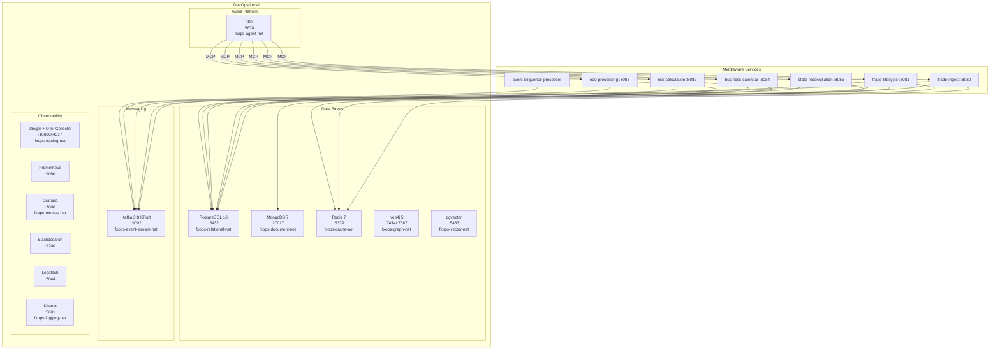

# Local Infrastructure (Docker Compose)

```mermaid
flowchart TB
    subgraph DevOps/Local
        subgraph Data Stores
            PG[PostgreSQL 16<br/>:5432<br/>fxops-relational-net]
            MONGO[MongoDB 7<br/>:27017<br/>fxops-document-net]
            REDIS[Redis 7<br/>:6379<br/>fxops-cache-net]
            NEO4J[Neo4j 5<br/>:7474/:7687<br/>fxops-graph-net]
            PGVEC[pgvector<br/>:5433<br/>fxops-vector-net]
        end

        subgraph Messaging
            KAFKA[Kafka 3.8 KRaft<br/>:9092<br/>fxops-event-stream-net]
        end

        subgraph Observability
            JAEGER[Jaeger + OTel Collector<br/>:16686/:4317<br/>fxops-tracing-net]
            PROM[Prometheus<br/>:9090]
            GRAF[Grafana<br/>:3000<br/>fxops-metrics-net]
            ES[Elasticsearch<br/>:9200]
            LS[Logstash<br/>:5044]
            KIB[Kibana<br/>:5601<br/>fxops-logging-net]
        end

        subgraph Agent Platform
            N8N[n8n<br/>:5678<br/>fxops-agent-net]
        end
    end

    subgraph Middleware Services
        S1[trade-ingest :8080]
        S2[trade-lifecycle :8081]
        S3[risk-calculation :8082]
        S4[eod-processing :8083]
        S5[business-calendar :8084]
        S6[state-reconciliation :8085]
        S7[event-sequence-processor]
    end

    S1 & S2 & S3 & S4 & S5 & S6 --> PG
    S2 --> MONGO
    S1 & S2 & S6 --> REDIS
    S1 & S2 & S3 & S4 & S7 --> KAFKA
    N8N -->|MCP| S1 & S2 & S3 & S4 & S5 & S6
```
