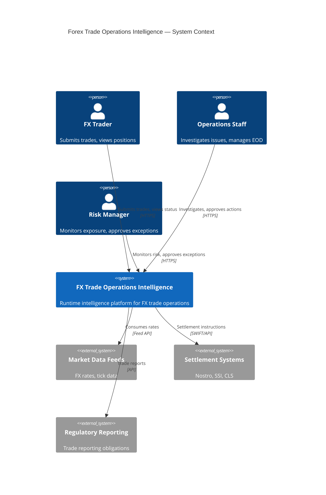

# System Context Diagram

```mermaid
C4Context
    title Forex Trade Operations Intelligence — System Context

    Person(trader, "FX Trader", "Submits trades, views positions")
    Person(ops, "Operations Staff", "Investigates issues, manages EOD")
    Person(risk, "Risk Manager", "Monitors exposure, approves exceptions")

    System(platform, "FX Trade Operations Intelligence", "Runtime intelligence platform for FX trade operations")

    System_Ext(market, "Market Data Feeds", "FX rates, tick data")
    System_Ext(settlement, "Settlement Systems", "Nostro, SSI, CLS")
    System_Ext(regulatory, "Regulatory Reporting", "Trade reporting obligations")

    Rel(trader, platform, "Submits trades, views status", "HTTPS")
    Rel(ops, platform, "Investigates, approves actions", "HTTPS")
    Rel(risk, platform, "Monitors risk, approves exceptions", "HTTPS")
    Rel(platform, market, "Consumes rates", "Feed API")
    Rel(platform, settlement, "Settlement instructions", "SWIFT/API")
    Rel(platform, regulatory, "Trade reports", "API")
```
