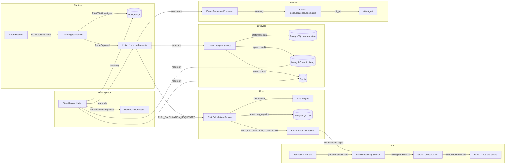

# Trade Lifecycle Data Flow

```mermaid
flowchart LR
    subgraph Capture
        A[Trade Request] -->|POST /api/v1/trades| B[Trade Ingest Service]
        B -->|FX-000001 assigned| C[(PostgreSQL)]
        B -->|TradeCaptured| D[Kafka: fxops.trade.events]
    end

    subgraph Lifecycle
        D -->|consume| E[Trade Lifecycle Service]
        E -->|state transition| F[(PostgreSQL: current state)]
        E -->|append audit| G[(MongoDB: audit history)]
        E -->|dedup check| H[(Redis)]
    end

    subgraph Risk
        D -->|RISK_CALCULATION_REQUESTED| I[Risk Calculation Service]
        I -->|Drools rules| J[Rule Engine]
        I -->|result + aggregation| K[(PostgreSQL: risk)]
        I -->|RISK_CALCULATION_COMPLETED| L[Kafka: fxops.risk.results]
    end

    subgraph EOD
        L -->|risk snapshot signal| M[EOD Processing Service]
        N[Business Calendar] -->|global business date| M
        M -->|all regions READY| O[Global Consolidation]
        O -->|EodCompletedEvent| P[Kafka: fxops.eod.status]
    end

    subgraph Detection
        D -->|continuous| Q[Event Sequence Processor]
        Q -->|anomaly| R[Kafka: fxops.sequence.anomalies]
        R -->|trigger| S[n8n Agent]
    end

    subgraph Reconciliation
        T[State Reconciliation] -->|read-only| C
        T -->|read-only| G
        T -->|read-only| H
        T -->|read-only| D
        T -->|canonical + divergences| U[ReconciliationResult]
    end
```
